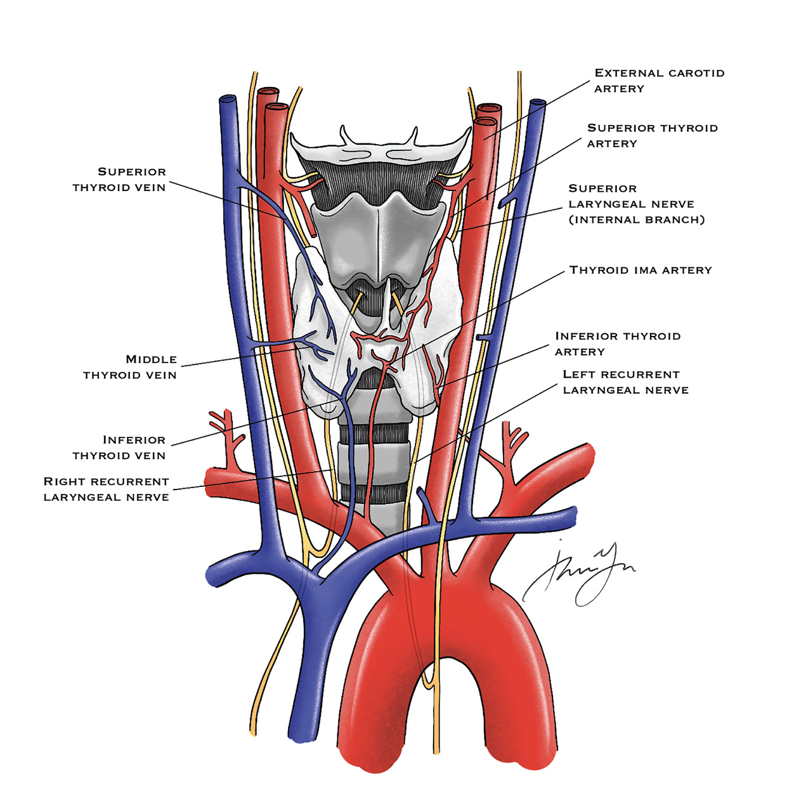
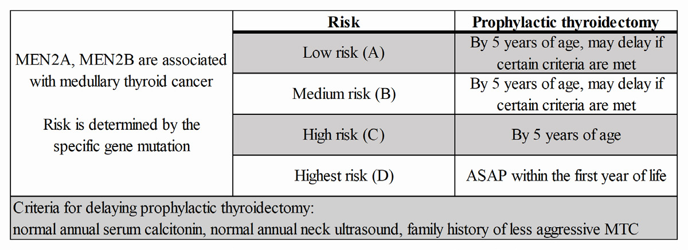

# 02 THYROID

---

<!-- Page 13 -->

13
02 THYROID

---

<!-- Page 14 -->

14
02 THYROID
High Yield Anatomy
Figure 1:  Thyroid Anatomy (Thyroid in Grey)
Vascular supply:
• Superior thyroid artery: branch from External carotid artery 
• Inferior thyroid artery: branch off of thyrocervical artery
• Ima artery off of innominate directly to the isthmus 
• Superior thyroid vein drains into IJV, inferior drains into 
innominate vein 
Nerves:
• Superior laryngeal nerve: motor to cricothyroid muscle; 
loss of projection and fatigue
• Recurrent laryngeal nerve: Right travels with vagus and 
loops around Right innominate artery 

---

<!-- Page 15 -->

15
02 THYROID
• Left travels with vagus and loops around aorta
• Preoperative laryngoscopy to visualize cords, bilateral 
damage can obstruct airway
Thyroglobulin: stores T3 (more active) and T4
Thyroid Embryology:
4th Endodermal pouch  Bilobed solid organ---follicular cells, 
colloid and parafollicular cells (produces calcitonin)
Pyramidal lobe extension can cause thyroglossal duct cyst; 
resect this as it has the potential to get infected or malignant 
transformation
High-Yield Pathophysiology/Treatment
•	 Thyroid storm: 
o Seen in Grave’s disease
o Treatment with beta blockers, Lugol’s solution, cooling 
blankets
•	 Thyroid Nodule:
o Ultrasound (Look for hypoechogenecity, microcalcification, 
irregular margins, unorganized vascular patterns, lymphatic 
invasion) followed by FNA 
•	Indeterminant
•	Repeat FNA
•	Benign
•	Repeat US in 6-12 
months
•	AUS/FLUS
•	Repeat FNA
•	Follicular neoplasm
•	Lobectomy
•	Suspicious malignancy
•	Lobectomy
•	Malignancy
•	Total thyroidectomy
Table 1: Bethesda Criteria 
*AUS – Atypia of undetermined significance 
**FLUS – Follicular lesion of undetermined significance

---

<!-- Page 16 -->

16
02 THYROID
•	 Hyperthyroidism: 
o Low TSH, elevated T3, T4
o Treatment with PTU (side effects of aplastic anemia or 
agranulocytosis) or methimazole (cretinism, aplastic anemia 
and agranulocytosis)
o PTU OK during Pregnancy as it does not cross placenta 
•	 Graves’ disease: 
o Diffuse uptake of radioactive iodine (RAI), antibodies against 
TSH receptors
o RAI worsens ophthalmopathy
•	 Multi-nodular goiter:
o Total or subtotal thyroidectomy
•	 Thyroiditis:
o Hashimoto’s: caused by antithyroid antibodies; treatment 
with thyroid replacement
o Subacute granulomatous: viral etiology, treatment with 
NSAIDs, steroids
•	 Papillary thyroid cancer:
o MC thyroid malignancy; in women; spread lymphatically 
o Biopsy pathology shows psammoma bodies, orphan Annie 
nucleus
o Tx with total thyroidectomy with Level VI involvement
• Do total – so can follow up thyroglobulin for surveillance, 
postoperative radioiodine treatment, remove potential 
multifocal disease 
•	 Follicular Thyroid Cancer:
o FNA is not reliable so do diagnostic/therapeutic lobectomy  
o Hematogenous spread
o Treatment with total thyroidectomy, MRND for + nodes and 
postoperative Radioactive iodine ablation

---

<!-- Page 17 -->

17
02 THYROID
•	 Medullary Thyroid Cancer:
o Cancer from parafollicular C cells producing Calcitonin
o 20% associated with germline mutations in RET oncogene
o Tx with total thyroidectomy with Central dissection, modified 
radical dissection if lymph nodes involved
o Surveillance with CEA, Calcitonin 
Table 2: MEN and Medullary Thyroid Cancer
Quick Hits
o Radioactive Iodine ablation does not work for MTC
o Avoid injuring the Superior Laryngeal Nerve by ligation close 
to the superior pole of the thyroid
o MC symptom of elevated calcitonin is diarrhea 

---

<!-- Page 18 -->

18
02 THYROID

## Figures

