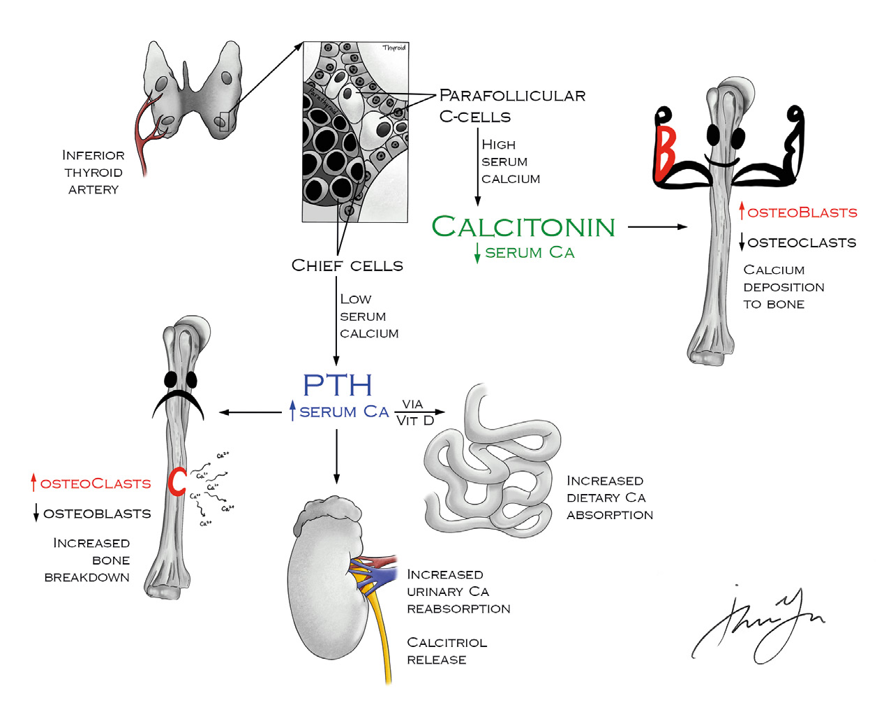

# 03 PARATHYROID

---

<!-- Page 19 -->

19
03 PARATHYROID

---

<!-- Page 20 -->

20
03 PARATHYROID
High Yield Anatomy and Physiology 
•	 What is the relationship of the parathyroid glands and the 
recurrent laryngeal nerve?
o Superior parathyroids are posterior and lateral to RLN
• Originate from 4th pharyngeal pouch
o Inferior parathyroids are anterior and medial to RLN
• Originate from 3rd pharyngeal pouch
• Inferior glands more variable
• Thymus also migrates with 3rd pharyngeal pouch
o Inferior thyroid artery provides blood supply to all 4 glands in 
80% of cases
•	 What cells release parathyroid hormone (PTH), and what is the 
stimulus?
o PTH released from chief cells in parathyroid in response to 
low Ca levels
•	 What cells release calcitonin and what is the stimulus?
o Calcitonin is released from parafollicular c-cells in the thyroid 
in response to high calcium
•	 What are the actions of PTH on bone and in the kidney?
o Bone -- Stimulates osteoclasts for resorption of Ca and 
phosphate 
o Kidneys – Stimulates resorption of Ca, inhibits resorption of 
phosphate and bicarb, Stimulates conversion of 25(OH)D3 
to 1,25(OH)2D3 via 1-alpha hydroxylase (phosphate trashing 
hormone)
•	 How does Vit D (1,25OH2D3) increase serum Ca?
o Stimulates absorption of Ca and Phosphate in gut
•	 How does Calcitonin decrease serum Ca in the bone and the 
kidney?
o Bone -- Inhibits osteoclast bone resorption
o Kidney – Inhibits resorption of Ca and phosphate

---

<!-- Page 21 -->

21
03 PARATHYROID
Figure 1: Parathyroid Hormone Physiology
•	 What is the most common cause of hypercalcemia in the 
outpatient and inpatient setting?
o Outpatient = primary hyperparathyroidism
o Inpatient = Malignancy
•	 What is the mechanism of hypercalcemia due to malignancy?
o MCC hypercalcemia 2/2 malignancy is production of PTH 
related protein (e.g. Squamous cell lung CA, Breast CA)
o Lytic bone lesions are less common malignant cause of 
hypercalcemia
•	 What is the treatment of a hypercalcemic crisis?
o Treat with fluids (normal saline around 300ml/hr) and lasix 
once patient is euvolemic . Initially just saline . Why not LR?
o LR has calcium 
•	 What . are the most common causes of primary 

---

<!-- Page 22 -->

22
03 PARATHYROID
hyperparathyroidism?
o Adenoma (80-90%; 2-5% have double adenoma)
o Hyperplasia (10-15%)
o Parathyroid CA (<1%), MEN 1 and 2A
•	 What are the laboratory tests used to diagnose 
hyperparathyroidism?
o Increased Ca (24-hour collection), Decreased Phos (except 
with renal failure)
o Elevated serum PTH (normal 5-40 pg/dL)
o Chloride to Phosphate ratio >33 (Very specific)
o Increased Urinary Ca, Increased urinary cAMP
Chloride/Phos ratio  > 33 is a reliable way to diagnose 
hyperparathyroidism and frequently tested.
•	 What studies can be used to localize an adenoma?
o Non-invasive – U/S, sestamibi, Single photon emission CT 
(SPECT), MRI
• Best is likely sestamibi with SPECT + U/S
o Invasive – angiography with venous sampling for PTH 
gradients
• Reserved for re-operative cases
•	 What is the treatment for hyperparathyroidism and who should 
undergo treatment?
o Parathyroidectomy is only long-term treatment for HPT
o Clear evidence that symptomatic patients should undergo 
surgery
•	 What are the indications for asymptomatic patients to undergo 
parathyroidectomy?
o Elevation of Serum Ca 1 mg/dL or more over normal value
o Decreased Cr Clearance (<60mL/min)
o T-score < -2 .5

---

<!-- Page 23 -->

23
03 PARATHYROID
o Poor access to care/follow-up
o Age <50
o Some argue all patients with HPT should get surgery
•	 How do you confirm adequate intraoperative resection of a 
parathyroid adenoma?
o Measure intraoperative rapid PTH assay – Need 50% drop
•	 How do you treat multi-gland parathyroid disease  
o subtotal parathyroidectomy (3 .5 glands) or total 
parathyroidectomy with reimplantation into SCM or 
brachioradialis
•	 In what patients do you see secondary hyperparathyroidism 
and what is the treatment?
o In patients with renal failure
o Treat with Ca/Vit D supplements, renal diet, phosphate 
binders
•	 In what patients do you see tertiary hyperparathyroidism and 
what is the treatment?
o Continued high production of PTH despite renal transplant
o Tx: subtotal parathyroidectomy or subtotal with auto-
transplantation
•	 In what patients would you be concerned for parathyroid 
cancer and what is the treatment?
o Generally, have very high calcium levels, may have palpable 
mass . 
o Rare cause of hyperparathyroidism
o Tx: En bloc resection with ipsilateral thyroid and central neck 
dissection 
• Recurrence/Metastasis treated with palliative surgery, 
calcium lowering drugs (bisphosphates/calcimimetics) . 
Chemorads rarely effective .

---

<!-- Page 24 -->

24
03 PARATHYROID
Quick Hits
•	 A patient with high-normal range serum Ca with elevated PTH 
and evidence of bone loss, what is the diagnosis?
o Normocalcemic hyperparathyroidism
o Early form of primary HPT
o Surgery if symptomatic
•	 What are the electrolyte disturbances found with 
hyperparathyroidism:
• Hyperchloremic metabolic acidosis
• d/t PTH effect on bicarb excretion in kidney
• Hypophosphatemia
• However, with significant renal impairment, phosphate 
may be elevated
•	 A patient with elevated PTH, elevated Ca, Low urinary Ca, 
what is the diagnosis and treatment?
o Benign Familial Hypocalciuric Hypercalcemia
o Tx? Nothing
•	 The inferior thyroid artery supplies parathyroid gland laterally 
or medially?
o Medially
•	 During a neck exploration for hyperparathyroidism you find 3 
normal glands and missing superior gland, where should you 
look next?
o Check retroesophageal space and open carotid sheath
•	 During a neck exploration and you find 3 normal glands and 
missing inferior gland, where should you look next?
o Check ipsilateral side of mediastinal thymus, consider intra-
thyroid gland
•	 You find 4 normal appearing glands with elevated PTH?
o Consider hypersecreting, supernumerary parathyroid gland 
most commonly located in thymus thymectomy

---

<!-- Page 25 -->

25
03 PARATHYROID
•	 Where is the most common location of a missed gland?
o NORMAL anatomic position
•	 Where is the most common location of an ectopic gland?
o Thymus

---

<!-- Page 26 -->

26
03 PARATHYROID

## Figures

