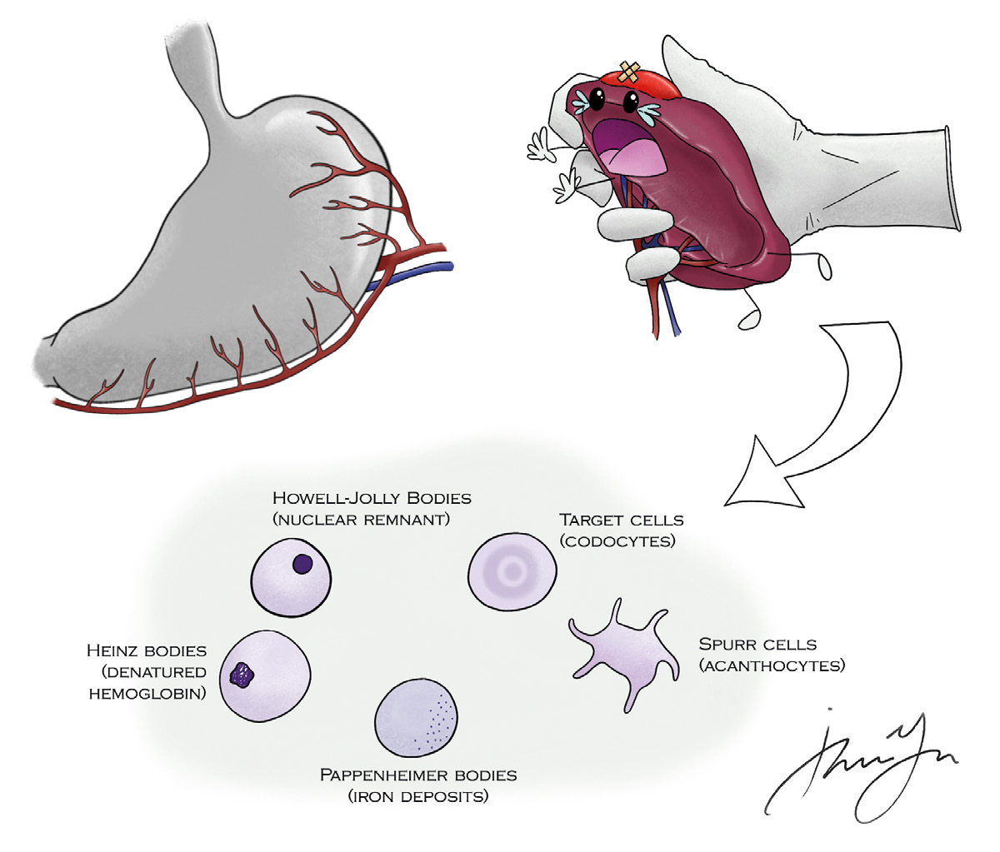

# 06 SPLEEN

---

<!-- Page 57 -->

57
06 SPLEEN

---

<!-- Page 58 -->

58
06 SPLEEN
High Yield Anatomy/Physiology
•	 Main Ligaments (there are more minor ligaments, but these 
are the most surgically important)
o Gastrosplenic  contains short gastrics
o Splenorenal  contains splenic vessels and tail of pancreas
o Splenocolic
o Splenophrenic
•	 Spleen functions:
o Store platelets, filter senescent erythrocytes, re-energize 
erythrocytes through “pitting”, immune function (largest 
concentration of lymphoid tissue in the body)
• Pitting = removal of intracellular products
o Opsonization: Tuftsin and Properdin
•	 Red pulp — Filters RBCs — Most of the spleen — Thin walled 
sinusoids separated by cords containing red cells
•	 White pulp — Immune functions
o Lymphoid follicles — B-cells
o Periarterial lymphatic sheath (PALS) — T-cells
•	 Peripheral blood smear suggesting absent/damaged spleen:
o Howell-Jolly body = Nuclear remnants (most reliable finding)
o Pappenheimer body = Iron deposits
o Target cell = Immature RBC
o Heinz body = Intracellular denatured hemoglobin
o Spur cell = Deformed membrane
o What if you don’t see these post-splenectomy
• Accessory spleen

---

<!-- Page 59 -->

59
06 SPLEEN
Figure 1 - Figure 1 - Hematologic Consequence of Splenectomy
Indications for splenectomy
•	 Unstable trauma patients
•	 Hematologic disorders: MC ITP and spherocytosis
•	 Splenic abscess
•	 Symptomatic cysts
•	 Primary malignancies (mainly non-Hodgkins lymphomas)
Splenic Trauma
•	 Can be secondary to iatrogenic trauma from splenic capsular 
tear with over vigorous retraction during foregut or colon 
procedures
•	 Penetrating trauma  splenectomy
•	 Blunt injury  selective non-operative management

---

<!-- Page 60 -->

60
06 SPLEEN
o Patient must be hemodynamically stable without peritonitis 
 Otherwise emergent laparotomy and splenectomy
o Nonoperative management includes in-hospital or ICU 
monitoring, serial abdominal examinations, serial hematocrit 
measurements, and a period of immobility (bed rest/post-
discharge restricted activity)
o Angiographic intervention should be considered for:
• AAST grade >III injuries (subcapsular hematoma >50% or 
expanding; ruptured subcapsular hematoma; laceration 
>3cm or involving trabecular vessels)
• Presence of contrast blush
• Moderate hemoperitoneum
• Any signs of ongoing splenic bleeding
Hematologic Disorders
•	 Idiopathic thrombocytopenia purpura (ITP)
o Thought to be caused by autoantibodies to glycoproteins IIb/
IIIa and Ia/IIa
o Initial management is medical  Steroids, IVIG
o Splenectomy for medically refractory cases or for recurrence 
(avoids need for longstanding steroids)
• Patients who have a good response to steroids  
predictive of a favorable response after splenectomy
o When do you transfuse platelets?
• Only for intraoperative bleeding  give after ligating 
splenic artery if possible (prevents consumption of 
transfused platelets)
•	 Hereditary Spherocytosis
o Presentation: anemia, splenomegaly
o Autosomal dominant defect in cell membrane protein 
(spectrin)  RBC less deformable  culled by spleen
o Splenectomy recommended for symptomatic patients older 
than 6 years old (want them to develop immune function 
prior to splenectomy)

---

<!-- Page 61 -->

61
06 SPLEEN
o Typically, will require cholecystectomy at time of surgery as 
well (check for gallstones – hemolysis produces bilirubin 
stones)
•	 Pyruvate Kinase Deficiency — Congenital hemolytic anemia 
caused by impaired glucose metabolism – splenectomy 
reduces transfusion requirements
•	 Hemoglobinopathies — Sickle cell disease, thalasemias — 
Rare indication for splenectomy
Splenic abscess
•	 Causes: IV drug use, endocarditis, secondary infection of 
traumatic pseudocyst, sickle cell disease
•	 Unilocular with thick wall in stable patient  percutaneous 
drainage
•	 Multi-locular, thin walled  suspect echinoccocal abscess  
Splenectomy
Splenic lesions
•	 Splenic cyst
o Well defined hypodense lesion without an enhancing rim
o Two types
• True cysts: congenital, parasitic (echinococcus), or 
neoplastic
• False cysts: post traumatic pseudocyst
o Leave alone if asymptomatic (serology and imaging 
characteristics can typically rule out parasitic cyst or 
malignancy)
o Large cysts (>5cm) or symptomatic  Consider laparoscopic 
cyst excision or fenestration
•	 Hemangioma = MC splenic tumor  splenectomy if 
symptomatic 
•	 Angiosarcoma = primary malignant tumor of spleen 
o Associated with vinyl chloride and thorium dioxide exposure

---

<!-- Page 62 -->

62
06 SPLEEN
o Aggressive, high mortality
o Splenectomy if caught in time
•	 Non-Hodgkins lymphoma
o MC CLL  Splenectomy for anemia/thrombocytopenia
Splenic artery aneurysm
•	 MC visceral artery aneurysm, more common in women
•	 When to treat?
o >2cm
o All pregnant women or women of childbearing age, 
regardless of size (As high as 70% rupture risk during 
pregnancy
•	 Treatment  Usually endovascular coil embolization of the 
aneurysm or placement of covered stent
o Very distal aneurysms may require splenectomy
o Tradition open or laparoscopic splenic artery ligation also 
acceptable options
Post splenectomy infection
•	 Decreased IgM and IgG leads to increased susceptibility to 
encapsulated organisms (S . pneumoniae, N . meningitidis, H . 
influenza)
o Timing of vaccination?
• 2 weeks prior to elective splenectomy or prior to hospital 
discharge following emergent splenectomy (or 2 weeks 
post-op if reliable follow-up)
•	 OPSI risk is higher in children — especially in hematologic 
disease (Beta thalassemia)
•	 If suspicion of OPSI  Broad spectrum antibiotics 
immediately! — Don’t wait for cultures
•	 Prophylactic antibiotics?
o Consider for children <10 years old
o Definitely not in adults

---

<!-- Page 63 -->

63
06 SPLEEN
Quick Hits
•	 Patient s/p splenectomy for ITP with persistent 
thrombocytopenia . Periepheral smear with Howel-jolly bodies?
o Accessory spleen
o Diagnose with imaging: radionuclide spleen scan (tagged 
RBC scan)
o MC location: splenic hilum
•	 MC organism associated with OPSI?
o S . pneumo
•	 Abdominal pain and CT with spleen in RLQ, abdominal U/S 
shows no flow in splenic vein. Diagnosis?
o Wandering spleen
• Caused by failure of fusion of dorsal mesogastrium, 
leading to lack of splenic ligaments
• Risk of splenic torsion and infarction
o Treatment?
• Splenectomy if splenic infarction, otherwise splenopexy
•	 MC source of post splenectomy bleeding?
o Short gastrics
•	 Patient with abdominal pain following splenectomy . CT shows 
large, low attenuation, contained fluid collection in surgical 
bed/lesser sac . Diagnosis?
o Pancreatic leak — tail of pancreas at risk during 
splenectomy 
o Treatment?
• Percutaneous drain
•	 Patient with fever, hemolytic anemia, renal failure, purpura, 
neurologic changes . Diagnosis and management?
o Thrombotic thrombocytopenic purpura (TTP)
o FAT-RN mnemonic (Fever, Anemia, Thrombocytopenia, 
Renal, Neurological)
o Caused by defective ADAMTS13 metalloproteinase (vWF 
cleaving protein)  Platelet aggregation in microvasculature 
o Treatment = Plasmapheresis

---

<!-- Page 64 -->

64
06 SPLEEN

## Figures

