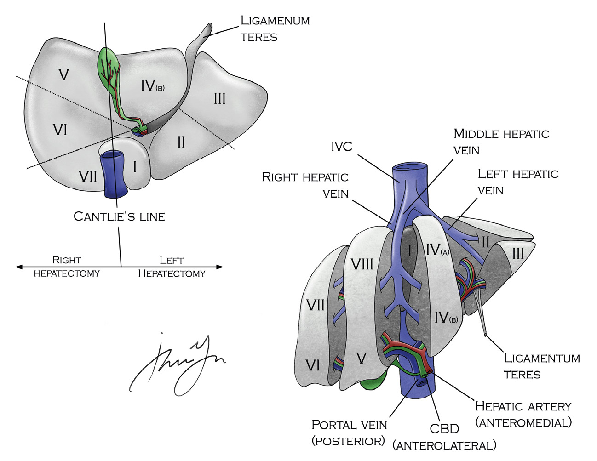
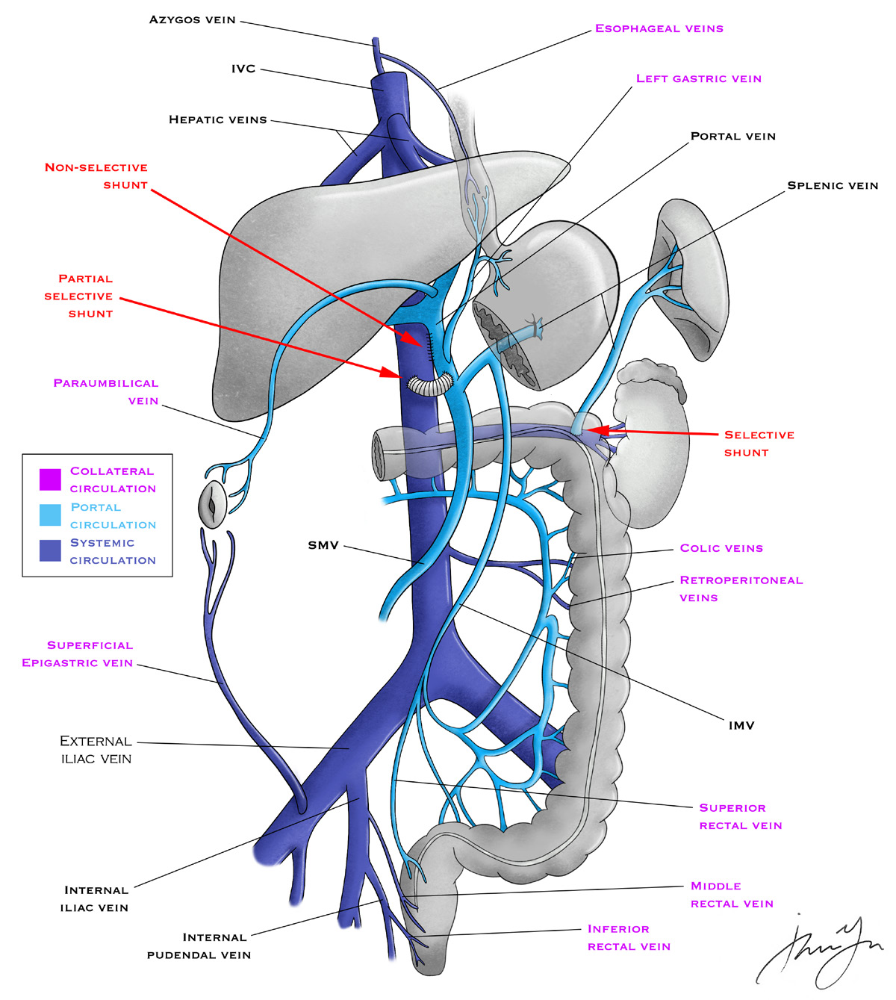
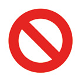
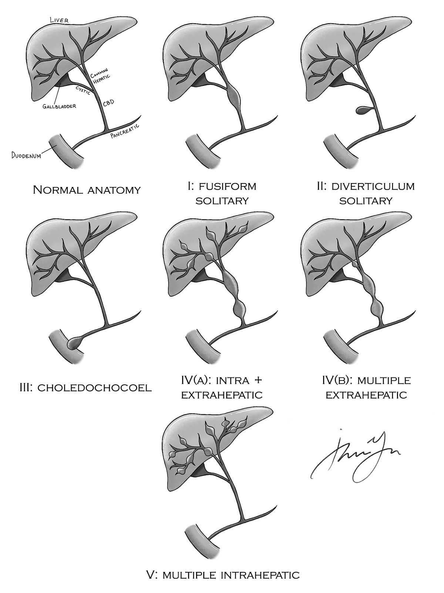
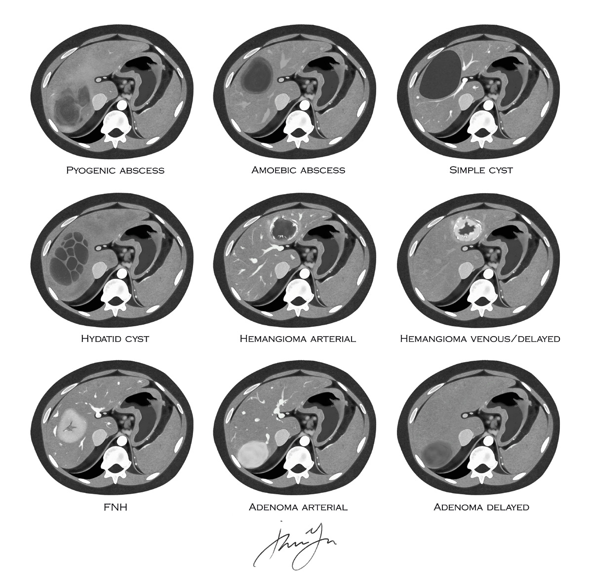
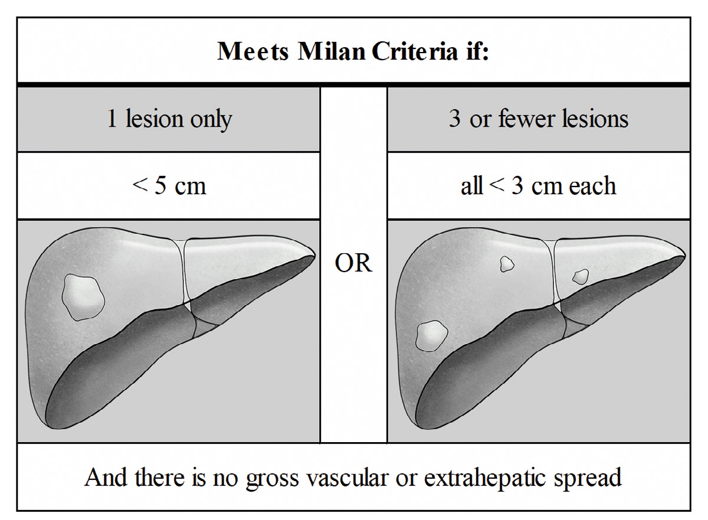

# 07 HEPATOBILIARY

---

<!-- Page 65 -->

65
07 HEPATOBILIARY

---

<!-- Page 66 -->

66
07 HEPATOBILIARY
PART ONE
High Yield Anatomy
•	 What structures are in the portal triad?
o Common bile duct
o Proper hepatic artery (medial)
o Portal vein (posterior)
o Runs in hepatoduodenal ligament
•	 What separates the right and left lobes of the liver?
o Cantlie’s Line (line between gallbladder fossa and IVC)
•	 What numbers correspond to the anatomic liver segments?
o I = caudate lobe
o II-III = left lateral segments
o IV = left inferior anteromedial
o V = right inferior anteromedial
o VI-VII = right posterior lateral
o VIII = right superior anteromedial
•	 What is the venous drainage?
o 3 hepatic veins  drain into IVC
o Medial and left hepatic vein usually merge before draining 
into IVC
•	 What are the most common aberrant vascular anatomy?
o Replaced right hepatic – most commonly off the SMA, 
travels behind pancreas and CBD
o Replaced left hepatic – most commonly off the left gastric, 
travels in gastrohepatic ligament
 
During foregut surgery, take care not to ligate a replaced 
left traveling in the gastrohepatic ligament.

---

<!-- Page 67 -->

67
07 HEPATOBILIARY
Figure 1 – Segmental anatomy of the liver
Benign Biliary Disease
o What is the management of asymptomatic gallstones?
• Observation
o What about uncomplicated symptomatic cholelithiasis?
• Elective cholecystectomy
o How do you manage symptomatic cholelithiasis in 
pregnancy?
• Higher rates of spontaneous abortion with non-operative 
management
• Laparoscopic cholecystectomy during the second trimester
• Place ports via open Hassan technique
• Keep pneumoperitoneum as low as possible
• Place bump under right side to offload cava
o How do you manage acute cholecystitis?
• Early cholecystectomy if surgically fit

---

<!-- Page 68 -->

68
07 HEPATOBILIARY
There is no benefit to waiting or “cooling off” acute 
cholecystitis with antibiotics. 
 
• Cholecystostomy tube if unable to tolerate surgery
• If recovered from their critical illness  interval 
cholecystectomy
o Recurrent symptoms are common after 
cholecystostomy tube removal
o What is the management of suspected choledocholithiasis?
• Several acceptable approaches and much variability 
between institutions, but in general:
• Strong suspicion (CBD stone on imaging, clinical 
cholangitis, bilirubin > 3, dilated CBD > 6 mm)  
consider preop ERCP for duct clearance
o IOC and possible CBD exploration if ERCP not 
available
• Moderate suspicion (abnormal liver tests other than 
bili, mild elevation in bili, clinical gallstone pancreatitis) 
 MRCP or IOC
• Low suspicion (no biochemical or imaging suggestive 
of CBD stone)  no further investigation prior to 
cholecystectomy
• CBD stones identified during IOC  flush + glucagon up to 
twice
• If small stone and large enough cystic duct  
transcystic CBD exploration using fluoroscopic 
guidance or choledochoscope
• If not amenable to transcystic approach  either 
lap CBD exploration or postop ERCP depending on 
resources available and surgeon experience
• What if you can’t visualize the hepatic ducts on IOC?
• Pull catheter back and try flushing again
• Trendelenburg to see if change in imaging (back filling 
using gravity)

---

<!-- Page 69 -->

69
07 HEPATOBILIARY
• Convert to open to investigate injury to hepatic duct
o Gallstone pancreatitis
• Do you need to perform ERCP?
• Only if clinical signs of cholangitis
• Stone will likely pass and no improvement of outcomes 
with early ERCP in patients with gallstone pancreatitis 
alone
• When do you perform cholecystectomy?
• Should be done during index admission after clinical 
pancreatitis resolves
• In severe cases with significant peripancreatic fluid 
collections  wait until fluid collections mature or 
regress  interval cholecystectomy at 6 weeks is 
acceptable, but an ERCP with sphincterotomy should 
be performed to reduce risk of complications during 
waiting period
o What is gallstone ileus?
• Small bowel obstruction caused by a gallstone (typically at 
IC valve) resulting from a cholecystoenteric fistula (usually 
fistula to duodenum)
• What is the Rigler triad?
• Bowel obstruction
• Gallstone seen in intestine
• Pneumobilia on imaging
• How do you treat this?
• Primary goal: relieve the obstruction
o Perform enterotomy proximal to obstruction and 
milk stone back and remove through enterotomy
• Should you perform cholecystectomy and fistula 
takedown at the time of enterolithotomy?
o No
o A combined procedure has higher morbidity and 
recurrence rates are low

---

<!-- Page 70 -->

70
07 HEPATOBILIARY
o Can consider in select circumstances: patient 
stable and gangrenous cholecystitis present (in 
other words they’re stable and REALLY need their 
gallbladder out)
99% of the time the answer is enterotomy and milk the 
stone. Avoid cholecystectomy and fistula takedown.
o What are gallbladder polyps?
• Majority are benign hyperplastic polyps
• Management
• Symptomatic  cholecystectomy
• Asymptomatic  cholecystectomy if > 10 mm in size
o If over 18 mm  treat as gallbladder cancer until 
proven otherwise
o Polyps over 6 mm need serial imaging or consider 
surgery to avoid need for surveillance
Portal Hypertension
o What is the hepatic vein pressure gradient (HVPG)?
• Gradient between the wedged hepatic vein pressure 
and the free hepatic vein pressure – requires passage of 
balloon catheter into hepatic vein under fluoroscopy
• Portal hypertension defined as (HVPG) > 6 mmHg
o What are the clinical effects of portal hypertension?
• Portosystemic venous collaterals, ascites, hepatic 
encephalopathy, splenomegaly
o What is the relationship between the site of increased portal 
resistance and the etiology of portal hypertension?
• Presinusoidal  e .g . schistosomiasis
• Sinusoidal  e .g . alcoholic cirrhosis, viral hepatitis
• Postsinusoidal  Budd-Chiari syndrome
• Many are mixed disorders (e .g . primary biliary cirrhosis 
has both presinusoidal and sinusoidal elements)

---

<!-- Page 71 -->

71
07 HEPATOBILIARY
o What are the sites of collateral circulation?
• Where splanchnic venous system meets with systemic 
drainage
• Distal esophagus/proximal stomach (esophageal 
submucosal veins to proximal gastric veins)
• Rectum (IMV to pudendal vein)
• Umbilicus (vestigial umbilical vein to left portal vein)
• Retroperitoneum (mesenteric and ovarian veins)
o How do you treat it?
• Pharmacologic
• Splanchnic vasoconstrictors in acute setting = 
vasopressin, octreotide
• Non-selective beta-blockers for prophylaxis = nadolol, 
propranolol
• Endoscopic variceal banding
• Transjugular intrahepatic portosystemic shunt (TIPS)
• Used for acute or recurrent variceal bleeding, 
refractory ascites, Budd-Chiari syndrome, or hepatic 
hydrothorax
o What is the management of acute esophageal variceal 
bleeding?
• Resuscitate, transfuse, antibiotics, intubation for airway 
protection
• Octreotide  endoscopic treatment  TIPS if 
uncontrolled (balloon tamponade as temporizing measure)
• If rebleed after initial endoscopic control  2nd 
endoscopy  consider TIPS
o What are the surgical options for portal hypertension?
• Gastroesophageal devascularization
• Generally reserved for patients with extensive portal 
venous thrombosis and no portosystemic shunt 
options

---

<!-- Page 72 -->

72
07 HEPATOBILIARY
• Esophageal transection with division and anastomosis
• Rarely used since TIPS
• Devascularization procedures
• Total devascularization of the greater curvature and 
upper 2/3rd of the lesser curvature and circumferential 
devascularization of the lower 7 .5 cm of the 
esophagus
• Portosystemic shunts
• Selective shunts (e.g. distal splenorenal or “Warren” 
shunt)
o Decompress only part of portal venous system
o Good for variceal bleeding but does not help 
ascites
• Partial portosystemic shunts
o Type of side to side shunt where flow is calibrated 
by the size of the synthetic interposition graft 
placed between the portal vein and vena cava
• Nonselective portosystemic shunts
o Decompress the entire portal venous system
o Side to side portocaval shunt is most common
o High rate of encephalopathy and complicate later 
liver transplant
Variceal bleeding  selective shunt.
Ascites  nonselective shunt.

---

<!-- Page 73 -->

73
07 HEPATOBILIARY
Figure 2 – Vascular anatomy of portosystemic shunts 
Liver Abscess 
o What types of abscesses can be found in the liver?
• Pyogenic abscess (most common, > 80%)
• Usually secondary to biliary tract infection (E . coli 
most common pathogen), GI source (diverticulitis, 
appendicitis)
• Treatment = percutaneous drain and antibiotics
• Ameobic abscess
• Typical presentation is patient with liver abscess after 
travel to Mexico

---

<!-- Page 74 -->

74
07 HEPATOBILIARY
• Get serology
• Treatment = metronidazole, rarely needs drainage
• Echinococcal cyst
• Hydatid cyst
• Characteristic double walled cyst on CT
• Check serology
• Treatment = albendazole followed by surgical excision
o Do not aspirate or spill  cause anaphylaxis
Quick Hits
•	 What hepatic vein pressure gradient is typically required for 
variceal rupture?
o 12 mmHg
o What is the definition of portal HTN?
• 6 mmHg
•	 What are the components of the Child-Turcotte-Pugh score?
o Bilirubin, albumin, prothrombin time, encephalopathy, ascites
•	 What are the components of the Model for End-stage Liver 
Disease (MELD) score?
o Bilirubin, INR, creatinine
•	 What is the MELD score at which patients have a survival 
benefit for transplantation?
o 15
•	 What is the management of umbilical hernias in a cirrhotic with 
ascites?
o Ideally done in elective setting
o Medically control ascites first
• Control of ascites is key to reduce hernia recurrence and 
postoperative complications, such as wound infection, 
evisceration, ascites drainage, and peritonitis
• If medical treatment of ascites doesn’t work  intermittent 

---

<!-- Page 75 -->

75
07 HEPATOBILIARY
paracentesis, temporary peritoneal dialysis catheter or 
transjugular intrahepatic portosystemic shunt may be 
necessary
• Use mesh in the elective setting
o If patient eligible for transplant  repair hernia at time of 
transplant
o If complicated (incarcerated, strangulated, ruptured)  must 
repair urgently
• No mesh, close in layers (close peritoneum), sterile 
dressing
• Aggressive ascites control postop until healed
Avoid leaving an intraperitoneal drain on the exam – 
patient can get hypotensive. Intermittent paracentesis is the 
standard.
 
•	 How do you manage symptomatic cholelithiasis in a patient 
with cirrhosis and ascites?
o Medically manage until cirrhosis is compensated, then 
laparoscopic cholecystectomy by an experienced liver 
surgeon .
o Replace clotting factors and platelets preop if necessary
PART TWO
Cystic Hepatobiliary Lesions
o What are choledochal cysts?
• Unknown etiology but likely secondary to an anomalous 
biliary-pancreatic duct junction with reflux of pancreatic 
enzymes (long common BP duct)
• Most are identified and treated in early childhood
• Can cause, pain, biliary obstruction, cirrhosis
• Carry malignant potential

---

<!-- Page 76 -->

76
07 HEPATOBILIARY
o What is the Todani classification system and treatment by 
type?
• I – Fusiform dilation of extrahepatic biliary tree
• Resection with hepaticojejunostomy
• II – Saccular diverticulum of CBD
• Excision of cyst – likely with RNY biliary enteric 
reconstruction
• III – Dilation of intramural duct (choledochocele)
• Uncommon – approach transduodenally  
transduodenal excision or sphincteroplasty
• IVa – Multiple dilations of intra and extra-hepatic ducts
• Hepatic resection and biliary reconstruction
• IVb – Multiple dilations of extra-hepatic ducts
• Excision and hepaticojejunostomy
• V – Multiple dilations of intrahepatic ducts (Caroli’s)
• Transplantation (can have one attempt at partial 
resection if isolated to one part of liver)

---

<!-- Page 77 -->

77
07 HEPATOBILIARY
Figure 3 – Types of choledochal cysts
o How do you manage a simple hepatic cyst?
• No treatment if asymptomatic
• 100% recurrence rate with aspiration alone
• Laparoscopic cyst fenestration for symptomatic cysts  send 
capsule for pathology

---

<!-- Page 78 -->

78
07 HEPATOBILIARY
• If concern for abscess, hydatid cyst, or malignancy  
aspirate for cytology
Hepatobiliary Tumors
o What are the characteristics of a hepatic hemangioma?
• Most common liver tumor, male predominance, equal 
distribution in liver
• Congenital vascular malformations, generally 
asymptomatic
• Can cause pain, compressive symptoms
• Rarely hemorrhage, inflammation, or coagulopathy
• Kasabach-Merritt Syndrome = hemangioma + 
consumptive coagulopathy
• Imaging
• CT: hypodense pre-contrast; peripheral  central 
enhancement in the arterial phase; persistent contrast on 
delayed series
• MRI: hypointense on T1; hyperintense on T2
• Treatment
• Asymptomatic  observation (regardless of size, no 
risk of rupture)
• Symptomatic  resection
o Focal Nodular Hyperplasia
• 2nd most common liver tumor, women 30-50 years old
• Completely benign, usually asymptomatic
• Imaging
• CT: well demarcated; rapid arterial enhancement with 
central stellate scar
• MRI: hypointense with central scar on T1; isointense 
with hyperintense scar on T2
• Treatment
• Nothing – no malignant potential, no bleeding risk

---

<!-- Page 79 -->

79
07 HEPATOBILIARY
o Adenoma
• Rare, associated with OCP and androgen steroid use
• Malignant transformation in 10%
• Risk of rupture increases with size  30% risk of spontaneous 
bleeding with tumors > 5 cm
• Can present with pain, abdominal fullness, abnormal LFTs, 
or bleeding from rupture
• Imaging
• CT: arterial enhancement with washout on portal 
phase; smooth surface with tumor capsule; no central 
scar
• MRI: mildly hyperintense on T1 and T2
• Treatment
• Small lesions  discontinue OCPs and it may regress
• Larger lesions (> 4 cm) or no regression after stopping 
OCPs  resect
• Ruptured  IR embolization, recover, then resect in 
elective setting
Positive sulfur colloid uptake = functioning Kupffer cells  FNH
Negative sulfur colloid uptake = absent Kupffer cells, from 
hepatocytes  adenoma
 

---

<!-- Page 80 -->

80
07 HEPATOBILIARY
Figure 4 – Cross sectional imaging of benign hepatic lesions
o What are the features of hepatocellular carcinoma (HCC)?
• Risk factors (causes of liver inflammation)
• HBV, HCV, cirrhosis of any cause, inherited errors of 
metabolism (hemochromatosis, alpha 1 antitrypsin 
deficiency), aflatoxin
• CT scan: hypervascular lesions; hyperintense during 
arterial phase; hypodense during the delayed phase
• Characteristic lesion on imaging + elevated AFP = no 
biopsy needed
• Is there a role for PET/CT?
• No role in HCC
• What is the most common site of metastasis?

---

<!-- Page 81 -->

81
07 HEPATOBILIARY
• Lung
• What is the management?
• Resection indicated for cure if solitary mass without 
major vascular invasion and adequate liver function 
(i .e . low grade with normal function or Childs A without 
portal hypertension)
o Resection is possible but controversial for limited 
major vascular invasion or multifocal disease that 
is resectable
• How much FLR (future liver remnant) is needed?
o No cirrhosis  25%
o Childs A  30-40%
o What if less than above but otherwise resectable 
disease?
• Consider preop portal vein embolization of 
diseased side
• No cirrhosis or Childs A and early stage  resection
• Moderate to severe cirrhosis and early stage  
Transplant
o Must meet Milan criteria:
• One lesion < 5 cm
• 3 or fewer lesions all less than 3 cm and no 
gross vascular or extrahepatic spread

---

<!-- Page 82 -->

82
07 HEPATOBILIARY
Figure 5 – Milan criteria
o Usually perform neoadjuvant chemotherapy prior 
to transplant
• Locoregional therapies should be considered in 
patients who are not candidates for surgical curative 
treatments, or as a bridge to curative therapy
o Ablation (radiofrequency, cryoablation, microwave) 
= best for small lesions < 5 cm
o Arterially directed therapies – transarterial 
chemoembolization (TACE)
• Consider for unresectable tumors > 5 cm
o External beam radiation therapy
• Also an option for unresectable disease
• Good for lesions not amenable to ablation or 
TACE due to tumor location
o What are the features of cholangiocarcinoma?
• Classified as intrahepatic or extrahepatic disease
• Risk factors (inflammation of bile ducts): primary sclerosing 
cholangitis, bile duct stones, choledochal cysts, liver fluke 
infections, HBV, HCV

---

<!-- Page 83 -->

83
07 HEPATOBILIARY
• What is the management of intrahepatic 
cholangiocarcinoma?
• Preop biopsy is not necessary if radiographically and 
clinically suggested malignancy
• Diagnostic laparoscopy to rule out disseminated 
disease recommended
o Lymph node metastasis past porta hepatis and 
distant metastases contraindicate resection
o Multifocal liver disease is generally not amenable 
to resection
Unlike hepatocellular carcinoma, transplantation is NOT an 
option for multifocal cholangiocarcinoma.
 
• Hepatic resection with negative margin is goal (formal 
anatomic resection, wedge resection, or segmental 
resection)
• What is the management of extrahepatic 
cholangiocarcinoma?
• Basic principle is complete resection with negative 
margins and regional lymphadenectomy
• Location is hilar, how do you resect?
o In order to be resectable, contralateral hemi-liver 
must have intact arterial/portal flow and biliary 
drainage uninvolved with tumor
o Reconstruction generally with Roux-en-Y 
hepaticojejunostomy
• Location is distal, how do you resect?
o Pancreaticoduodenectomy (Whipple)
o What are the features of gallbladder carcinoma?
• Risk factors: chronic inflammation, porcelain gallbladder 
(much lower risk than previously thought), polyps > 1 cm, 
typhoid infection, primary sclerosing cholangitis, IBD
• Many discovered incidentally at time of cholecystectomy 
for symptomatic gallbladder disease

---

<!-- Page 84 -->

84
07 HEPATOBILIARY
• Surgical management
• T1a tumors (invades lamina propria)  
cholecystectomy alone
• T1b and greater (invades muscle layer)  
cholecystectomy with limited hepatic resection 
(typically segments IVb and V) and portal 
lymphadenectomy
o More extensive resection may be required for 
more advanced disease in order to obtain negative 
margins
Quick Hits
•	 Patient with colorectal cancer and isolated liver metastasis 
receives neoadjuvant FOLFOX therapy, restaging shows 
complete radiologic response . Next step?
o Still perform hepatic resection as complete pathologic 
response is rare
Same principle as rectal cancer that has clinically resolved 
after neoadjuvant
•	 Patient with asymptomatic cholelithiasis and a 5 mm 
gallbladder polyp . Next step?
o Cholecystectomy
o Risk of malignant transformation within gallbladder polyps 
has been linked to concurrent cholelithiasis  surgery 
recommended regardless of polyp size if concurrent stones
•	 Highest negative predictive value test for choledocholithiasis?
o GGT (beta-glutamyl transpeptidase)  normal GGT has 
97% NPV
•	 How do you manage choledocholithiasis in patient with prior 
Roux-en-Y gastric bypass?
o Transgastric ERCP or advanced double-balloon endoscopy

---

<!-- Page 85 -->

85
07 HEPATOBILIARY
•	 What is the significance of HCC found in young patient without 
cirrhosis?
o Fibrolamellar variant
o Better prognosis, recurrence is common
o Marker?
• Neurotensin
•	 Incidental finding of adenocarcinoma invading lamina propria 
layer of gallbladder following cholecystectomy . Next step?
o No further treatment  cholecystectomy alone is enough
•	 Incidental finding of adenocarcinoma following 
cholecystectomy . Next step?
o Stage
o Go back to OR for resection of segments IVb and V and 
portal lymphadenectomy
o Do you need to excise port sites?
• No benefit
•	 What is the significance of isolated gastric varices?
o Most commonly caused by splenic vein thrombosis 
secondary to pancreatitis
o Treatment = splenectomy
•	 Patient 4 weeks after hospitalization for car accident with liver 
laceration that was managed nonoperatively presents with 
upper GI bleed . Management?
o First step = EGD  you see blood coming from the 
duodenal papilla
o What is this?
• Hemobilia from hepatic artery-biliary duct fistula
• Treatment = angioembolization
•	 What segments do you take in a right liver resection?
o 5-8
o Left?

---

<!-- Page 86 -->

86
07 HEPATOBILIARY
• 2-4 +/- caudate (1)
o Left lateral segmentectomy?
• 2-3
o Extended right?
• 5-8 + 4
o Extended left?
• 2-4 + 5 and 8

## Figures

