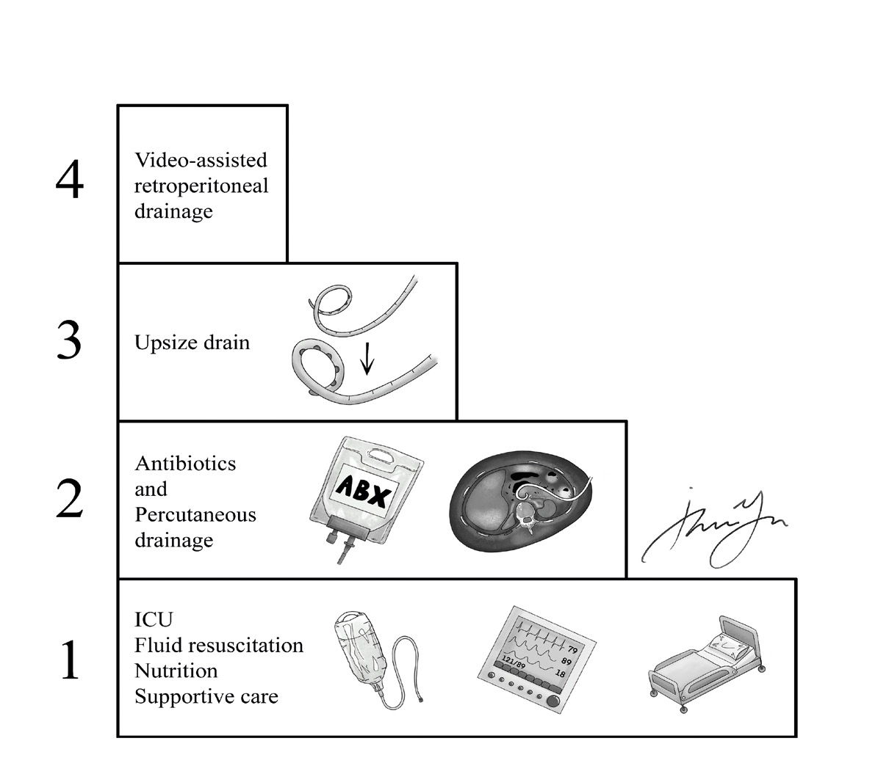
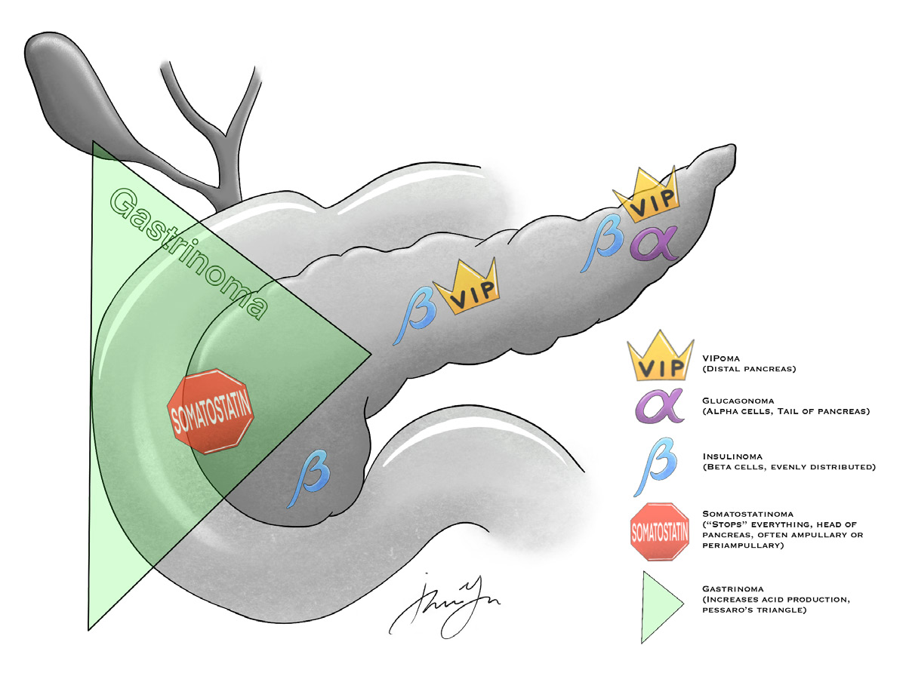
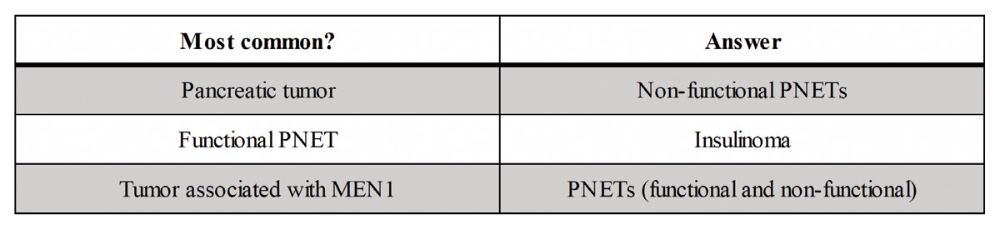

# 09 PANCREAS

---

<!-- Page 93 -->

93
09 PANCREAS

---

<!-- Page 94 -->

94
09 PANCREAS
Acute Pancreatitis
•	 Most common causes = ETOH, Gallstones
•	 Gallstone pancreatitis:  Clear the duct (ERCP vs IOC) → 
cholecystectomy during same admission
<4 weeks
>4 weeks
Non-necrotizing
Acute peri-
pancreatic fluid 
collection
Pseudocyst
Necrotizing
Acute necrotic 
collection
Walled off necrosis (you 
WON an operation)
Table 1 - Revised Atlanta Classification for post pancreatitis fluid collections
•	 Necrotizing pancreatitis
o Antibiotics? 
• No for pancreatitis
• No for necrotizing pancreatitis
• Yes, for necrotizing pancreatitis with signs of infection
• Clinical signs: fever, elevated WBC
• CT guided FNA with organisms
• Imipenem is antibiotic of choice
o Step-up approach — Answer for infected pancreatic necrosis 
used to be immediate OR for open debridement — 2010 
JAMA article showed improved outcomes with delayed OR 
with “step-up” approach

---

<!-- Page 95 -->

95
09 PANCREAS
Figure 1:  Step-Up Approach for Infected Pancreatic Necrosis
Chronic Pancreatitis
•	 Secondary to longstanding ETOH abuse, biliary tract disease, 
autoimmune, or idiopathic 
•	 What are the symptoms of chronic pancreatitis?
o Persistent abdominal pain, weight loss, pancreatic 
insufficiency (malabsorption, steatorrhea, diabetes) with hx 
of one or more bouts of pancreatitis
•	 What is the preferred imaging and findings?
o CT can confirm diagnosis - demonstrates fibrosis, atrophy, 
and calcification of the gland
•	 Chronic pancreatitis increases risk of pancreatic cancer
•	 Non-operative management — pain control, nutritional 
management, abstaining from ETOH, pancreatic enzyme 
replacement

---

<!-- Page 96 -->

96
09 PANCREAS
•	 Two main categories of operations for chronic pancreatitis: 
Decompress obstructed ductal system and resection of 
diseased tissue (Or combination of both) — several variations 
and very complex topic but main operations for the ABSITE 
are:
o Puestow Procedure — Longitudinal pancreaticojejunostomy
o Beger Procedure — Resection of pancreatic head up to 
wall of duodenum with either end to end or side to side 
pancreaticojejunostomy (Duodenum preserving pancreatic 
head resection)
o Frey Procedure — Lateral longitudinal 
pancreaticojejunostomy with an excavation of the pancreatic 
head (Core out head of pancreas but avoid pancreatic 
transection required of Beger procedure)
•	 Operative intervention depends on particular morphology of 
disease
o For dilated pancreatic duct (6mm or greater) would go with 
Peustow, so long as pancreatic head is normal
o If pancreatic head dominant disease with or without duct 
dilation  Frey procedure
o If distal pancreatic duct stricture with side branch changes 
and normal pancreatic head  distal pancreatectomy
o Minimal change pancreatitis  Resection and/or 
drainage will not help  denervation operation (bilateral 
thoracoscopic splanchnicectomy)
Pseudocyst
•	 More common with chronic pancreatitis, however, can occur 
after acute pancreatitis
•	 Most will resolve spontaneously  manage expectantly 
for at least 6 weeks (ideally 3mo) . Most will resolve in this 
time period, wait time also allows wall to mature . Consider 
intervention if  >6cm or symptomatic .
•	 Often associated with pancreatic duct abnormality  Need 
ERCP or MRCP prior to intervention

---

<!-- Page 97 -->

97
09 PANCREAS
o Available approaches include transpapillary endoscopic 
stenting, endoscopic transluminal drainage, open 
cystgastrostomy, laparoscopic cystgastrostomy 
o How I would answer: If given a patient with persistent 
abdominal pain following pancreatitis and contained fluid 
collection on CT  Image ductal system FIRST (ERCP 
or MRCP), then if it’s been at least 6 weeks open or lap 
cystgastrostomy .
Cystic Neoplasms of the Pancreas
•	 Many found incidentally on abdominal CTs done for other 
reasons  MRCP will provide better characterization and duct 
anatomy .
o EUS is helpful as well and allows for aspiration for cyst fluid 
analysis (CEA and Amylase)
•	 Management based on cyst characteristics and patient 
symptoms
o CEA >192 c/w mucinous cyst
o High amylase indicates ductal communication (pseudocyst 
or IPMN)
•	 Serous cystadenoma
o Predominantly benign
o Well circumscribed with characteristic central stellate scar on 
imaging
o Low CEA
o Resect only if symptomatic or growing on serial imaging
•	 Mucinous cystic neoplams (MCN)
o One of two mucinous lesions of the pancreas (along with 
IPMN)
o Have malignant potential
o Elevated CEA on FNA
o Radiographically: thick walled, single cyst with internal 
septations
o All MCNs should be resected in fit patients

---

<!-- Page 98 -->

98
09 PANCREAS
•	 Intraductal Papillary Mucinous Neoplasm (IPMN)
o Classification: Main Duct IPMN and Branch Duct IPMN 
(Mixed type managed like MD)
o Main Duct IPMN — higher risk of malignancy than BD-IPMN
• Endoscopic visualization of mucin secreting from a 
patulous “fish mouth” papilla is pathognomonic for MD 
IPMN
• Surgical resection is recommended for all main duct and 
mixed type IPMNs
o Branch Duct IPMN — lower risk of malignancy than MD-
IPMN
• Management based on Fukuoka guidelines
• Decision to resect based on fitness of patient for surgery, 
risk tolerance of patient, and individual cyst characteristics
• Consider resection for:
o “Worrisome Features” — cyst size >3cm, 
thickened cyst wall, nonenhancing mural nodules, 
lyphadenopathy, MPD >10mm, abrupt change in 
MPD size with distal atrophy
o EUS with mural nodules, main duct involvement, 
or suspicious cytology
o Young patient with cyst >2cm owing to cumulative 
risk of malignancy
•	 Age can indicate likely lesion
o Daughter  solid pseudopapillary
o Mother  mucinous
o Grandmother  serous

---

<!-- Page 99 -->

99
09 PANCREAS
Neuroendocrine Tumors of the Pancreas (PNETs)
Figure 2: PNET Distribution
•	 Comprise 1-2% of pancreatic tumors
•	 Frequently non-functional, but can also elaborate a number 
of bioactive peptides (gastrin, glucagon, somatostatin, insulin, 
VIP)
•	 If functional, clinical presentation is characteristic of hormone 
elaborated
•	 Nonfunctional pancreatic neuroendocrine tumor
o Majority (60-90%) of nonfunctional PNETs are malignant
o Most discovered late due to asymptomatic nature . Can be 
discovered incidentally or 2/2 symptoms from mass effect – 
Generally large at time of discovery with high metastasis rate
o MC in head of pancreas
• Tumors IN the head of the pancreas: insulINoma, 
gastrINoma, somatostatINoma
o Patients with locoregional disease should undergo resection

---

<!-- Page 100 -->

100
09 PANCREAS
•	 Insulinoma 
o Most common functional PNET
o Insulin secreted by beta-cells
o Most are benign (90%)
o Located throughout pancreas
o Associated with “Whipple Triad”
• Fasting hypoglycemia
• Neuroglycopenic symptoms (confusion, combativeness, 
seizures, visual changes, loss of consciousness)
• Relief of symptoms with administration of glucose
o Biochemical diagnosis and confirmation tests – If meet the 
below criteria, localization studies should be done
• Symptoms with plasma glucose <55mg/dL
• Insulin >18pmol/L
• C-peptide > 0 .6 ng/mL
• Proinsulin > 5 pg/mL
• Beta-hydroxybutyrate < 2 .7mmol/L
• An increase in plasma glucose of at least 25 mg/dL after 
administration of glucagon
o Localization studies
• 1 – Triphasic CT or MRI
• 2 – Endoscopic US
• 3 – If above unable to localize  Selective intra-arterial 
calcium injection with hepatic venous sampling for insulin
• Somatostatin scintigraphy is NOT effective
o Treatment
• Depends on location, suspicion for malignancy, and 
presence of other tumors
• Solitary, benign appearing tumors can be treated with 
enucleation
• Distal tumors may be treated with distal spleen 
preserving pancreatectomy 
• Suspicion for malignancy requires formal resection

---

<!-- Page 101 -->

101
09 PANCREAS
•	 Gastrinoma
o Gastrin stimulates acid secretion from parietal cells 
o Mostly malignant (60-90%)
o 2/3rd are located in Gastrinoma Triangle, a triangle formed 
by:
• Junction of the cystic duct and CBD
• Junction of the 2nd and 3rd portions of the duodenum
• Junction of the neck and body of the pancreas
o Associated with classic triad (abdominal pain, diarrhea, 
weight loss) in the presence of PUD
o Diagnostic and confirmatory tests
• Elevated fasting serum gastrin level – must be with a low 
gastric pH or high basal acid output (as use of PPI or H2 
blockers will raise gastrin levels)
• Fasting gastrin level >1000 pg/mL is diagnostic
• Elevated levels <1000 pg/mL  secretin stimulation 
test
o Gastrinoma will have a paradoxical effect from 
secretin (Increase >200 pg/mL with administration 
of secretin is diagnostic)
• Localization studies
o 1 . Triphasic CT or MRI
o 2 . Somatostatin receptor scintigraphy (SRS)
o 3 . EUS
o 4 . Possible selective intra-arterial calcium 
injection with hepatic venous sampling for gastrin 
(institution specific)
o Unable to localize  Exploration with the following 
maneuvers 
• Intraoperative U/S
• Transduodenal palpation
• Intraoperative upper endoscopy with 
transduodenal illumination
• Duodenotomy with palpation

---

<!-- Page 102 -->

102
09 PANCREAS
o Treatment
• Tumor in duodenal mucosa  enucleation and 
periduodenal lymph node dissection 
• Noninvasive tumors 5cm or smaller in head 
of pancreas  enucleation with periduodenal 
lymph node dissection
• Tumors >5cm or invasive in head of pancreas 
 Whipple
• Tumor in body and tail  distal pancreatectomy
•	 Glucagonoma
o Glucagon secreted from alpha islet cells and acts on 
hepatocytes and adipose tissue to increase gluconeogenesis 
and glycogenolysis 
o Mostly malignant (90%)
o MC location is tail of pancreas
o Associated with 4 D’s – dermatitis, diabetes, depression, and 
DVT
• DVT 2/2 a factor X-like antigen secreted by tumor
o Characteristic skin rash = necrolytic migratory erythema
o Diagnostic and confirmatory tests
• Glucose intolerance + fasting glucagon levels between 
1,000-5,000 pg/mL
o Localization studies
• Triphasic CT or MRI
• Somatostatin receptor Scintigraphy
• EUS
• Selective visceral angiography
o Treatment
• Resection with regional lymphadenectomy (no enucleation 
due to high malignant potential
• Usually distal pancreatectomy

---

<!-- Page 103 -->

103
09 PANCREAS
• What else is needed?
o Cholecystectomy (d/t possible need for prolonged 
somatostatin therapy)
•	 Somatostatinoma
o Somatostatin has a broad spectrum of inhibitory activity in 
the GI tract 
o Mostly malignant
o MC location is head of pancreas (duodenal location also 
common)
o Associated with cholecystitis, DM, malabsorption, 
steatorrhea
o Localization studies
• Triphasic CT or MRI
• Somatostatin receptor scintigraphy
• EUS
• Selective arteriography
o Treatment 
• Resection with regional lymphadenectomy (No enucleation 
due to high malignant potential)
• AND…?
• Cholecystectomy 
•	 VIPoma
o VIP is neuropeptide that stimulates secretion of fluids and 
electrolytes into lumen, also inhibits gastric acid secretion 
o Mostly malignant
o MC location is body or tail of pancreas (extra-pancreatic 
locations also possible: adrenal, retroperitoneum, 
mediastinum)
o Associated with WDHA syndrome (watery diarrhea, 
hypokalemia, achlorhydria) 
o Diagnostic tests
• Elevated fasting VIP levels when diarrhea is present

---

<!-- Page 104 -->

104
09 PANCREAS
o Localization studies 
• Triphasic CT of MRI
• Somatostatin receptor scintigraphy
• EUS
• Selective arteriography
o Treatment
• Resection with regional lymphadenectomy (no enucleation 
due to high malignant potential
• AND???
• Cholecystectomy (d/t possibly need for prolonged 
somatostatin therapy)
Table 21:  High-Yield PNET
Pancreatic Adenocarcinoma
•	 Risk factors: cigarette smoking, heavy ETOH use, chronic 
pancreatitis, increased BMI, longstanding DM
•	 Imaging
o Pancreatic protocol CT
o EUS can be complimentary to CT in patients with 
questionable involvement of lymph nodes or blood vessels
o PET/CT used selectively if suspicion for metastasis
•	 Role of staging laparoscopy? – Controversial . Used routinely 
by some, selectively by others only in patients at high risk for 
disseminated disease (borderline resectable, high CA 19-9, 
large primary tumor, large regional nodes, highly symptomatic)
•	 Biopsy?
o Pathologic diagnosis NOT required prior to resection
o Needed prior to neoadjuvant therapy or if unresectable, prior 

---

<!-- Page 105 -->

105
09 PANCREAS
to definitive chemotherapy 
•	 Role of preoperative biliary drainage?
o No effect on survival; associated with increased wound 
infections rates
o For resectable disease and not undergoing neoadjuvant 
therapy  Consider only if significant pruritis, cholangitis, 
coagulopathic .
o For patients undergoing neoadjuvant therapy  drain if 
jaundiced
o What kind of stent?
• Self-expanding metal stents are preferred because they 
are easy to place without dilation, have longer patency 
than plastic stents, and do not interfere with resection
•	 Resectability
o Resectable
• No arterial tumor contact
• <180-degree contact with SMV or PV without vein contour 
irregularity
o Borderline Resectable
• Tumor contact with SMA or celiac <180 degrees
• Tumor contact with common hepatic only (no celiac or 
proper hepatic involvement) allowing for resection and 
reconstruction
• Involvement of SMV or PV that is amenable to resection 
and reconstruction
• Tumor contact with IVC
o Unresectable 
• Distant metastasis
• >180-degree contact with SMA or celiac
• Unreconstructable involvement of SMV or PV
•	 Treatment
o Primary Surgery

---

<!-- Page 106 -->

106
09 PANCREAS
• Distal tumors present late and are usually too advanced at 
time of diagnosis for resection  Distal pancreatectomy 
and splenectomy if resectable
• Head of pancreas tumor  pancreaticoduodenectomy 
(Whipple procedure)
• If found to be unresectable at time of operation  
consider palliative biliary bypass, gastrojejunostomy, and/
or celiac plexus neurolysis depending on individual tumor 
characteristics and patient symptoms
• In absence of frank venous occlusion PV or SMV resection 
and reconstruction may be performed in order to obtain R0 
resection
o Perioperative therapy
• Recurrence rates are high, even with R0 resection  
Everyone gets adjuvant therapy
• FOLFIRINOX (FOLinic acid, Fluorouricil, IRINotecan, 
OXaliplatin)
• Neoadjuvant chemoradiation should be considered for 
those with borderline resectable disease (requires EUS 
with FNA for pathologic confirmation first)
Quick Hits
•	 Patient with history of multiple episodes of pancreatitis now 
presents with hematemesis . Diagnosis and management?
o Gastric varices from splenic vein thrombosis
o Treatment = Splenectomy
•	 Patient with multiple branch duct IPMNs on imaging .  There 
are multiple small benign appearing cysts throughout proximal 
pancreatic body with larger dominant one more distally with 
worrisome features . Management?
o Resect distal lesion, okay to leave smaller benign ones 
behind but will need surveillance
•	 48-year-old patient incidentally diagnosed with 2cm branch 
chain IPMN on abdominal CT . Microcytic anemia noted on 
laboratory w/u . What else does he/she need as part of work 
up?
o Colonoscopy — IPMN patients have higher incidence of 

---

<!-- Page 107 -->

107
09 PANCREAS
extra-pancreatic malignancies (MC - Colon adenocarcinoma)
•	 Syndromes associated with PNETs?
o MEN I
• Usually multiple PNETs – can be functional or non-
functional
•	 MC pancreatic tumor?
o Nonfunctional
•	 MC functional tumor?
o Gastrinoma
•	 Patient presents with episodes of fasting hypoglycemia and 
dizziness that resolves with glucose administration . C-peptide 
is checked and is low .  Diagnosis?
o Exogenous (factitious) insulin administration
•	 Medical management of functional neuroendocrine tumors of 
pancreas?
o Octreotide; except for…Insulinoma  
•	 Somatic mutations associated with pancreatic 
adenocarcinoma?
o KRAS, TP53, CDKN2A, SMAD4
•	 Biomarkers associated with pancreatic adenocarcinoma?
o Many, but CA 19-9 is best validated and most clinically useful
•	 During pancreaticoduodenectomy for pancreatic 
adenocarcinoma, a clinically positive lymph node is 
encountered outside the field of resection.  Should you:
o A . Leave it alone
o B . Perform regional lymphadenectomy
o C . Sample the node but not perform complete regional 
lymphadenectomy
• Answer = C . Nodal metastasis are a marker of systemic 
disease and removal is unlikely to alter overall survival . 
Outside of a clinical trial a regional lymphadenectomy 
should not be performed during Whipple procedure . 

---

<!-- Page 108 -->

108
09 PANCREAS

## Figures

