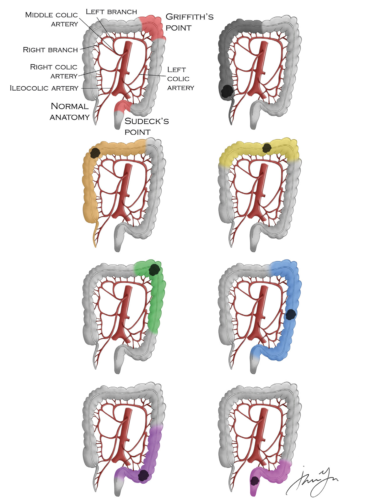
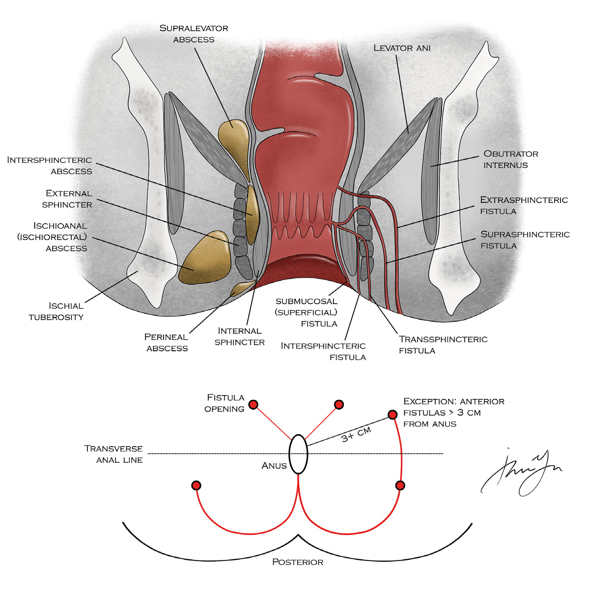
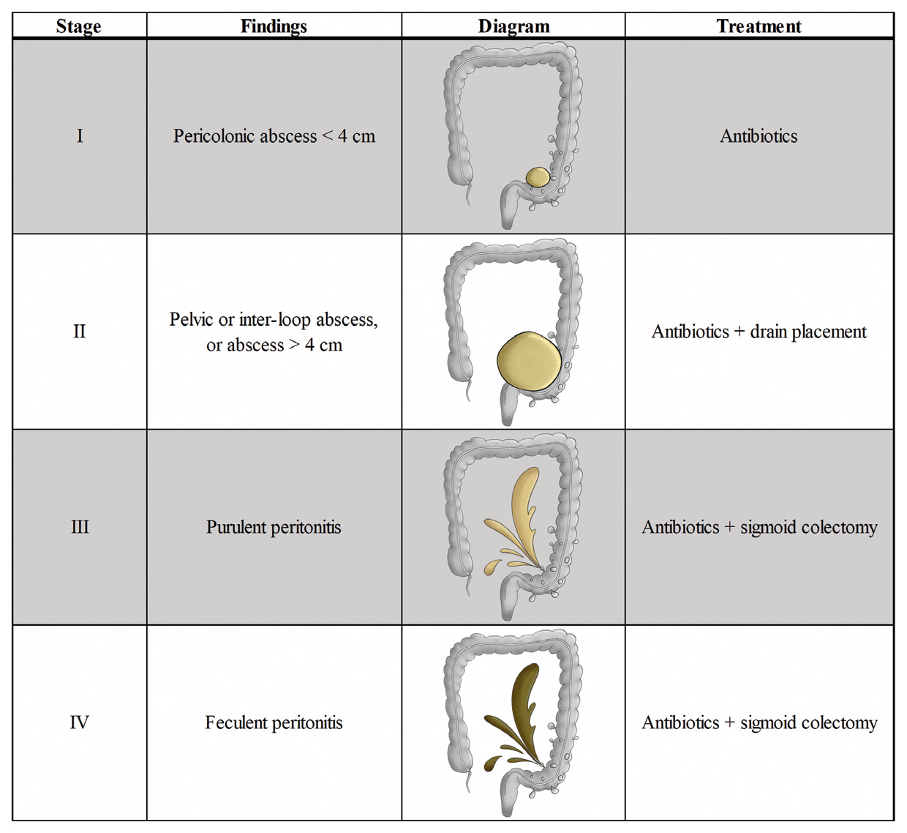
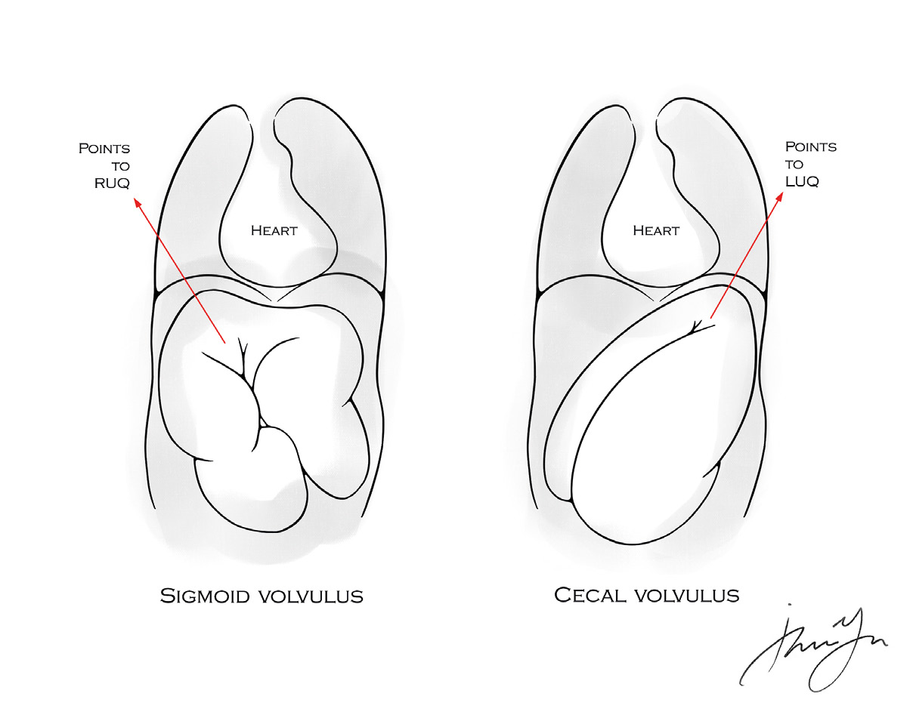
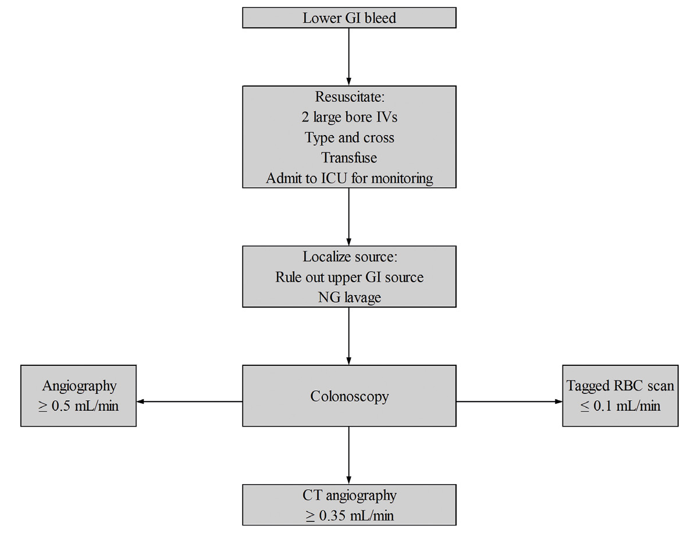
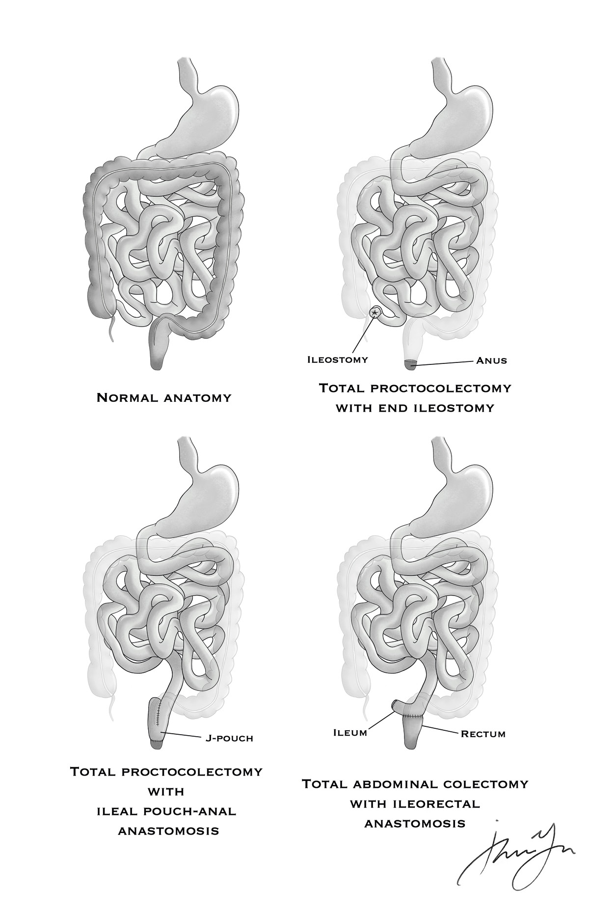
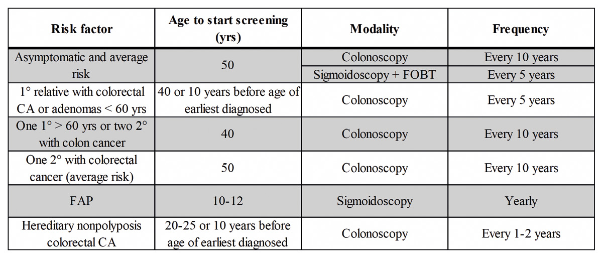
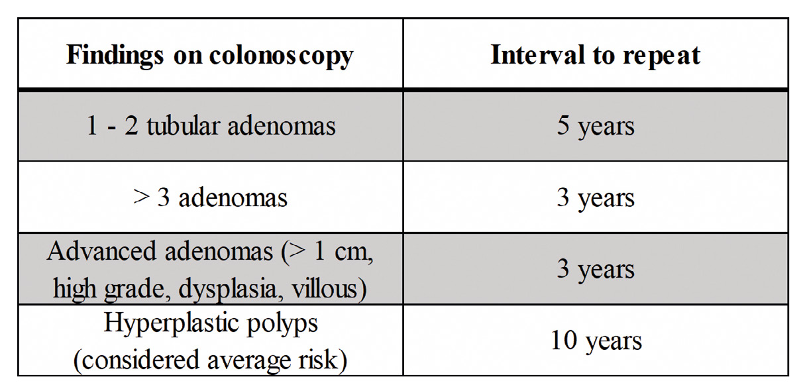
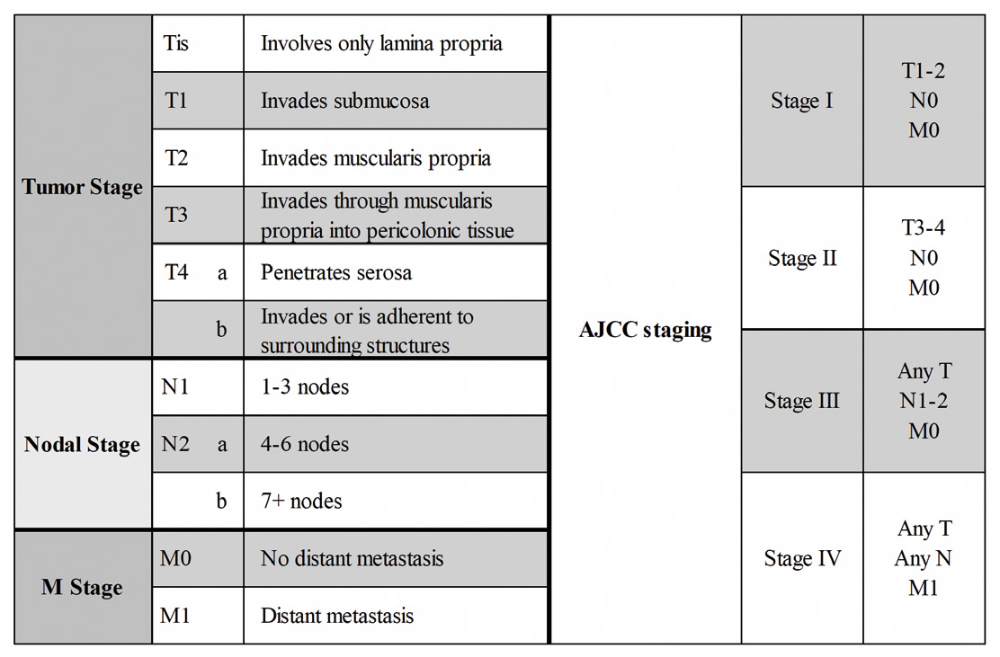

# 10 Colorectal

---

<!-- Page 109 -->

109
10 COLORECTAL

---

<!-- Page 110 -->

110
10 COLORECTAL
High Yield Anatomy
•	 What are the dimensions of the colon?
o Approximately 5- 6 feet in length, with the rectum 
encompassing approximately 15 cm
o Normal caliber is 3-8 cm, cecal diameter > 9 cm is abnormal
•	 Which portions of the colon are retroperitoneal?
o Ascending
o Descending
•	 What is the blood supply to the colon?
o Superior mesenteric artery
• Terminal branch = ileocolic artery  TI, cecum
• Right and middle colic arteries  ascending and proximal 
2/3rd of the transverse colon
o Inferior mesenteric artery
• Left colic  distal 1/3rd of the transverse colon and 
descending
• Sigmoid branches  sigmoid colon
• Superior rectal artery  proximal rectum 
o Collaterals
• Marginal artery  along the colon wall connecting the 
SMA and IMA
• The Arc of Riolan (meandering mesenteric artery)  
smaller connection between the SMA and IMA
•	 What are the “watershed” areas of the colon:
o Splenic flexure – SMA/IMA connection (Griffith’s point)
o Rectal/sigmoid – superior/middle rectal artery connection 
(Sudeck’s point)

---

<!-- Page 111 -->

111
10 COLORECTAL
Figure 1 – Vascular anatomy of the colon with tumor resection margins
•	 What is the blood supply to the rectum?
o Superior rectal (hemorrhoidal) artery - branch of IMA
o Middle rectal (hemorrhoidal) artery - branch of internal iliac 
(hypogastric) artery

---

<!-- Page 112 -->

112
10 COLORECTAL
o Inferior rectal (hemorrhoidal) artery- branch of internal 
pudendal  from internal iliac
Remember to check groin lymph nodes for low rectal 
cancers .
 
•	 What is the venous drainage of the rectum?
o Superior rectal vein  IMV  portal circulation
o Middle and Inferior rectal veins  internal iliac vein  
systemic circulation
•	 What are the proximal and distal extents of the rectum?
o Proximal extent starts where the taeniae splay
o Distal extent is the anal canal (15 cm from anal verge)
•	 What defines the anal canal?
o Begins at puborectalis sling (anorectal ring)  ends at anal 
verge = squamous mucosa blending with the perianal skin
•	 What defines the anal margin?
o Extends 5 cm radially from squamous mucocutaneous 
junction 
PART ONE
Anal Fissure 
o	Where do anal fissures present?
• 90% located within posterior midline
• Females can have anterior fissures in 25% of cases
o	What is the first line treatment?
• Non-operative management
• Psyllium or other bulking agent, sitz baths +/- topical 
anesthetic 
• Topical nitrates  side effects = headaches
• Topical calcium channel blockers have similar efficacy to 
nitrates without the side effects

---

<!-- Page 113 -->

113
10 COLORECTAL
• Botulinum toxin has modest healing rates for those who 
fail topical therapy
 
Incontinence with botulinum injection is a contraindication 
for LIS.
o	What are the surgical options?
• Lateral internal sphincterotomy
• LIS has superior efficacy to nonoperative treatments, but 
has a small risk of fecal incontinence
• Contraindications: women of childbearing age, prior 
obstetrical injuries, IBD, or history of sphincter dysfunction/
incontinence
• Anocutaneous flap
• Has inferior healing rates to LIS but lower incidence of 
fecal seepage/incontinence
• Can be performed in addition to LIS or botulinum injection
Anorectal Abscess/Fistula-in-Ano
o	Anorectal Abscess
• Where do anorectal abscesses occur?
• Defined by the anatomic space they occupy
• Intersphincteric- between the internal and external 
sphincter muscles
• Ischiorectal (ischioanal)- lateral to the rectal wall in the 
space next to the ischial tubercle
• Perirectal/Perianal – right around the anus
• Supralevator – above the levator muscle
• Submucosal – under the mucosa in the anal canal
• Deep postanal space
• Bilaterally ends in the ischiorectal fossa
• “Floor” is the anococcygeal ligament
• “Ceiling” is the levator muscle

---

<!-- Page 114 -->

114
10 COLORECTAL
Figure 2 – Anorectal anatomy
• What is the primary treatment?
• Drainage
• Superficial perianal and ischiorectal – external incision 
and drainage
• Deeper intersphincteric and supralevator – internal 
transanal drainage
• Who needs antibiotics after drainage?
•  If there is cellulitis, systemic signs of infection, or 
underlying immunosuppression
• What is the risk of developing fistula in ano?
• One-third of patients with anal abscess will develop 
FIA

---

<!-- Page 115 -->

115
10 COLORECTAL
o	Fistula in Ano (FIA)
• How are anal fistulae defined?
• Relationship to sphincter muscles
• Intersphincteric – most common type and runs 
between the internal and external sphincter muscles
• Transsphincteric – runs across both the internal and 
external sphincter muscles
• Can also be categorized as high (>1/3rd of the 
muscle complex) or low (< 1/3rd of the muscle 
complex)
• Suprasphincteric – runs between the muscles and up 
and over the external sphincter
• Extrasphincteric – runs over and above (outside) of the 
sphincter complex
• Submucosal
• What are the general principles of management?
• If superficial, simple fistula with minimal or no sphincter 
involvement discovered at the time of I&D for abscess  
okay to perform fistulotomy at time of drainage
• If involves more than 25% of sphincters  drain abscess 
and place seton
• Seton induces fibrosis of tract
• Goal is to convert high fistula to low fistula and prepare 
tract for later procedures
• LIFT = Ligation of Intersphincteric Fistula Tract
• Good option for fistulas not amenable to simple 
fistulotomy
• Anorectal advancement flap +/- LIFT
• Always done after seton placement
Avoid selecting fistula plug or fibrin glue as the answer.
 

---

<!-- Page 116 -->

116
10 COLORECTAL
Hemorrhoids
o	What are hemorrhoids?
• Vascular cushions or sinusoids in the anal canal that help 
with gross continence
o	Where is the division between internal and external 
hemorrhoids?
• Dentate/pectinate line
• Innervation is somatic below the dentate line and autonomic 
above (i .e . external hemorrhoids are painful)
o	What are the common symptoms of hemorrhoidal disease?
• Bleeding, swelling, thrombosis
• Internal hemorrhoids predominately prolapse and bleed
• External hemorrhoids predominately present with pain after 
clotting
o	What is the classification of internal hemorrhoids?
• I – internal only
• II – prolapse and spontaneously reduce
• III – prolapse and manually are reducible
• IV – prolapse and are not reducible
o	How do you manage hemorrhoidal disease?
• Bowel hygiene: no prolonged sitting or straining at the toilet, 
fiber (25-35g/day), and plenty of fluid
• Internal hemorrhoids can be banded
• Risks- pain, bleeding, ulcer, and small risk of Fournier’s 
gangrene
• Symptomatic/thrombosed external hemorrhoid can be 
excised 
Never choose banding or incision and drainage for external 
hemorrhoids.
Diverticulitis
o	What is the Hinchey classification?

---

<!-- Page 117 -->

117
10 COLORECTAL
Table 1 – Hinchey classification of diverticulitis
o	What constitutes complicated disease?
• Perforation, abscess, fistula, obstruction, stricture
• Phlegmon (contained area of inflammation) or extra-luminal 
gas alone does NOT constitute complicated disease
o	What is the management of a clinically stable, reliable patient 
with uncomplicated disease who can tolerate oral hydration?
• Outpatient treatment with oral antibiotics to cover gram 
+ and gram – (e.g. amoxicillin/clavulanate, levofloxacin/
metronidazole)
o	What about a patient with complicated disease or who cannot 
tolerate oral hydration?
• This requires admission, IV hydration, and IV antibiotics 
(piperacillin/tazobactam or levofloxacin/metronidazole)
• May require operative or percutaneous intervention

---

<!-- Page 118 -->

118
10 COLORECTAL
o	How about a patient presenting unstable and/or with diffuse 
peritonitis?
• OR for urgent sigmoid colectomy
• While there is literature to support primary anastomosis in 
select patients even in Hinchey III/IV disease, safest answer 
is Hartmann’s
Avoid selecting laparoscopic lavage. If in the OR urgently/
emergently  resect.
o	What if the patient is stable with an abscess?
• Depends on the size and somewhat controversial, but in 
general:
• < 3 cm generally resolve with antibiotics
• > 3 cm should consider percutaneous drainage
• What if the abscess is inaccessible by IR and not resolving 
with medical management?
• May be candidate for laparoscopic drain placement
• Goal is to let acute phase resolve so patient may undergo 
elective, single stage colectomy at later date
o	Patient with single episode of uncomplicated diverticulitis 
diagnosed on abdominal CT was successfully treated 
nonoperatively . What is the next step?
• If no recent colonoscopy  needs colonoscopy, typically 6 weeks 
after resolution of episode
• To rule out underlying ischemia, IBD, or neoplasm
o	When would you recommend an elective sigmoid colectomy?
• For uncomplicated disease:
• Difficult question - used to be based on number of 
episodes and age; however, we now know that the 1st 
episode tends to be the worst and multiple uncomplicated 
episodes does not necessarily increase the risk of needing 
an emergent colectomy and stoma
• Decision for elective colectomy is now highly individualized

---

<!-- Page 119 -->

119
10 COLORECTAL
• Consider individual risk of surgery based on co-
morbidities and general health of patient
• Effect of diverticulitis episodes on lifestyle and career
• Suspicion for neoplasm?
• Chronic symptoms (smoldering disease)?
• Complicated disease
• Elective colectomy should generally be offered to patients 
after recovery from a complicated episode of diverticulitis .
Clostridium Difficile Infection (CDI)
o	What is clostridium difficile?
• Anaerobic, gram positive rod
o	What is the medical management?
• Metronidazole (500 mg TID) and vancomycin (125 mg QID) 
are first line oral options
• Previously, metronidazole was first line for mild to 
moderate disease and vancomycin was first line for severe 
disease
• Vancomycin is now first line with fidaxomicin as the 
alternative
• Vancomycin enemas are also an option
• Fidaxomicin = oral macrolide with activity against resistant 
strains, usually requires ID consult
• Probably not the answer on the boards
• Patients with refractory CDI can be considered for fecal 
transplant if conventional methods have failed
o	When is surgery required?
• Surgery reserved for severe colitis that fails to respond to 
medical therapy
• Outside of obvious indications like perforation and 
generalized peritonitis, the decision to operate can be very 
difficult
• Multisystem organ failure is an ominous sign – you’ve 
waited too long; perforation is also associated with high 
mortality

---

<!-- Page 120 -->

120
10 COLORECTAL
• Consider early operative intervention in patients requiring 
vasopressors or signs of impending sepsis
• What is the procedure of choice?
• Subtotal colectomy with ileostomy
A diverting loop ileostomy with colonic lavage and 
antegrade vancomycin enemas is another surgical option, 
but not on the exam.
 
Colonic Volvulus
o	Sigmoid volvulus 
• What is the radiographic finding on plain films? 
• Bent inner tube sign – apex points to RUQ
• What are your next steps?
• Contrast enhanced CT to confirm diagnosis and assess 
colon viability
• If no colonic ischemia or perforation on CT  endoscopic 
detorsion with decompression tube left in place for 1-3 days
• High long-term recurrence rate after initial endoscopic 
detorsion  consider sigmoid colectomy during index 
admission in appropriate patients
• What operation do you perform if emergent indications?
• Safest answer = open sigmoidectomy with end colostomy 
(Hartmann)
• What operation do you perform in the semi-elective setting 
after successful detorsion?
• Open sigmoid colectomy with anastomosis
Case scenario is usually an elderly, nursing home patient 
on antipsychotics with history of constipation.
o	Cecal volvulus
• What is the radiographic finding?

---

<!-- Page 121 -->

121
10 COLORECTAL
• Coffee bean pointing to the left upper quadrant
• How do you manage this?
• Endoscopic reduction is NOT recommended – rarely 
successful with high recurrence
• These patients need to go to OR  resect if dead bowel
• How do you decide on resection vs pexy?
• Data is limited - resection has lower recurrence but may 
have higher procedure-related morbidity than pexy
• Both are acceptable answers
• Safest answer = resection (ileocecectomy or right 
hemicolectomy) with primary anastomosis
Never choose cecostomy, endoscopic detorsion, or operative 
detorsion alone.
Figure 3 – Appearance of colonic volvulus on plain film

---

<!-- Page 122 -->

122
10 COLORECTAL
Acute Colonic Pseudo-Obstruction (Ogilvie’s)
o	What are the risk factors for Ogilvie’s?
• High dose opiates, electrolyte abnormalities, etc .
o	What are the risk factors for perforation?
• Cecum > 12 cm or duration > 6 days
o	What is the initial treatment if no signs of ischemia and cecum 
< 12 cm?
• Supportive care and correct underlying cause: correct 
electrolytes, fluid resuscitation, minimize narcotics and 
anticholinergic medications, treat infection, bowel rest and 
decompression
o	What if patient is not improving with supportive care?
• Neostigmine = anti-acetylcholinesterase, promotes colonic 
transit
• What is the most common side effect?
• Bradycardia  need to give in a monitored setting
o	What if the patient is not responsive to neostigmine or 
neostigmine is contraindicated?
• Endoscopic decompression
o	How do you manage ischemia or perforation?
• OR for resection (ostomy vs anastomosis +/- diversion on 
case by case basis)
Rectal Prolapse
o	How do you diagnose rectal prolapse?
• Full thickness intussusception of the rectal wall with visible 
concentric rings (important to differentiate from prolapsed 
hemorrhoids)
o	What is the common patient presentation?
• Higher incidence in elderly females, developmentally 
delayed, and psychiatric co-morbidities with multiple meds, 
straining and chronic diarrhea
o	What are the goals of surgery?

---

<!-- Page 123 -->

123
10 COLORECTAL
• Eliminate prolapse through either resection or restoration of 
normal anatomy
• Correct associated functional abnormalities
• Avoid creation of de novo bowel dysfunction
o	What is the mainstay of treatment?
• Surgery
• Low risk– Transabdominal rectal fixation (rectopexy)
• Open vs laparoscopic have equivalent recurrence 
rates, improved morbidity with laparoscopic approach
• Rectopexy is the key component
• If patient has constipation  add LAR or sigmoid resection 
to rectopexy
• High risk (older, multiple co-morbidities, cannot tolerate 
general anesthetic) – Perineal proctosigmoidectomy 
(Altemeier procedure)
• Lower morbidity but higher recurrence and less 
durable 
• High fiber diet
Quick Hits
•	 What is the main nutrient of colonocytes?
o  Butyrate (short chain fatty acids)
Glutamine is the primary source for small bowel enterocytes.
•	 Patient with sigmoid volvulus on CT  on endoscopy mucosa 
is dusky with ulceration . Next step?
o Abort endoscopy  OR for urgent sigmoidectomy
•	 Patient with anal fissure lateral or multiple fissures. What do 
you worry about?
o	
Crohn’s disease, HIV, syphilis, tuberculosis

---

<!-- Page 124 -->

124
10 COLORECTAL
•	 You take septic patient with fulminant C diff colitis to ex lap for 
planned total abdominal colectomy but upon opening the colon 
looks normal . What do you do?
o C diff is mucosal disease  proceed with TAC and end 
ileostomy
•	 What is the management of a lower GI bleed?
o 1st steps – Resuscitate – 2 large bore IVs, type and cross, 
transfuse, admit to ICU for monitoring
o Localize the source – 
• R/o upper GI source – NG lavage
• Colonoscopy, angiography, and/or tagged RBC scan
• Recommendations of which to perform first vary and are 
institution specific – would say colonoscopy on test if it’s 
an option
• Most will stop spontaneously  If stops initially and then 
rebleeds can try 2nd attempt at localization as long as 
patient is stable
o If patient unstable and/or ongoing transfusion requirement 
• Segmental colectomy if bleeding source localized by 
colonoscopy, angiography, or tagged RBC scan
• TAC if unable to localize

---

<!-- Page 125 -->

125
10 COLORECTAL
Figure 4 – Management approach for lower GI bleed
PART TWO
Ulcerative Colitis
o	How is UC defined?
• Chronic inflammatory condition affecting rectum and 
extending proximally (spares anus)
• Buzzwords: mucosal disease, contiguous, characteristic 
crypt abscesses and pseudopolyps
o	What is the management?
• Most can be managed medically with 15-30% eventually 
requiring surgery
• Steroids for acute flares, mesalamine maintenance, 
infliximab added if resistant
o	What are indications for surgical intervention?
• Medical intractability (most common), malignancy, and other 
complications from colitis (stricture, perforation, fulminant/
toxic colitis)

---

<!-- Page 126 -->

126
10 COLORECTAL
o What constitutes “medical intractability?”
• Growth failure in children
• Condition worsens while on medical therapy
• Condition is insufficiently controlled with maximal medical 
therapy – somewhat vague, but essentially patient can’t 
achieve adequate quality of life
• Risk of chronic medical therapy is not tolerated (e .g . chronic 
steroids)
• Disabling extra-intestinal manifestations that may respond to 
colectomy (e .g . large joint arthropathy, erythema nodosum, 
episcleritis)
• What about hepatobiliary manifestations?
• Typically, do NOT respond to colectomy (e .g . primary 
sclerosing cholangitis)
o	What is the association between UC and malignancy?
• Increased risk of malignancy associated with prolonged 
inflammation
• Surveillance recommendations;
• Patients with extensive colitis (proximal to splenic flexure)
• Endoscopy after 8 years of disease and then every 1-2 
years
• 4 quadrant random biopsy should be performed at 10 
cm intervals throughout involved segment of colon – 
along with directed biopsies of suspicion lesions
• What do you do if there is malignancy or high-grade 
dysplasia?
• Total proctocolectomy with or without IPAA
o	What are the surgical options?
• If emergent (toxic colitis, perforation, etc .)  total or subtotal 
colectomy with end ileostomy
• Later may perform completion proctectomy and IPAA

---

<!-- Page 127 -->

127
10 COLORECTAL
• Elective options
• Total proctocolectomy with end ileostomy = curative, 
removes all pathologic tissue
• Commits patient to lifelong ileostomy
• Total proctocolectomy with IPAA – MC procedure in elective 
setting
• Advantage of no stoma, but may have complications 
related to pouch (e .g . pouchitis)
• Must have good baseline continence prior to IPAA
• Must be sure it’s UC and not Crohn’s (Distal ileum used for 
ileal pouch)
• TAC with ileorectal anastomosis
• Only used in highly select cases
• Must have uninvolved rectum (rare)
• Rectum still at risk for ongoing disease and risk of CA  
Needs annual surveillance of residual rectal cuff

---

<!-- Page 128 -->

128
10 COLORECTAL
Figure 5 – Operative options for ulcerative colitis
Crohn’s Disease
o	How is Crohn’s disease described?

---

<!-- Page 129 -->

129
10 COLORECTAL
• Chronic, incurable, inflammatory disorder that can affect any 
segment of the intestinal tract (TI most common, usually 
spares rectum)
• Bimodal distribution (20-30s; 50-60s)
• Buzzwords: transmural involvement, segmental, 
characteristic creeping fat
UC is limited to the mucosa and affects the colon 
continuously.
• Phenotypes: inflammatory, fibrostenotic, penetrating (can 
overlap and change)
• Extraintestinal manifestations – arthritis/arthralgias, 
megaloblastic anemia (2/2 malabsorption of B12 in TI), 
uveitis, erythema nodosum
o	What is the medical treatment?
• Steroids for acute flares, 5-ASA/mesalamine for 
maintenance, infliximab for resistant disease
o	When is surgery indicated?
• Surgery is not curative unlike UC
• Reserved for complications of disease – stricturing, 
obstruction, malignancy, perforation, fistula
• Preserve as much small bowel as possible (often need 
multiple resections over course of lifetime)
o	What is the management of symptomatic strictures?
• If able to reach endoscopically – can try endoscopic dilation 
first
• Otherwise – resection or stricturoplasty
• Resection is most commonly performed – especially if 
isolated short segment disease
• Stricturoplasty is useful for preserving bowel length if there 
is concern for existing or impending short gut
• Type of stricturoplasty depends on length of stricture:
• Short strictures (< 10 cm) – Heineke-Mikulicz 
stricturoplasty

---

<!-- Page 130 -->

130
10 COLORECTAL
• Longitudinal incision on stricture and close 
transversely
• Medium-length strictures (10-20 cm) – Finney 
stricturoplasty
• Fold strictured segment on itself and make a 
common channel in the loop 
• Long strictures (> 20 cm) – Michelassi
• Similar to Finney – side-to-side isoperistaltic 
stricturoplasty
• Perform biopsies of strictured segment – Don’t 
inadvertently leave a malignancy behind for the 
sake of preserving bowel length
• Malnutrition, presence of inflammation/
perforation/fistula, and suspicion for malignancy 
are contraindications for stricturoplasty
Colon Cancer
o	What are the screening recommendations?
Table 2 – Colorectal cancer screening recommendations
o	If patient has a personal history of adenomas what is the 
recommended surveillance interval?

---

<!-- Page 131 -->

131
10 COLORECTAL
Table 3 – Colonoscopy surveillance recommendations
• What if a malignant polyp was found?
• Malignant pedunculated or sessile polyps may be 
managed endoscopically if the following criteria are met:
• Polyp can be removed in 1 piece
• Resection margins free of dysplasia or cancer
• Lesion is well or moderately differentiated and no 
angiolymphatic invasion
• Limited submucosal invasion (cancer cells 2mm or 
less past muscularis mucosa)
• Malignant polyps that do not meet low-risk criteria or 
cannot be adequately removed via endoscopic techniques 
 oncologic resection
o	One of the few cancers that you absolutely need to know the 
staging . What is the TNM staging?

---

<!-- Page 132 -->

132
10 COLORECTAL
Table 4 – Colon cancer staging
• Positive lymph node defined as 0.2 mm deposit of cancer 
cells
o	What extent of proximal and distal margin is required?
• Ideally 5-7 cm to ensure adequate lymphadenectomy 
o	How many nodes are needed?
• At least 12
o	What is the management of Stage IV disease?
• Should classify as 1) resectable, 2) potentially resectable (if 
able to downstage with standard chemotherapy regimens), 
or 3) unresectable
• Resectable
• In medically fit patients, curative resection of hepatic and/
or pulmonary metastases can be performed
• Sequence of chemotherapy, resection of primary 
tumor, and resection of metastasis varies widely 
by surgeon, institution, and individual patient/tumor 
characteristics 
• Safe answer if given resectable colon CA with hepatic 
metastasis: 3 months of preoperative FOLFOX  
surgery  3 months of postop FOLFOX

---

<!-- Page 133 -->

133
10 COLORECTAL
• Potentially resectable disease should receive preoperative 
FOLFOX  re-evaluate resectability based on response
• Unresectable 
• Surgery only for palliation (obstruction, bleeding, 
perforation)
• If obstruction  stenting is preferable to colectomy or 
diversion
o	Adjuvant therapy 
• Who gets adjuvant therapy?
• In general, Stage III and above (positive nodes or M1)
Adjuvant therapy for “high-risk” stage II disease (T4 
primary, perforation/obstruction, poorly differentiated, <12 
nodes harvested) is not standard of care.
• What is the regimen?
• FOLFOX for 6 months (or 3 mo preop + 3 mo postop)
• Folinic acid (leucovorin)
• Fluorouracil (5-FU)
• Oxaliplatin 
• Radiation is not indicated for colon cancer
Rectal Cancer
o	What is the workup for newly diagnosed rectal cancer?
• Labs including CEA
• Rigid proctoscopy to document level of tumor
• CT chest/abdomen/pelvis to evaluate metastatic disease
• Endorectal U/S (EUS) or Rectal MRI for T and N stage
• MRI is particularly helpful in determining tumor 
circumferential margin (CRM)
• CRM = total distance between tumor and mesorectal 
fascia
• Very important prognostic indicator

---

<!-- Page 134 -->

134
10 COLORECTAL
o	Who gets neoadjuvant chemoradiotherapy?
• Locally advanced tumors of mid-distal rectum (T3 or greater 
or any N+ disease)
• What is the regimen?
• 5000 cGy radiotherapy delivered concurrently with 5-FU 
chemotherapy delivered over 5-6 weeks  surgery to 
follow roughly 8-12 weeks after 
• 5-FU is a radiosensitizer
o	Surgical Management
• When is local excision an option?
• Consider for T1 lesions without high-risk features
• Well to moderately differentiated lesions, no 
lymphovascular or perineural invasion, < 3 cm, and < 
1/3rd of circumference of bowel lumen
• Big issue here is not able to pathologically examine 
regional lymph nodes
• Patient counseling is key: up to 20% local recurrence rate 
for T1 lesions
• If good surgical candidate wound lean toward 
resection
Local excision can be performed for T2 lesions in poor 
surgical candidates but is likely not the correct answer for 
the exam.
• How do you manage tumors of upper 3rd of rectum?
• Tumor specific mesorectal excision with 5 cm distal margin
• What about tumors of the mid to lower 3rd of rectum?
• Total mesorectal excision (TME) as part of LAR or APR
• With TME – 2 cm distal margins are ideal, 1 cm okay if 
very distal
• If can’t get this margin with sphincter preservation  
needs APR

---

<!-- Page 135 -->

135
10 COLORECTAL
o	What is the adjuvant therapy?
• FOLFOX recommended for:
• Stage III or greater who did not receive neoadjuvant (in 
other words, patient was understaged during preop w/u)
• High-risk stage II or greater who received neoadjuvant 
therapy
• In this case, we assume that pathologic high-grade 
stage II disease is the result of downstaging by 
neoadjuvant therapy
Anal Squamous Neoplasms
o	How will these be described?
• Histologic variants: cloacogenic, basaloid, epidermoid, 
mucoepidermoid
• You need to know these because they will try to trick you by 
giving you a patient with an anal mass that was biopsied, 
and path returns as one of these variants . Recognize that 
you are dealing with anal SCC
• They try to get you to do an APR when what the patient 
needs is primary chemoradiotherapy (Nigro) . 
o	What HPV serotypes are associated with anal SCC?
• 16 and 18
o	Who has a higher incidence of anal SCC?
• Immunosuppressed patients
o	What is anal intraepithelial neoplasm (AIN)
• Precursor lesion to SCC
• Many confusing classification systems exist
• Know this:
• AIN I, II, and III correspond to low-moderate-high grade 
dysplasia, respectively
• Low grade AIN (LGAIN) = AIN I/II
• High grade AIN (HGAIN) = AIN III
o	What is the primary treatment for SCC of anal canal?

---

<!-- Page 136 -->

136
10 COLORECTAL
• Chemoradiotherapy (Nigro Protocol)
• 5-FU, Mitomycin C, and 3000 cGy XRT
o	What do you do with persistent or recurrent SCC of anal canal 
after primary CRT?
• APR
o	How do you manage SCC of the anal margin?
• Treat like skin CA  WLE
The anal margin extends 5 cm radially from the squamous 
mucocutaneous junction.
o	What is the treatment of HGAIN/LGAIN?
• Overall low rate of conversion to SCC (higher in 
immunosuppressed)
• Several local treatments can be used:
• Topical 5% imiquimod
• Topical 5% 5-FU
• Photodynamic therapy
• Targeted destruction
• Probably most important part of any of above treatments is 
close clinical f/u with surveillance every 4-6 months
• Some advocate observation with surveillance alone 
o	Anal melanoma is treated with APR
Quick Hits
•	 Transverse colon cancer with local invasion of head of 
pancreas, no evidence of metastatic disease . How do you 
treat?
o Resect en bloc: Whipple + extended hemicolectomy
•	 Treatment of isolated peritoneal carcinomatosis 2/2 colon CA?
o Carcinomatosis often associated with widespread 
metastasis . However, if isolated  cytoreductive surgery 
with intraperitoneal chemotherapy

---

<!-- Page 137 -->

137
10 COLORECTAL
•	 What do you do with rectal cancer with apparent complete 
clinical response to neoadjuvant therapy?
o Current imaging (CT, MRI, PET) cannot reliably predict 
complete clinical response  this patient still requires 
resection
•	 Patient referred for “hemorrhoid.” On exam has 1 cm palpable 
mass of anal canal . Biopsy performed in clinic returns 
epidermoid carcinoma . Management?
o Primary chemoradiotherapy (Nigro protocol)
o This is a variant of SCC
•	 Patient with prior proctocolectomy and IPAA for UC presents 
with fever, pelvic pain, and increased frequency of stools. 
Flexible endoscopy shows mucosal inflammation of ileal 
pouch . Diagnosis?
o Pouchitis
o Treatment?
• Antibiotics (ciprofloxacin/metronidazole), supportive care
• Budesonide enemas if not responsive to antibiotics
o Chronic pouchitis  suspect Crohn’s
o Severe refractory pouchitis may require pouch excision and 
ileostomy
•	 During laparoscopic exploration for presumed acute 
appendicitis, appendix appears normal, but TI inflamed. What 
do you do?
o Suspect Crohn’s
o If cecum uninvolved  appendectomy to prevent future 
diagnostic confusion
o If cecum inflamed  leave appendix in place
o Either way, treat medically for acute Crohn’s flare.

---

<!-- Page 138 -->

138
10 COLORECTAL

## Figures

