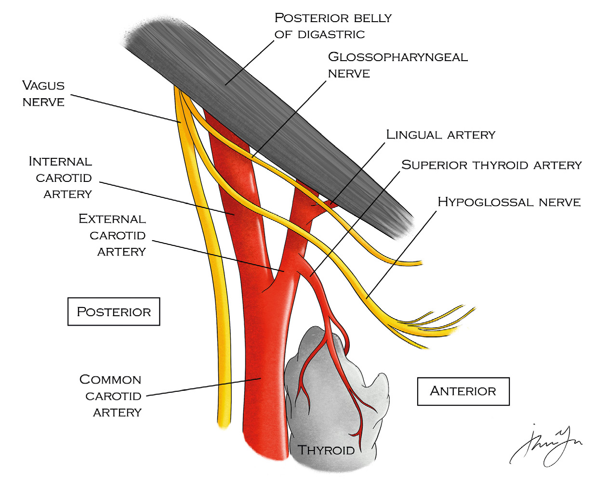
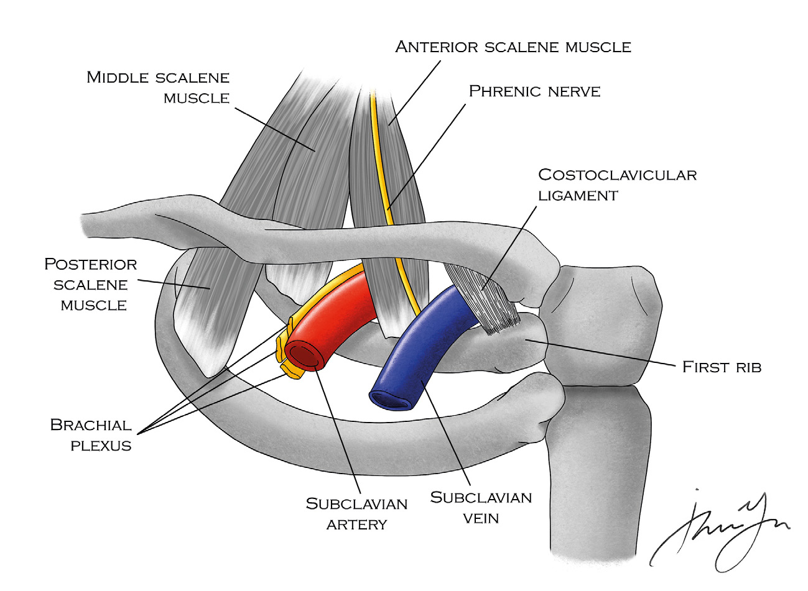
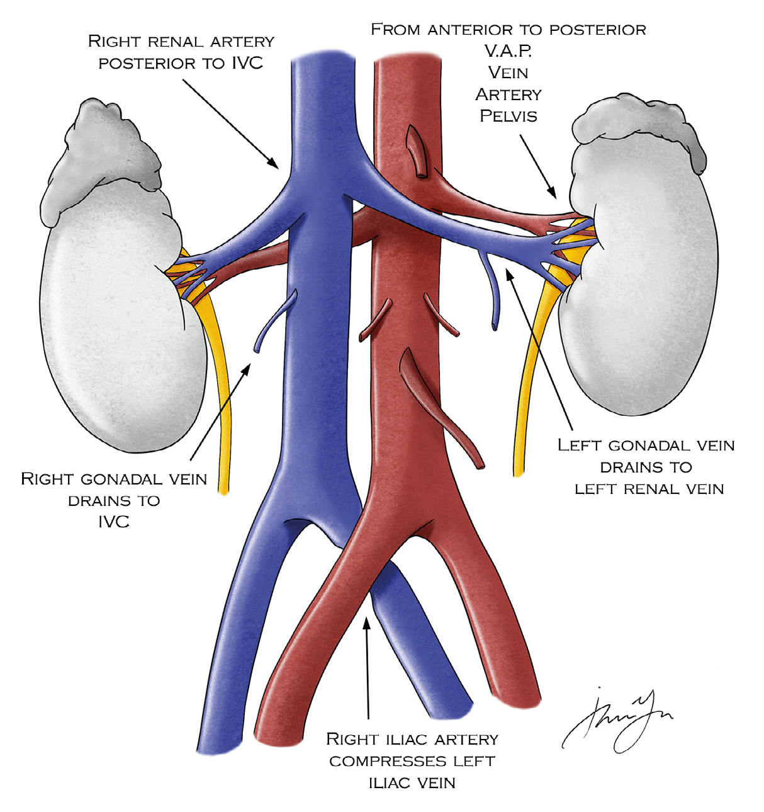

# 11 VASCULAR

---

<!-- Page 139 -->

139
11 VASCULAR

---

<!-- Page 140 -->

140
11 VASCULAR
Carotid/Vertebral
•	 What are the structures of the carotid sheath?
o Carotid Artery
o Internal Jugular Vein
o Vagus Nerve
•	 What are the segments of the vertebral artery?
o V1 - Origin off subclavian to foramina of C6
o V2 (Foraminal) - From the transverse foramen of C2-C6
o V3 - From C2 to Dura
o V4 – Intracranial
•	 What is the structure commonly overlies the carotid artery 
bifurcation?
o Facial vein off of IJ generally overlies the bifurcation
•	 What is the first branch of the external carotid artery?
o Superior thyroid artery
•	 Is the external carotid artery flow high or low resistance ?
o It is high resistance (flows to muscular facial muscles), so 
triphasic flow on doppler, brief reversal of flow
•	 Can the external carotid artery be ligated?
o External carotid can be tied off to help control excessive 
facial bleeding in trauma
•	 Internal carotid artery main blood supply to brain, first branch is 
the ophthalmic
o Low resistance as it is supplying brain tissue, so it has 
continuous forward flow which creates a biphasic doppler 
signal 
Doppler of the internal carotid is biphasic with a long 
diastolic phase, distinctly different than the high resistance of 
the triphasic external carotid

---

<!-- Page 141 -->

141
11 VASCULAR
Figure 1. Carotid Bifurcation Anatomy
•	 Hoarseness after carotid endarterectomy?
o Likely injury to vagus nerve
o From clamping the carotid the vagus nerve was also 
clamped
•	 Tongue deviation to side of injury?
o Likely hypoglossal nerve injury
o Nerve lies just cephalad to carotid bifurcation so can easily 
be damaged
•	 Ipsilateral mouth droop after a carotid?
o Marginal mandibular injury
o From retraction on mandible, generally when trying to 
expose high lesions
•	 This nerve lies deep to posterior belly of digastric and if divided 
can cause disabling dysphagia .
o Glossopharyngeal 

---

<!-- Page 142 -->

142
11 VASCULAR
•	 What layers of carotid are removed during an endarterectomy?
o Intima and part of the media
•	 What is the typical location of carotid atherosclerosis?
o Carotid bifurcation due to turbulence
•	 Indications for performing carotid endarterectomy
o Symptomatic (stroke or TIA), 50-70% warrants surgery
o Asymptomatic – controversial if over 80% or EDV (end 
diastolic velocity) > 140 cm/s (which correlates with 80% 
stenosis)
• Should start with medical management aspirin and a statin
•	 What if patient is symptomatic but duplex shows <50% 
stenosis?
o No surgery indicated
o Optimize medical management – aspirin, Plavix and a statin
•	 What if patient has a stroke and imaging shows a completely 
occluded carotid artery?
o Anticoagulation to prevent progression, no benefit to 
recanalizing
•	 What situations would an emergent carotid endarterectomy be 
indicated
o Crescendo TIAs
• TIA symptoms are recurring and becoming more severe or 
lasting longer in duration
•	 What is the most common non stroke cause of morbidity and 
mortality after CEA
o Myocardial infarction
•	 When should you operate on a symptomatic carotid
o Small stroke or TIA – within two weeks once symptoms 
resolve
o Hemorrhagic stroke – 6-8 weeks

---

<!-- Page 143 -->

143
11 VASCULAR
•	 What if patient demonstrates symptoms of stroke in PACU 
after carotid endarterectomy
o Return to OR to evaluate for intimal flaps or thrombus
o In OR start with US
•	 Which clinical scenarios would you consider carotid stenting 
over carotid endarterectomy
o Hx of neck dissection, neck irradiation, recurrent carotid 
disease
o Severe cardiac disease
TCAR (Transcarotid Artery Revascularization) or 
transfemoral stenting should be considered in patients 
with previous neck surgery or radiation. TCAR has lowest 
stroke rate.
Non-Atherosclerotic Carotid Lesions
•	 A patient s/p blunt trauma and is found to have asymptomatic 
carotid dissection
o Should be anticoagulated (either heparin or Plavix, not 
standardized)
o Repeat imaging before leaving hospital
•	 A patient s/p blunt trauma and found to have a symptomatic 
dissection
o Will likely require a covered stent
•	 A patient s/p blunt trauma with traumatic occlusion of carotid 
artery
o If already have neurologic injury/completed stroke unlikely to 
get better with intervention
o Antithrombotic therapy
•	 Carotid body tumors
o All require resection
o Consider embolization prior to surgery due to risk of bleeding

---

<!-- Page 144 -->

144
11 VASCULAR
Subclavian/Thoracic Outlet
•	 Name the structures of the thoracic outlet anterior to posterior
o Subclavian vein
o Phrenic nerve
o Anterior scalene
o Subclavian artery
o Middle scalene
o First Rib
•	 What anatomic anomaly puts patients at risk for thoracic outlet 
syndrome?
o Cervical rib
•	 Where is brachial plexus found in the thoracic outlet?
o The brachial plexus is along the middle scalene, posterior to 
the subclavian artery
Figure 2. Thoracic Outlet Anatomy 
 

---

<!-- Page 145 -->

145
11 VASCULAR
•	 Which type of TOS is most common, and what are the classic 
symptoms?
o Neurogenic (95%)
o Pain, weakness, numbness and tingling in the hand, 
particularly in ulnar distribution
o Symptoms worse with manipulation/elevation of arm
•	 Treatment of neurogenic TOS?
o Physical therapy is go to method
o If PT fails confirm diagnosis with scalene block or nerve 
conduction test
o First rib resection and scalenectomy with neurolysis is 
operation of choice for refractory neurogenic TOS
•	 A swimmer presents with a blue swollen arm, what is this and 
how do you treat it?
o Subclavian Vein Thrombosis (Paget-Schroetter), 
compression at costoclavicular junction
o Treat with catheter directed thrombolysis followed by first rib 
resection within the same hospital stay or shortly after
•	 A young person with no atherosclerotic risks factors presents 
with ischemia of the hand
o Common presentation for arterial TOS, though arterial TOS 
is very rare
o Likely an anomalous cervical rib is compressing the 
subclavian artery and will lead to an aneurysm, which is an 
embolic risk
o Will need first rib resection with interposition graft for the 
artery
Subclavian Steal Syndrome
•	 Where is the anatomic stenosis that results in subclavian 
steal?
o Proximal subclavian narrowing
o Results in a reversal of blood flow in vertebral, which can 
lead to vertebrobasilar symptoms

---

<!-- Page 146 -->

146
11 VASCULAR
o Symptoms occur when extremity is exerted and it steals 
blood from cerebral circulation
•	 How do you fix it?
o Endovascular recanalization and stenting or potentially 
carotid subclavian bypass are subclavian transposition
Dialysis Access
•	 How long should a temporary catheter be left in place (called 
Vas-Cath at many places) and why do they need to be 
removed?
o 3 weeks
o Infection risk
•	 How do long term tunneled catheters differ (Permacath)
o They are cuffed
o They are tunneled
o Lower risk of central infection 
o Still higher infection rate, and high risk of central venous 
stenosis compared with fistula or graft
•	 What is preferred location for temporary dialysis access and 
what should be taken into account?
o Right IJ direct to right atrium
o Avoid the side where you plan to place permanent AV Fistula
o Will cause central venous stenosis, will lead to failure of 
permanent access
•	 What is preferred location for AV fistula creation for dialysis 
access?
o “Fistula First” Always start distal on non-dominant arm, and 
upper extremities before lower extremities, Start distal to not 
burn bridges .
o Reducing catheter days, improves life expectancy
o Focus is now moving to choosing the right access for the 
right person, a person with a short life expectancy, a fistula 
may not be the best access

---

<!-- Page 147 -->

147
11 VASCULAR
•	 What is the most common reason for AV fistulas to malfunction 
over time?
o The major cause of hemodialysis AV access failure is venous 
outflow problems.
•	 A patient reports that she is having high venous return 
pressures, and increased bleeding after dialysis, what is 
the likely problem, how do you diagnose it and what is the 
treatment?
o Likely has venous outflow stenosis
o Can be diagnosed with duplex US
o Fistulogram with balloon angioplasty can likely correct the 
lesion
•	 What are criteria for fistula maturation, “Rule of 6s”?
o Needs to be 6 mm in diameter 
o <6 mm deep
o >600 mL/min in flow
•	 6 weeks after a brachio-cephalic fistula creation, the fistula 
fails to mature, what are some likely causes of this and how 
can they be managed?
o Possible inadequate inflow, rule out stricture at anastomosis, 
potential balloon angioplasty vs revision of anastomosis
o Competing flow from side branches, branches need to be 
ligated or coiled
A bleeding fistula with pinpoint hole bleeding can be 
treated with a stitch and urgent fistulogram. Bleeding 
from an ulcer on a fistula is a surgical emergency.
 

---

<!-- Page 148 -->

148
11 VASCULAR
Fasciotomies
•	 When are fasciotomies indicated? What are the symptoms?
o In a patient with documented lower extremity compartment 
syndrome
o A patient that had acute limb ischemia for > 4 hours, should 
be considered for prophylactic fasciotomy
o Patients will have tight compartments, pain with passive 
motion of foot
•	 Where to make incision to access anterior and lateral 
compartments?
o Make incision lateral to tibia in between the tibia and 
fibula (H type incision to pen both anterior and lateral 
compartments, incisions should be anterior and posterior to 
intermuscular septum .
•	 What nerve can you injure with the lateral incision and what 
deficit would you see?
o Superficial peroneal nerve which can lead to difficulties with 
foot eversion .
•	 To access superficial posterior and deep posterior 
compartments?
o Make incision two centimeters posterior/medial to tibia
o The key to perform a complete four-compartment fasciotomy 
is to make sure that the posterior deep compartment has 
been fully decompressed. Both the superficial and the deep 
posterior compartments are decompressed through the 
medial incision .
•	 How do you release the deep posterior compartment?
o Take soleus off of the tibia .
Thoracic Aorta
•	 In a blunt thoracic aortic injury, where is the most common site 
of injury?
o Just distal to subclavian artery in the descending thoracic 
aorta, at the level of the ligamentum arteriosum, the aorta is 
tethered here

---

<!-- Page 149 -->

149
11 VASCULAR
o A pseudoaneurysm develops here (partial transection)
o Treated with TEVAR
•	 What are the size criteria for treating descending thoracic 
aortic aneurysms?
o If endovascular repair is possible if  > 5 .5 cm
o Otherwise aorta should be > 6 .5 cm
•	 What is a feared complication of thoracic aorta repairs?
o Paraplegia (<5% for endovascular vs 20% for open)
o Reduce this risk by placing lumbar drains and increasing the 
blood pressure
o Spinal Perfusion Pressure = MAP (drive up with pressors) – 
ICP (lower with spinal drain) 
Abdominal Aorta/Aneurysms
•	 Acute mesenteric ischemia has 4 types
o Embolic
o Thrombotic
o Venous thrombosis
o Non occlusive mesenteric ischemia
•	 Which is most common type of mesenteric ischemia and how 
do you diagnose and treat it
o Embolic is most common, likely from afib or endocarditis 
o Patients will have severe abdominal pain, with no other 
supporting findings on exam (pain out of proportion to exam)
o CTA is best modality to diagnose
o Heparinize the patient and take to OR for ex lap and SMA 
embolectomy
o Best to leave abdomen open and re-explore in 12-24 hours 
before resecting any marginally perfused bowel
•	 Which type is most common in a patient that has severe 
atherosclerotic disease burden?
o Thrombotic disease
o This likely occurs at ostium/takeoff of the SMA

---

<!-- Page 150 -->

150
11 VASCULAR
o Embolic disease is more distal, generally at first branch of 
SMA
o Pts with thrombotic AMI, likely have had unrecognized 
symptoms for months – years
o These patients will likely require a mesenteric bypass rather 
than embolectomy
•	 Which disease process embolic vs thrombotic will have 
proximal jejunal sparing?
o Embolic because it lodges just distal to first branch of SMA 
(3-10 cm distal to ostium)
o Thrombotic patients will not have any sparing of small 
intestine
•	 How do you identify the SMA to perform embolectomy?
o Lift transverse colon cephalad and follow to base of 
transverse mesocolon
o Just to the right of Ligament of Treitz (LOT) will be the SMA
o Mobilize LOT to access SMA at its origin
•	 What are characteristics of mesenteric venous thrombosis  
o Sub-acute, multiple days of abdominal pain and bloody 
diarrhea
o Generally have an underlying hypercoaguable disorder
o CTA will demonstrate small bowel wall thickening, 
mesenteric edema, and thrombosis of SMV
o Heparinize patients, rarely need surgery, only for resection of 
ischemic bowel
•	 What are characteristics of NOMI?
o Patients are generally critically ill, on multiple pressors and 
many times have cardiac failure
o Ischemia is in watershed areas (splenic flexure and upper 
rectum)
o Treatment is resuscitation and improvement of cardiac 
functions
o Only OR if need to resect ischemic bowel

---

<!-- Page 151 -->

151
11 VASCULAR
Figure 3. Abdominal Vascular Anatomy
Quick Hits
•	 What is most common site for a upper extremity embolus to 
lodge?
o	
Brachial artery at bifurcation of radial and ulnar 
artery
•	 What is most common site for a lower extremity embolism to 
lodge
o	
Common femoral artery at bifurcation of 
profunda and SFA

---

<!-- Page 152 -->

152
11 VASCULAR
•	 In a patient with a ruptured AAA with hypotension that is 
getting a crash laparotomy . Where should you get proximal 
control?
o Supraceliac aorta through the gastrohepatic ligament, 
underneath crus of diaphragm, press aorta against spine
•	 A patient that has a ruptured AAA that is being transferred to 
you, what do you tell the outside center to keep his BP at?
o Permissive hypotension keep SBP 80-100
•	 MC organism in graft infections is?
o Staph epidermidis (slow insidious bug)
•	 Treatment for popliteal entrapment syndrome?
o Resect medial head of gastrocnemius
•	 What if a patient has refractory HTN and is found to have a 
beads on a string appearance in renal arteries or has same 
angiographic finding on internal carotids?
o Fibromusclar dysplasia, most common in renal arteries and 
balloon angioplasty is treatment method of choice . Also seen 
in carotids
Aneurysms Continued…
•	 What is the most common splanchnic aneurysm and 
indications for operating on it?
o Splenic artery
o Operate on if  >2 cm, or if pt is pregnant
o Most can be coil embolized 
o If unstable perform splenectomy
•	 What is the clinical presentation of a ruptured splenic artery 
aneurysm?
o “Double Rupture”, due to containment by the lesser sac, and 
then free intraperitoneal rupture
•	 What size criteria should you treat hepatic and SMA 
aneurysms?

---

<!-- Page 153 -->

153
11 VASCULAR
o Treat when they reach 2 cm in size
o Treat with resection and reconstruction
•	 What size criteria for treating iliac artery aneurysms?
o Commonly associated with abdominal aortic aneurysms
o 3 .5 cm is size criteria for repair
o Generally repaired with endovascular stents
•	 What is the size criteria for treating femoral artery aneurysm, 
and what is most likely complication of femoral artery 
aneurysm?
o 2 .5 historically but can be observed up to 3 .5 cm
o Unlikely to rupture more likely to cause embolus or 
thrombosis
o Treat with resection and interposition
•	 Size criteria for treating popliteal artery aneurysms, what 
workup does patient need?
o 2 cm or if symptomatic (Embolic source or thrombosis)
o Pts need work up for AAA
•	 What are options for treating popliteal artery aneurysms
o Exclude and bypass or interposition with vein is the gold 
standard
o Endovascular stents are reasonable if patient is not a good 
candidate for open surgery
•	 Indications for operating on abdominal aortic aneurysms
o >5 .5 cm in males or > 5 cm in females
o If growth > 1cm/year
o If symptomatic or infected (mycotic)
•	 When performing an open AAA repair when do you re-implant 
the IMA?
o If back pressure is poor or less than 40 mmHg

---

<!-- Page 154 -->

154
11 VASCULAR
• If pulsatile back bleeding collateral flow is adequate, if 
minimal colon likely requires the additional flow from aorta
o If colon appears dusky or they had previous colonic surgery
• Disrupts collateral blood flow such as Arc of Riolan or 
Marginal Artery of Drummond
Recognizing and managing complications is the most 
important aspect for ABSITE and oral boards. 
•	 What vein is at risk for injury in an open AAA when clamping 
aorta proximally?
o A retro-aortic left renal vein can be injured and cause 
significant bleeding
o Important to evaluate for this on preoperative imaging
•	 Patient develops painless abdominal distention after starting 
a diet following an open AAA repair . Fluid is seen and tapped 
and noted to be milky, what is this condition called and how do 
you treat?
o Chylous Ascites
o Low fat, high protein diet with medium-chain fatty acid 
supplementation
•	 A patient after an open AAA repair develops abdominal pain 
and bloody diarrhea . What are you concerned for and what is 
algorithm to treat this condition?
o Sigmoidoscopy to diagnose, along with starting IVF and IV 
abx
o Many times can be managed nonoperatively, but if patients 
develop peritonitis, sepsis, or frankly necrotic colon seen 
on sigmoidoscopy they need an emergent colectomy with 
Hartman’s pouch
•	 Which part of large intestine is spared from ischemia after AAA 
induced colonic ischemia
o Middle and distal rectum as they have separate blood supply 
from sigmoid/upper rectum

---

<!-- Page 155 -->

155
11 VASCULAR
o Blood supply is from internal iliacs not IMA
•	 A pt is identified with a 4 cm abdominal aortic aneurysm how 
do you want to follow it
o Yearly duplex US if aneurysm is 4 cm or less
o If greater than 4 will need at least every 6 month duplex 
•	 If you diagnose an infrarenal aortic graft infection, what is 
treatment of choice?
o -Axillary to  bi-femoral bypass with aortic graft excision
•	 When you perform an aorto-bifemoral bypass how do you 
decide between end to end aortic anastomosis vs end to side 
anastomosis?
o Need to ensure flow into at least 1 internal iliac for pelvic 
perfusion
o If external iliacs are patent can perform end-end as patient 
will have internal iliac perfusion from retrograde flow
o If external iliacs are not patent can perform end-side 
anastomosis which will allow antegrade flow into internal 
iliacs assuming common iliacs are patent
•	 What anatomic criteria are needed to perform an EVAR?
o Neck diameter less than 32 mm
o A neck angle less than 60 degrees
o A neck length of at least 10 mm
o Iliac diameters of at least 7 mm
o Lack of thrombus or calcification in infrarenal neck
•	 What are the types of endoleaks and treatment options for 
each
o Type 1 (a proximal, b for distal)
• Means the endograft isn’t sealed at proximal or distal end 
point
• These must be fixed, as risk of rupture
• Generally place a cuff to seal more proximally or distally

---

<!-- Page 156 -->

156
11 VASCULAR
o Type II 
• Lumbars or IMA continue to fill aneurysm sac
• Only need to be fixed if aneurysm sac continues to grow
• Coil embolization of lumbars feeding sac is best treatment 
option
o Type III
• Components of the endograft are not sealed
• Must be fixed, as aneurysm sac will be pressurized
• Reinforce with cuff across previous interlap between 
components
o Type IV
• Porosity of graft, or a tear in the graft
• May need to reline the graft with new endograft
Peripheral Vascular Disease
•	 How do you calculate an ABI?
o Take which ever pedal pressure is the highest (DP or PT) 
and divide that by the highest brachial pulse (right or left 
arm)
•	 How to interpret an ABI?
o  .9  1 .4 is normal 
 
 .5   .89 may have claudication 
 
<0 .5 = May have rest pain 
 
<0 .3 = Tissue loss
•	 What if patient has non compressible vessels, can you rely on 
ABIs?
o No small vessel calcification will lead to falsely elevated ABIs
o Toes pressures should be obtained, as these vessels are 
generally free from calcification

---

<!-- Page 157 -->

157
11 VASCULAR
•	 A patient presents with claudication, how do you treat them?
o Smoking cessation, exercise, statin therapy
•	 What indications would you intervene on a patient with 
claudication
o Lifestyle limiting claudication that failed improvement with 
medical management
o Tissue loss
o Rest pain
High yield! Do not offer operation for claudication, 
unless failed medical management and severe lifestyle 
impairment
•	 What options are there for imaging blood vessels
o CTA is good for proximal vessels to level of knee if kidney 
function ok
o If not angiography can use less contrast and visualize tibial 
vessels better
o Also can do C02 angiography if very poor renal function
o MRA is also an option
•	 What are essentials of operative planning in vascular surgery?
o Inflow, outflow and vascular conduit (if bypass)
•	 What are principles of deciding between treating a lesion 
endovascular vs open
o In general, endovascular interventions are best suited for 
lesions that are short and not heavily calcified. 
o Long occlusions that are densely calcified with good inflow, 
outflow and conduit are likely better treated with open 
bypass vs endarterectomy . 
o The common femoral artery is rarely treated with an 
endovascular approach because it is a mobile area that is 
prone to kinking and also because of the relative ease of an 
open approach .

---

<!-- Page 158 -->

158
11 VASCULAR
•	 A patient presents with buttock claudication, impotence, and 
absence of femoral pulses, what is this syndrome called and 
where would you expect the lesions to be?
o Leriche Syndrome
o Aorto-iliac symptoms
o Patient likely needs an aorto-bifemoral bypass
•	 If a patient presents with a large acute embolus that lodges 
at the aortic bifurcation, how does this differ in regards to 
treatment options compared to Leriche  Syndrome?
o Embolic disease can be treated with bilateral transfemoral 
retrograde embolectomy
o Leriche syndrome is an atherosclerotic disease process for 
which a bypass would be indicated
•	 A pt presents with thigh claudication, where would you expect 
the lesion to be?
o Iliac lesion
•	 A pt presents with calf claudication, where would you expect 
this lesion to be?
o SFA
•	 Know basic anatomy of angiogram
o You will have your anterior tibial artery branching first and 
going through intermuscular septum, you will then have tibial 
peroneal trunk, with peroneal coursing posterior to fibula, 
and posterior tibial doing just that, traveling behind the tibia
•	 What are the four compartments of the lower leg? And what do 
they contain
o Anterior and lateral released with lateral fasciotomy incision
• Anterior contains anterior tibial artery
• Lateral compartment contains superficial peroneal nerve
o Superficial and deep posterior 
• Superficial contains the gastrocnemius and sural nerve
• Deep contains the tibial nerve, posterior tibial artery, and 
peroneal artery

---

<!-- Page 159 -->

159
11 VASCULAR
o What vessels does diabetes damage?
• Tibial vessels and small vessels of the feet
•	 In a patient with a diabetic foot wound, what imaging modality 
is the most sensitive for osteomyelitis?
o MRI
•	 How to manage a diabetic foot ulcer with osteomyelitis in 
underlying bone?
o Debride to healthy bone and then prolonged antibiotics 4-6 
weeks . 
•	 In any patient with a foot wound it is important to make sure 
adequate perfusion, how is this done
o Start with non invasive flow studies (NIFs) and ABIs
o If these show flow that is impaired the patient needs an 
angiogram that can be both diagnostic and therapeutic 
Venous Disease
•	 How do operatively approach the left common iliac vein
o By dividing the overlying right iliac artery, if the vein needs to 
be accessed and repaired
•	 What veins can be ligated in trauma
o Can ligate any vein distal to renal veins
o The closer to the renal veins the more morbidity, but if it is for 
exsanguinating hemorrhage it can be considered
o If major vein ligation consider prophylactic fasciotomy
•	 Can you divide either renal vein?
o You can divide the left renal vein if it is proximal to gonadal 
vein and gonadal vein is intact to allow retrograde drainage

---

<!-- Page 160 -->

160
11 VASCULAR
DVT Management
•	 A pt has a swollen blue leg up to the buttocks, with motor and 
sensation intact, what are you worried about and what is the 
treatment?
o Ileofemoral DVT causing phlegmasia cerulea dolens
o Catheter directed thrombolysis is the treatment
•	 What is the most common location of DVTs? Which leg has a 
higher rate?
o Ileofemoral DVTs are most common
o Left leg is 2x more common than right
•	 Where should an IVC filter be placed in relation to the renal 
veins
o Distal (caudad) to the renal veins
•	 How to long anticoagulate after a DVT
o Provoked DVT = 3 months of therapy
o Active Cancer = Continue therapy until no longer have 
cancer/cured
o Hypercoaguable disorder = lifelong therapy
Quick Hits
•	 How to access SMA in trauma?
o Exposure to SMA is by lifting of transverse colon and 
mobilizing ligament of treitz 
•	 How to expose supraceliac aorta in trauma?
o Enter lesser sac through gastrohepatic ligament, can divide 
posterior crus of diaphragm
•	 What is the biggest risk factor for ischemic colitis in a patient 
with a ruptured aneurysm?
o Preoperative hypotension 
•	 Old lady with headaches, and temporal blindness and fatigue, 
what is it and how do you treat?

---

<!-- Page 161 -->

161
11 VASCULAR
o Temporal arteritis 
o Diagnose with a temporal biopsy
o Treat with corticosteroids
•	 What vessels are effected in Buerger’s disease?
o Small to medium sized vessels
•	 Mycotic aneurysms what is the most common organism?
o Staphylococcus (not salmonella) 
 
 

---

<!-- Page 162 -->

162
11 VASCULAR

## Figures

