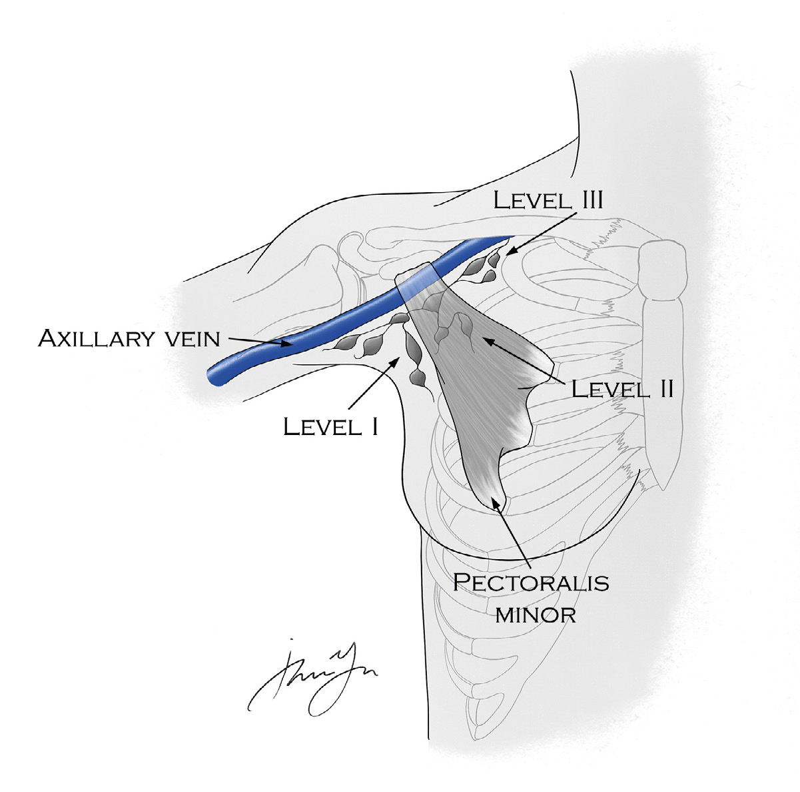

# 12 BREAST

---

<!-- Page 163 -->

163
12 BREAST

---

<!-- Page 164 -->

164
12 BREAST
High Yield Anatomy
•	 What are the surgical boundaries of the axillary lymph nodes?
o Level I – Lateral to pec minor
o Level II – Posterior to pec minor
o Level III – Medial to pec minor
Figure 1. Surgical Levels of The Axillary Lymph Nodes
•	 Name the nerve that can be injured during an axillary 
dissection based on the clinical sequela
o Results in winged scapula:
• Long thoracic innervating the serratus anterior
o Results in weakness in pullups and arm adduction:
• Thoracodorsal nerve innervating the latissimus dorsi

---

<!-- Page 165 -->

165
12 BREAST
o This nerve results in sensory deficits to the medial arm:
• Intercostobrachial
•	 What nerve innervates both pec major and pec minor:
o Medial pectoral nerve
o Lateral pectoral nerve only innervates pec major
Lateral pectoral nerve only innervates pec major
    
•	 What is the blood supply to the breast?
o Internal thoracic (aka mammary)
o Intercostals 
o Lateral thoracic
o Thoracoacromial arteries
•	 What is Batson’s plexus?
o Valveless venous plexus that allows direct hematogenous 
spread to the spine
Benign Breast Disease
•	 Breast Pain
o Common, self-limited in most cases
o Most frequent during the late luteal phase of the menstrual 
cycle
o Treatment
• Reassurance
• For severe pain, the following have been studied with 
variable results:
• danazol, bromocriptine, tamoxifen, primrose oil, 
vitamin E
•	 What is Mondor’s disease and what is the treatment?
o Superficial thrombophlebitis of the lateral thoracic vein or a 
tributary

---

<!-- Page 166 -->

166
12 BREAST
• MC secondary to recent surgery, trauma, or other 
inflammatory process
• Rarely associated with carcinoma
o Presentation: tender, palpable subcutaneous cord
o Treatment: NSAIDs
•	 Fibrocystic disease
o Most common in perimenopausal women
o Symptoms: breast pain, nipple discharge, lumps that vary 
throughout menstrual cycle
o Treatment:
• Simple cysts  observe
• Symptomatic  aspirate
• If aspirate is bloody or recurrent  cytology
• Bloody aspirate  surgical excision
• Unresolved after aspiration  surgical excision
• Recurrence  surgical excision
o Is there a risk of cancer?
• If cytology demonstrates atypical ductal or lobular 
hyperplasia
•	 Fibroadenoma and Phyllodes tumors
o Presentation: dominant mass
o Dx:
• Imaging
• If <35 yo  ultrasound (density of breast tissue)
• If >35 yo  mammography
• If findings are consistent with a benign fibroadenoma AND 
no risk factors  bi-annual ultrasound
• If any uncertainty  core needle biopsy (CNB)
• What if the mass continues to enlarge?
• Need excisional biopsy
o Fibroadenoma variants

---

<!-- Page 167 -->

167
12 BREAST
• Giant fibroadenoma
• >6 cm, can be difficult to distinguish from phyllodes 
tumor
• Complex fibroadenoma = risk for developing carcinoma
• Fibroadenoma with sclerosing adenosis, papillary 
apocrine hyperplasia, cysts, or epithelial calcifications
• Tubular adenoma = benign
• Variant of peri canalicular fibroadenoma with adenosis-
like epithelial proliferation
o Phyllodes tumor
• Subclassifications: benign, borderline, malignant
• 10% become malignant (greater potential if >5 mitoses per 
high power field)
o Rare hematogenous metastasis (does not go to nodes, so 
no sentinel lymph node biopsy (SLN) or Axillary dissection)
• Treatment: Wide local excision (1 cm margins)
• Do you need to perform SLN or axillary dissection?
o No . Hematogenous metastasis (rare)
•	 Nipple discharge
o What is the MC cause of bloody nipple discharge?
• Intraductal papilloma (not premalignant)
o What findings are more concerning for malignancy?
• Bloody, spontaneous, persistent, unilateral
• <40 yo  3% associated with cancer
• >60 yo  32% associated with malignancy
o Diagnosis:
• Ductal fluid cytology, contrast ductogram, ductoscopy – 
minimally helpful
• Best diagnostic test = Duct excision
o Treatment: subareolar resection of involved duct and 
papilloma

---

<!-- Page 168 -->

168
12 BREAST
•	 Duct Ectasia
o Dilation of the subareolar duct in peri- and post- menopausal 
women
o Symptoms: cheesy, viscous nipple discharge
o Treatment:
• Asymptomatic  observe
• Symptomatic  duct excision
•	 Breast Infections
o What are the most common bacteria to cause both breast 
abscesses and mastitis?
• Staphylococcus aureus
o 2 groups:
• Lactational - Most likely from blockage of the lactiferous 
ducts
• If no abscess  antibiotics alone, continue 
breastfeeding
• If abscess  aspiration and antibiotics, continue 
breastfeeding
o I&D if does not resolve promptly
• AE = concern for development of milk fistula
• Nonlactational – Periductal infections associated with 
smoking and ductal ectasia
• Tx: antibiotics, I&D if abscess present
o Patient presents with recurrent, unresolving mastitis . What 
else do you need to do?
• Biopsy of the skin to rule out inflammatory breast cancer
•	 Sclerosing Adenosis
o Presentation: microcalcifications
o Diagnosis: core needle biopsy
o Treatment: if no atypia and concordant with imaging  
observe

---

<!-- Page 169 -->

169
12 BREAST
o Not a precursor to cancer
•	 Radial Scar
o Alternate names: sclerosing papillary proliferations, benign 
sclerosing ductal proliferation
o Diagnosis: mammogram – appears similar to small, invasive 
cancer
o Treatment: excisional biopsy
• Associated with a small increased risk of cancer and the 
difference between invasive breast carcinoma may be 
difficult to determine on core biopsy alone
High Risk Breast Lesions
•	 Atypical lobular hyperplasia (ALH)
o Less well developed but morphologically similar to LCIS
o Not pre-malignant, but marker of increased risk
• 8-12-fold greater lifetime risk, or ~1% per year
o Diagnosis: CNB
o Treatment: excisional biopsy
• Why excise if not pre-malignant?
• Discordant finding as these lesions are often incidental 
to the radiographic abnormality that prompted the 
biopsy
•	 Atypical ductal hyperplasia (ADH)
o Associated with a 4-5-fold increased risk of invasive cancer
o Diagnosis: CNB
o Treatment: Excisional biopsy
• 9-30% incidence of DCIS on excisional biopsy
• 3% chance of invasive ductal carcinoma (IDC)

---

<!-- Page 170 -->

170
12 BREAST
•	 Lobular carcinoma in situ (LCIS)
o Multifocal and bilateral, genetic predisposition
o 90% ER/PR+ and HER2-
o What is the malignancy risk?
• Marker for 40% risk of CA development in EITHER breast
o What type of cancer do they develop?
• Ductal carcinoma
o Treatment:
• Wire localized excision
• What if there is a positive margin?
• No re-excision, adjuvant hormonal therapy
o Pleomorphic LCIS = variant that is treated like DCIS
No re-excision needed for LCIS when margin comes back 
positive
•	 Ductal carcinoma in situ (DCIS)
o Malignant cells of the ductal epithelium without invasion of 
the basement membrane (premalignant lesion)
o What is the malignancy risk?
• 50% in ipsilateral breast
• 5% in contralateral breast
o Presentation: majority are non-palpable
o Diagnosis: Mammography, CNB
o Treatment:
• Breast conserving therapy (BCT) = lumpectomy (1 cm 
margins) with adjuvant radiation (XRT)
• Post op whole breast XRT reduces risk of local 
recurrence by 50% but does not affect overall survival
• Large, multiquadrant, or contraindication to BCT  simple 
mastectomy + SLN

---

<!-- Page 171 -->

171
12 BREAST
• Up to 25% DCIS may show invasive component on 
final pathology, so SLN sampling required before 
removing all breast tissue
• Skin and nipple-sparing procedures with immediate 
reconstruction are options
• Adjuvant therapy
• Premenopausal  tamoxifen
• Postmenopausal  aromatase inhibitor (anastrazole)
o What is the most aggressive subtype of DCIS?
• Comedo
• Characterized by necrosis
• Treatment: simple mastectomy + adjuvant hormone 
therapy
DCIS excision need 2mm margin
Breast Cancer
•	 Screening
o When should you start screening mammography?
• Low risk: Age 40 every 2-3 years  annually after age 50
• High risk: 10 years before youngest age of diagnosis in 
first-degree relative
• Hereditary disorders with increased risk: BRCA 1/2, 
Li-Fraumeni (p53), Cowden syndrome (PTEN), Peutz-
Jeghers (STK11), CDH1
o BRCA 1/2 mutations  10-20-fold increased risk 
 30-60% risk by age 60
o Screening age 25 with annual mammogram AND 
MRI + pelvic exam and CA-125
o Findings on mammography that are concerning for 
malignancy: irregular borders, spiculated, distortion of 
breast, or small/thin linear branching calcification
o BIRADS classification

---

<!-- Page 172 -->

172
12 BREAST
Risk
Management
0
Incomplete
Further imaging
1
Negative
Routine follow-up
2
Benign
Routine follow-up
3
Probably Benign
6 month follow-up
4
Suspicious for Malignancy
Biopsy
5
Highly Suggestive of Malignancy
Biopsy
6
Biopsy-Confirmed Malignancy
Excision
•	 Gail Model
o Prediction model that calculates a woman’s risk of 
developing breast cancer within the next 5 years and within 
her lifetime .
o Variables:
• Age
• Age at first period
• Age at the time of the birth of a first child (or has not given 
birth)
• Family history of breast cancer (mother, sister or daughter)
• Number of past breast biopsies
• Number of breast biopsies showing atypical hyperplasia
• Race/ethnicity
o Underestimates risk for patients with strong family history 
(BRCA), personal hx of DCIS, LCIS, or invasive CA
•	 Invasive breast cancer
o NCCN staging pearls
T1
0-2 cm
N1
1-3 nodes
T2
2-5 cm
N2
4-9 nodes
T3
>5 cm
N3
>10 nodes or supra/
infraclavicular
T4
Chest wall or skin involvement

---

<!-- Page 173 -->

173
12 BREAST
Stage 1
Small tumor, no 
nodes (T1N0M0)
Surgery + Adjuvant 
chemoXRT if indicated
Stage 2
Larger tumor, minor 
nodal involvement 
(T3N0 or T2N1)
Surgery + Adjuvant 
chemoXRT if indicated
Stage 3a/3b
Local invasion or 
more nodes (T4N0 
or T3N2)
Surgery first vs 
neoadjuvant therapy
Stage 3c
Clavicular nodes 
(Any T, N3, M0)
Neoadjuvant + surgery if 
responds
Stage 4
Distal mets
Definitive chemotherapy
•	 Categories of breast cancer
o What is the most common type of breast cancer?
• Ductal carcinoma
o What type of breast cancer is less common and does not 
typically form calcifications?
• Lobular
o Which subtype has the worse prognosis?
• Signet ring cells
o Inflammatory breast cancer
• What is the typical presentation?
• Inflamed, angry breast that is erythematous and warm
• Characterized by rapid diffuse involvement of entire 
breast with cutaneous erythema and peau d’orange 
changes in the breast skin
• What is the hallmark biopsy result?
• Dermal lymphatic invasion
• Staging: T4d by definition = at least Stage IIIb
• Treatment = Neoadjuvant chemotherapy  modified 
radical mastectomy  adjuvant chemoXRT
• NO BCT

---

<!-- Page 174 -->

174
12 BREAST
o What are you concerned about if a patient presents with 
eczematous changes with scaling and ulceration of the skin 
and nipple? 
• Paget’s disease
• What are the hallmarks of this disease?
o Cells with clear cytoplasm and enlarged nucleoli
o Marker of underlying malignancy – DCIS or IDC 
(generally ER-/PR- and HER2+
• Treatment = Mastectomy including nipple-areolar 
complex + SLN
o Breast CA in men
• <1% of breast CA, usually ductal
• Risk factors: family history, Klinefelter’s, BRCA 2 (15% of 
breast CA in men)
• What is the procedure of choice for a male with breast 
cancer?
• Modified radical mastectomy
• Usually poor prognosis due to late presentation (same 
prognosis as women at similar stages)
o Breast CA in pregnancy
• Treatment in 1st trimester = modified radical mastectomy
• Late 2nd and 3rd trimester = BCT is an option
• SLN with modified isotope dosing, post-op 
chemotherapy, and post-delivery breast radiation
•	 Treatment Options
o Breast conserving (BCT): lumpectomy + whole breast 
irradiation
• “No ink on tumor” = negative lumpectomy margin
• Contraindications
• Absolute
o Pregnant and would require radiation during 
pregnancy

---

<!-- Page 175 -->

175
12 BREAST
o Multi-centric disease
o Positive pathologic margins after re-excision
• Relative – previous radiation, active connective tissue 
disease, tumors >5cm
For lumpectomy only margin needed is no ink on tumor
o Simple mastectomy
• BCT equivalent to simple mastectomy
o Chemotherapy
• Who gets chemotherapy?
• For the ABSITE:
o Tumors >1cm
• Exception = hormone receptor positive, node 
negative tumors with favorable oncotype 
characteristics can receive postop hormonal 
therapy alone
o Positive nodes
o Triple negative tumors
• What is the most common chemotherapy regimen?
• TAC
o Taxane (Docetaxel)  AE = peripheral neuropathy
o Adriamycin (Doxorubicin)  AE = cardiomyopathy
o Cyclophosphamide  AE = Hemorrhagic cystitis
• Mesna reduces risk of hemorrhagic cystitis
• Who is a candidate for neoadjuvant chemotherapy?
• Locally advanced/inoperable tumors: inflammatory, 
N2/N3, T4
• If tumor is too large relative to rest of breast for BCT 
and patient desires BCT
o Radiotherapy

---

<!-- Page 176 -->

176
12 BREAST
• Whole breast irradiation decreases local recurrence and 
improves survival
• After lumpectomy whole breast irradiation with boost to 
tumor bead is strongly recommended
• What are the indications for XRT after mastectomy?
• Advanced nodal disease (>4 nodes), fixed nodes, 
internal mammary nodes
• Skin/chest wall involvement
• Positive margins
• T3/T4 tumor, which is greater than 5cm
• Regional node irradiation
• >4 positive lymph nodes  XRT to supraclavicular, 
infraclavicular, and axillary LN
• Tumor central to inner area of breast  internal 
mammary node radiation
• 1-3 positive LN  grey zone, depends on individual 
characteristics
• Radiation is given AFTER chemotherapy
• Radiation in older adults
• NCCN guidelines allow for the use of lumpectomy with 
negative margins plus hormonal therapy WITHOUT 
radiation in women >70 with clinically negative nodes 
and ER+ T1 breast CA
o Endocrine therapy
• For Estrogen/Progesterone receptor (ER/PR) positivity
• Which has better prognosis receptor positive or receptor 
negative patients?
• Receptor positive
• More common in post-menopausal women
• Which has the better prognosis, ER or PR+?
• PR+
• Both is even better!

---

<!-- Page 177 -->

177
12 BREAST
• Treatment = 5 years of tamoxifen (pre-menopausal) or 
aromatase inhibitor (post-menopausal women)
o HER2 targeted therapy
• With HER2/neu receptor, is prognosis better or worse if 
positive?
• Worse
• Treatment = traztuzumab (Herceptin) for 1 year
•	 Axillary staging
o What is the most prognostic factor in staging of breast 
cancer?
• Nodal status
• 0 positive nodes  75% 5-year survival
• 4-10 nodes  40% 5-year survival
o SLN indicated for all invasive tumors
• ACOSOG Z0011 Trial = RCT comparing SLN to axillary 
dissection
• Women > 18yo with T1/T2 tumors, <3 positive SLN, 
BCT + whole breast XRT
• No difference in local recurrence, disease free survival, 
overall survival at median follow up of 6 .3 years
Z11 is critical especially for oral boards
If T1-T2 with < 3 positive SLN
AND patient is going to receive whole-breast radiation
No benefit to axillary dissection
o Axillary dissection recommended for:
• Clinically positive nodes confirmed by FNA or CNB
• Sentinel nodes not identified
• What nodes do you take?
• Level 1 and 2
• What nodes do you take in an axillary dissection for 
melanoma?
• Levels 1-3

---

<!-- Page 178 -->

178
12 BREAST
Quick Hits
•	 Patient presents with a dominant breast mass . Next step?
o IMAGING — Bilateral mammography and/or U/S
•	 Concerning lesion on mammography – core needle biopsy 
returns normal?
o Excisional biopsy for discordant findings
•	 Most common sites for breast cancer metastases?
o Bone, lung, brain, and liver
o Isolated tumor cell deposits (<0 .2mm) do NOT constitute 
metastatic disease
•	 Valveless venous system responsible for bony metastasis to 
spine?
o Batson’s plexus
•	 What is the cumulative risk of breast and ovarian CA with 
BRCA1 and BRCA2?
o BRCA1 – 65% breast, 40% ovary
o BRCA2 – 45% breast, 10% ovary
•	 Side effects of tamoxifen?
o Thromboembolism
o Increased risk of uterine CA
•	 Chronic lymphedema for 10 years following axillary dissection, 
now with dark purple lesion on upper arm?
o Stewart-Treves Syndrome (lymphangiosarcoma)
•	 What is Poland’s syndrome?
o Hypoplasia of the chest wall, amastia, hypoplastic shoulder, 
no pectoralis muscle
•	 What are the nodes between the pectoralis major and minor 
called?
o Rotter’s nodes

## Figures

