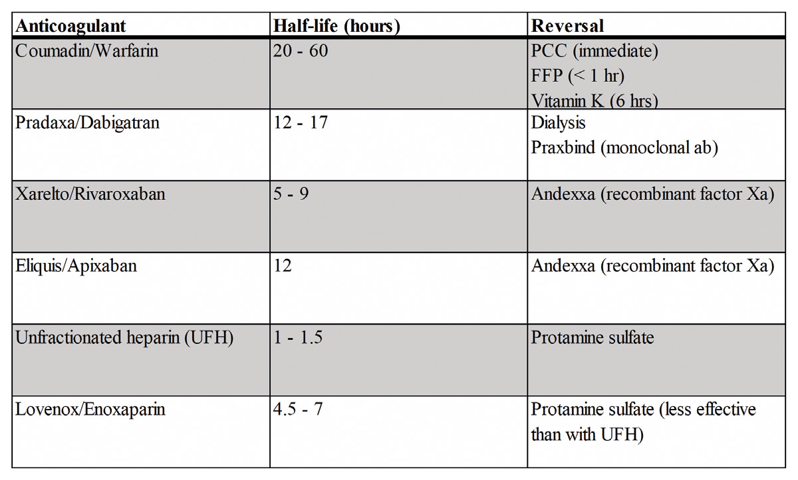

# 13 HEMATOLOGY

---

<!-- Page 179 -->

179
13 HEMATOLOGY

---

<!-- Page 180 -->

180
13 HEMATOLOGY
•	 A patient with a platelet disorder will have what coagulation lab 
abnormality?
o Increased bleeding time (PT and PTT not reliably affected)
•	 What is the most common congenital bleeding disorder? And 
what are the different types
o Von Willebrand’s Disease
• Type I – Most common, reduced quantity of vWf, treat with 
desmopressin (for most patients) or cryoprecipitate 
• Type II – Dysfunctional vWF , treat with desmopressin or 
cryoprecipitate
• Type III – Complete absence of vWF, desmopressin 
does not work, must use cryoprecipitate or Factor VIII 
replacement
•	 What bleeding disorders is cryoprecipitate helpful in?
o Von Willebrand’s, hypofibrinogenemia, hemophilia A
•	 What are the factors missing in Hemophilia A and Hemophilia 
B
o Hemophilia A = Factor VIII, prolongation of PTT
• Treat with factor VIII or cryo
o Hemophilia B = Factor IX, prolongation of PTT
• Treat with factor IX or FFP
•	 Coumadin = WEPT = Warfarin Extrinsic pathway PT
•	 PTT = intrinsic pathway
•	 A patient on coumadin undergoes surgery and following 
surgery platelets drop >50%, what tests to confirm the 
diagnosis? Treatment?
o Concern for Heparin Induced Thrombocytopenia
o Clinical suspicion with 4Ts score (thrombocytopenia, timing, 
thrombosis, and other possible causes)
o ELISA testing anti-platelet-factor-4 for initial screening
o Serotonin release assay for confirmation

---

<!-- Page 181 -->

181
13 HEMATOLOGY
o Stop heparin immediately with sufficient clinical suspicion
o Start safe anticoagulation (argatroban is classic; bivalirudin 
or fondaparinux also options)
•	 Patient presents with DVT and strong family history of DVT . 
What heritable blood clotting disorders would be on your 
differential?
o Factor V Leiden
o Prothrombin Gene Defect 20210
o Protein C and S Deficiency
o Antithrombin 3 Deficiency
o Hyperhomocystenemia 
•	 A patient is started on Coumadin and develops skin 
necrosis, what is the name of this phenomena and what is its 
pathophysiology?
o Warfarin induced skin necrosis
o Seen in patients with protein C and S deficiency 
o Short half-life of protein C and S (natural anticoagulants), 
leads to brief period of time where patient is hypercoagulable
o Important to bridge with Lovenox when starting coumadin
•	 Patients with hyperhomocysteinemia, how to treat this?
o Folic acid and B12
•	 How does antithrombin III deficiency present itself, and how do 
you treat it?
o They do not respond to heparin
o Treat with ATIII concentrate or FFP, prior to heparin admin
o Then start on long-term anticoagulant
•	 Mechanism of action of heparin? And how to reverse?
o Potentiates ATIII, makes it 1000x more potent
o Protamine to reverse
• Can cause hypotension and bradycardia

---

<!-- Page 182 -->

182
13 HEMATOLOGY
•	 What are characteristics of antiphospholipid syndrome, how do 
you diagnose and how do you treat it?
o History – symptoms of Lupus, prior DVTs, or recurrent 
pregnancy losses
o Will have prolonged PTT but are hypercoaguable
o Caused by antibodies to cardiolipin and lupus anticoagulant
o Treat with heparin bridge to coumadin
•	 What is mechanism of action of Warfarin?
o Inhibits VKORC (a protein that reduces Vitamin K to activate 
it)
o Inhibits creation of Factors X, IX, VII, II (1972) and protein 
and C and S
o Contraindicated in pregnant patients
•	 Warfarin reversal agents and their times to onset
o Administer Vit K (6 hours)
o FFP (<1 hour)
o Prothrombin Concentrate Complex (immediate)
•	 How do determine effectiveness of Lovenox
o Check factor Xa levels
o Unlike heparin, Lovenox is only weakly reversed by 
protamine
•	 Reversal agents for direct oral anticoagulants (DOACs)
o Dabigatran (Pradaxa)
• Can be reversed with dialysis
• And idarucizumab (Praxbind; monoclonal Ab that 
inactivates it)
o Apixaban (Eliquis) and rivaroxaban (Xarelto)
• Can be reversed with andexanet alfa (Andexxa; decoy-
receptor for factor Xa inhibitor molecules)

---

<!-- Page 183 -->

183
13 HEMATOLOGY
•	 What is mechanism of action of tPA? How to reverse it?
o Activates plasminogen, breaks down fibrinogen
o Aminocaproic acid
•	 What are contraindications to using tPA?
o Absolute
• Active internal bleeding
• Recent CVA or neurosurgery
• Recent GI bleed, or intracranial pathology
o Relative contraindications 
• Surgery past 10 days
• Recent organ biopsies, recent delivery
• Recent major trauma
• Uncontrolled hypertension
•	 Which coagulation factors are not synthesized in the liver?
o Factor VIII, and Desmopressin
•	 When to use FFP
o FFP has all coagulation factors
o Any coagulation disorder including Antithrombin III deficiency

---

<!-- Page 184 -->

184
13 HEMATOLOGY
•	 What factors are measured by PT/INR
o Measures external pathway – factors II, VII, IX, X (1972)
o Best test for liver synthetic function
o Goal INR of 2-3 generally in anticoagulated patients
•	 What factors are measured by PTT
o All except VII
o Goal of 60-90 in anticoagulated patients
Quick Hits
•	 Thrombin (factor II) is key to coagulation
o Fibrinogen to fibrin 
o Activates platelets 
•	 Fibrin links platelets (GpIIb/IIIa molecules) to form a platelet 
plug
•	 Antithrombin III is key to anticoagulation
o Binds and inhibits thrombin
o Heparin activates AT-III 
•	 What factors are made in liver?
o All except VIII and vWF
•	 Factor with the shortest half-life 
o Factor VII
•	 What factors does warfarin block?
o Vit K dependent factors: II, VII, IX, X, protein C and S
•	 What does cryo contain?
o High concentrations of vWF, VIII, and fibrinogen
•	 What is in FFP
o All clotting factors, some fibrinogen

## Figures

