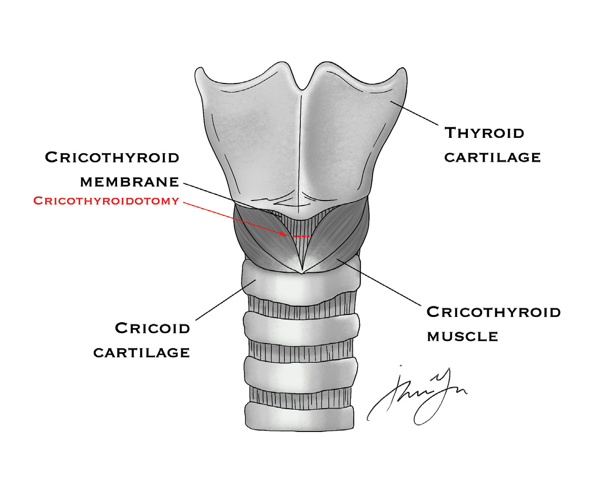
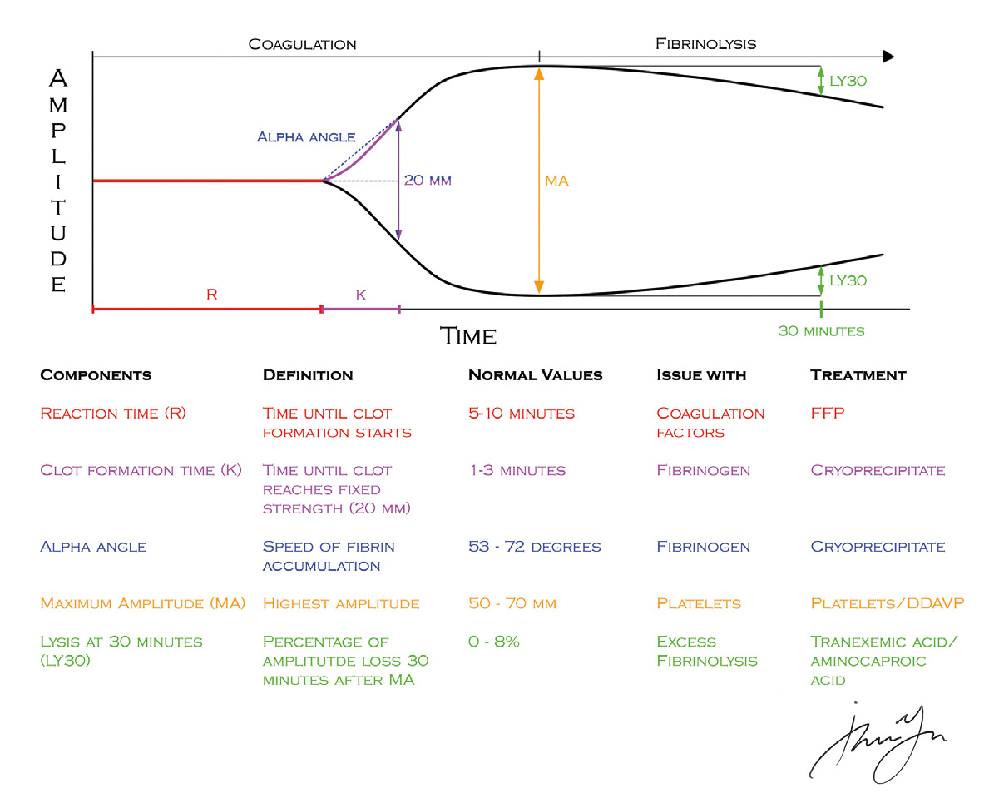

# 14 TRAUMA

---

<!-- Page 185 -->

185
14 TRAUMA

---

<!-- Page 186 -->

186
14 TRAUMA
Initial Assessment
•	 Always start with ABCDE’s (Primary Survey). A lot of trauma 
questions on the ABSITE just want you to be able to prioritize. 
Always address the airway first!!!
o Can’t intubate, can’t ventilate  Crichothyroidotomy (See 
Image)
 
•	 Disability – Looking for signs of intracranial pressure, not 
meant to be a complete neurologic assessment . GCS and 
pupil exam are the most important factors . 
o GCS – What component has the most prognostic ability?
•  Answer: Motor Score
o GCS < 8  Intubate
o Pupillary Exam
• Unilateral fixed dilated pupil  Ipsilateral space occupying 
lesion (blood) with compression of optic nerve
• Bilateral pinpoint pupils  Pontine hemorrhage

---

<!-- Page 187 -->

187
14 TRAUMA
Head Trauma
•	 Who needs an ICP Monitor?
o GCS < 8 with abnormal head CT
o 2 main types of ICP monitors: Ventriculostomy and “bolt” 
• Ventriculostomy – Drain placed in ventricle . Has the 
advantage of being able to drain CSF if needed to 
decrease ICP .
• Bolt – Placed intraparenchymal .
•	 Golden Rule of Head Trauma = avoid hypotension and hypoxia 
to avoid secondary brain injury
•	 Cushing’s Reflex – Bradycardia, Hypertension, Altered 
Respirations
o Late finding, indicates impending herniation
o Initial management – Elevate HOB, ventilate to pC02 35, 
Mannitol and/or Hypertonic Saline, Sedate and Paralyze 
•	 Epidural Hematoma 
o Presentation: Hit in head, lucid interval followed by rapid 
GCS deterioration
o Head CT shows lenticular lucency that is contained by suture 
lines 
•	 Subdural Hematoma
o Presentation: Older person on Coumadin with GLF
o Crescent shaped lucency that crosses suture lines
•	 Intraparenchymal Hemorrhage (most common in trauma)
o Common after blunt injury (e .g . MVC)
•	 Subarachnoid Hemorrhage
o Worst headache of life, spontaneous
•	 Cerebral Perfusion Pressure (CPP) = MAP - ICP
o CPP is surrogate for cerebral blood flow
o Ideally keep CPP  > 60 and ICP < 20

---

<!-- Page 188 -->

188
14 TRAUMA
o Main regulator of CPP?
• PaCO2
o In TBI, autoregulation is lost. Thus, CPP is exquisitely 
sensitive to changes in MAP .
•	 Interventions to reduce ICP
o Elevate head of bed
o Remove c-collar or anything around neck
o Hyperventilation (short term)
o Hypertonic Saline or Mannitol (Hypertonic saline preferred 
in trauma due to hypotension that can result from mannitol 
administration)
o Sedation/Paralysis
•	 Adjuncts in the treatment of head injury
o Seizure prophylaxis for trauma with intracranial bleed .
• 1-week prophylaxis, prevents early seizures
o Early enteral feeding within 24-48hrs
o Correct coagulopathy
• Reversal agents for coagulopathy 
• Coumadin -- PCC for rapid reversal . FFP is also okay . 
Add Vit K
• Pradaxa (Dabigatran) – Dialysis or Praxbind 
(idarucizumab)
• Apixaban/Rivaroxaban – PCC gives partial reversal
o What about Steroids?
• No benefit and potential harm
Spine Trauma
•	 Who can be cleared clinically?
o No distracting injury
o GCS 15, non-intoxicated
o No midline tenderness, no neurologic deficits 

---

<!-- Page 189 -->

189
14 TRAUMA
•	 Radiographic clearance?
o Generally, patients with a normal CT scan and no localizing 
symptoms can be cleared (somewhat controversial)
•	 Spinal cord injury syndromes
o Central cord syndrome – Typically upper extremity weakness 
(cape and gloves
• Generally elderly patient with spinal stenosis
o Brown Sequard (hemi-section)
• Ipsilateral motor deficit and contralateral pain/temperature 
deficit below level of injury
• Generally, results from penetrating (stab) injury
o Anterior cord syndrome
• Motor deficit below level of injury
• Results from vascular injury to anterior spinal artery
o Spinal Cord Injury Without Radiographic Abnormality 
(SCIWORA)
• Seen in pediatric population
•	 Neurogenic shock vs . Spinal Shock
o Neurogenic shock
• Affects hemodynamics . Hypotensive and Bradycardic .
o Spinal Shock
• Sensory/Motor affects . No effect on hemodynamics .
• Absent bulbocavernosus and cremasteric reflex. 
• Some functions may return with spinal shock . 
• Intact reflexes indicate deficits are likely permanent. 
•	 Management
o No steroids for spinal injury
o Stable vs unstable
• `2 of 3 columns disrupted = unstable and requires 
operative fixation

---

<!-- Page 190 -->

190
14 TRAUMA
Neck Trauma
•	 Zones of the neck 
o Zone 1 – clavicles to cricoid cartilage
o Zone 2 – cricoid cartilage to the angle of the mandible 
o Zone 3 – Angle of mandible to skull base
•	 Penetrating neck injury and patient hypotensive  OR
•	 Penetrating neck injury with hard sign of vascular injury  OR
•	 Penetrating neck injury and patient stable without hard sign of 
vascular injury  CT neck including CT angiogram
o If concerned for esophageal injury  add esophagram or 
EGD
•	 Esophageal injury
o Extend myotomy to see mucosal injury extent, repair in 2 
layers, buttress, drain
o Can’t locate injury during neck exploration    widely drain
•	 Blunt cerebrovascular injury (BCVI)
o Consider screening imaging (CTA) for:
• Severe cervical hyperextension/rotation or hyperflexion 
mechanism
• Hanging mechanism
• Neurological examination not explained by brain imaging
• Diffuse axonal injury
• Skull base fractures involving the foramen lacerum
• Horner’s syndrome
• LeFort II or III facial fractures
• Cervical spine fracture, particularly C1-C3
• Epistaxis from a suspected arterial source after trauma
• Blunt head trauma with GCS < 8
• Cervical bruit, hematoma
• An isolated cervical seat belt sign without other risk factors 

---

<!-- Page 191 -->

191
14 TRAUMA
and normal physical examination has failed to be identified 
as an independent risk factor in two retrospective studies 
and should not be used as the sole criteria to stratify 
patients for screening .
o Distal internal carotid is most common site for BCVI
o Antiplatelet therapy is generally treatment for most BCVI
o Endovascular intervention for pseudoaneurysm of AV fistula
Thoracic Trauma
•	 Indications for OR following thoracic trauma based on chest 
tube output
o Controversial and data limited  
o In general, for boards to OR if:
• >1500ml output after initial placement
• 200ml/hr output over 4 hours
•	 Flail Chest – 3 consecutive rib fractures in 2 locations
o Cause of hypoxia with flail chest    underlying pulmonary 
contusion
o Management:
• Pain control (epidural)
• Consider PPV, rib plating
•	 Sternal fracture
o Be concerned about blunt cardiac injury
o EKG is required for all suspected blunt cardiac injuries    
Sinus tach and PVCs are the most common abnormalities
o Utility of Troponin as screening tool for BCVI is controversial 
-- However, a normal ECG and normal Troponin essentially 
rule out blunt cardiac injury
o If patient demonstrated hemodynamic instability or persistent 
new arrhythmia  Echocardiogram
•	 Blunt Aortic injury (BAI)
o The proximal descending aorta, where the relatively mobile 

---

<!-- Page 192 -->

192
14 TRAUMA
aortic arch can move against the fixed descending aorta 
(ligamentum arteriosum), is at greatest risk from the shearing 
forces of sudden deceleration, although other segments or 
vessels can be affected .
o Physical exam – Hypotension, upper extremity hypertension, 
unequal blood pressures, external evidence of major chest 
trauma, thoracic outlet hematoma, fractured sternum, 
fractured thoracic spine, left flail chest
o Must maintain a high index of suspicion based on 
mechanism of injury or initial imaging
o CXR has low sensitivity – However, findings concerning for 
BAI include 1) widened mediastinum (8cm), 2) Depression of 
mainstem bronchus, 3) deviation of NG tube to the right, 4) 
Apical Cap, Disruption of calcium ring (broken halo)
• In short –Any clinical suspicion based on mechanism 
or a “funny looking” mediastinum on CXR needs further 
imaging
• CT angiography of the chest is comparable with 
aortography and is the diagnostic study of choice
o Classification scheme for grading the severity of aortic injury
• Type I (intimal tear)
• Type II (intramural hematoma)
• Type III (pseudoaneurysm)
• Type IV (rupture)
o Management
• Patients should be immediately started on anti-
hypertensive regimens to maintain systolic blood pressure 
within a “normal” range, generally less that 120mm Hg 
(B-Blocker, typically esmolol, with or without nitroprusside)
• Most blunt aortic injuries surviving to hospital are partial-
transections, and should be managed with blood pressure 
control until the definitive repair. 
• Thus, the priority in the management of 
hemodynamically unstable patients with potential 
aortic injury is to rapidly identify and control on-going 

---

<!-- Page 193 -->

193
14 TRAUMA
hemorrhage from other sites, and to avoid over-
resuscitation .
• In patients diagnosed with BAI, it is strongly recommended 
to use of endovascular repair over open repair
o Post endovascular repair of BAI develops left hand 
ischemia?
• Patient needs Carotid to subclavian bypass (subclavian is 
covered routinely during endovascular repair of BAI)
Abdominal Trauma
•	 Blunt Abdominal Trauma
o Focused Abdominal Sonography for Trauma (FAST) exam -- 
Only looking for free fluid in abdomen or pericardium
• Fluid = blood, succus, or urine
• CT scan is more sensitive/specific than FAST
• FAST can have false negative – should be repeated in 
unstable patients
o Most common injuries following blunt abdominal trauma -- 
Solid organ injury
• Hollow viscus or pancreas are the most commonly missed 
injury
o Abdominal seat belt sign – Should be concerned for bowel 
injury or pancreatic injury
o Solid organ injury and hemodynamically unstable    OR
o Solid organ injury and hemodynamically stable    Generally 
non-operative management – ICU monitoring, trend labs, 
supportive care
• Take to OR for ongoing transfusion requirement or if 
patient becomes unstable
o CT scan with free fluid and no solid organ injury    Hollow 
viscus injury until proven otherwise
o Hemodynamically stable with blush on CT (Spleen, liver, 
kidney)    Angioembolization

---

<!-- Page 194 -->

194
14 TRAUMA
•	 Abdominal stab wounds 
o Work-up and Management
• Hemodynamically unstable, evisceration, peritoneal signs  
  OR
• Anterior stab wounds
• Local wound exploration
o Look for violation of anterior rectus sheath .
• If truly negative and no other injuries – Can 
discharge patient 
• If violation of anterior sheath:
• Can observe with serial exams if 
hemodynamically stable and examinable +/- CT
• If hemodynamically stable and unexaminable 
 CT vs laparoscopic exploration looking 
for violation of posterior fascia/peritoneum 
(controversial)
• Flank stab wounds
• Concerned about retroperitoneal structures
• Triple contrast CT scan – Oral, Rectal, and IV
• Thoracoabdominal Stab wound
• Be concerned for diaphragm injury, even if completely 
stable and negative imaging
o Frequently missed on CT -- Best evaluated with 
laparoscopy
•	 Bowel injury
o Destructive = >50% circumference bowel wall involvement or 
devascularized 
• Treatment: Resection and anastomosis
o Non-Destructive = <50% and no vascular compromise
• Treatment: Primary Repair
o Damage control setting with destructive bowel injury
• Staple off bowel, leave in discontinuity (No anastomosis), 

---

<!-- Page 195 -->

195
14 TRAUMA
temporary abdominal closure, and take to ICU for 
resuscitation
o Penetrating Colon Injury
• Treatment: Primary repair for non-destructive injury; 
Resection and anastomosis for destructive injury
• Old teaching was a diversion for left-sided injury . Decision 
to divert is now based more on patients’ physiologic status. 
Left-sided injury no longer mandates diversion . 
o Bucket Handle Injury 
• Typically from blunt injury
• Mesentery of bowel in torn from bowel but bowel intact
• Treatment: Resection 
•	 Pancreatic Injury
o Key factors for management: Involvement of pancreatic duct, 
Location (Head, Body, or Tail), associated duodenal injury
o Distal injury with no ductal injury    Leave drains
o Distal injury with duct injury    Distal pancreatectomy with 
splenectomy
• Can consider spleen sparing in hemodynamically stable 
children
o Laceration to head of pancreas with or without ductal injury  
 Drainage only
•	 Retroperitoneal Hematoma
o Zone 1 – Central (aorta, vena cava)
o Zone 2 – Lateral (renal)
o Zone 3 – Pelvis (Iliac)
o Penetrating injury – explore all 3
o Blunt Injury
• Zone 1 – explore
• Zone 2 – explore only expanding/pulsatile hematoma
• Zone 3 – Generally don’t explore (pack and angiography)

---

<!-- Page 196 -->

196
14 TRAUMA
•	 Pelvic Fracture
o Be concerned about injury to adjacent structures (rectum, 
bladder, vagina, urethra)
o Open book pelvic fracture with hypotension    Pelvic binder 
1st step
• Angiography in stable patient
• OR for Preperitoneal packing in unstable patient
Shock
•	 Shock is defined as “end organ hypoperfusion”
•	 Classes of Hemorrhage 
o Class I = 0-15% blood loss
• Generally, no physiologic signs
o Class II = 15-30% blood loss
• Tachycardia, Narrowed pulse pressure
o Class III = 30-40% blood loss
• Hypotension
o Class IV = >40% blood loss
•	 Earliest sign of shock: Tachycardia and narrowed pulse 
pressure (Class II)
•	 Triad of death: Hypothermia, Coagulopathy, Acidosis
•	 Damage control principles: Control sepsis/spillage and 
hemorrhage, temporary closure, and resuscitate
o Return to OR when physiologically corrected
•	 Abdominal Compartment Syndrome
o 1st signs: Increased peak pressures on vent, decreased Up
o Confirm with bladder pressure
• Absolute pressure >20 is concerning for ACS
o Treatment is decompressive laparotomy
• Be cautious about decompressive laparotomy in burn 
patients following massive resuscitation as it is associated 

---

<!-- Page 197 -->

197
14 TRAUMA
with high mortality . In burn patients, drain placement to 
drain ascites for ACS is preferred .
•	 Damage Control Resuscitation
o Avoid crystalloid if at all possible . Key is permissive 
hypotension . 
o Balanced blood product resuscitation of platelets, PRBC, 
and FFP in a 1:1:1 ratio
o Bleeding trauma patient requiring massive blood product 
resuscitation
• Give TXA – 1g within 3 hours of injury with subsequent 1g 
given over 8 hours 
• Decreases fibrinolysis 
• Answer is NEVER Factor VII – No longer given in trauma
• TEG/ROTEM can guide resuscitation if available . Used 
more and more and may start showing up on ABSITE/
Boards (See Image) .
• Time – How long it takes to start clot
o If prolonged    Give FFP
• Angle – How fast they are forming a strong clot
o If low     Give Cryoprecipitate 
• Amplitude – Size of clot
o If low    Platelets
• LY30 – Measure Lysis
o If high    Give TXA

---

<!-- Page 198 -->

198
14 TRAUMA
Urologic Trauma
•	 Bladder Injury
o Frequently associated with pelvic fractures
o Will always have hematuria (Renal injury may not have 
hematuria)
o Management:
• Intraperitoneal injury    Operative repair
• Extraperitoneal injury    Foley drainage
•	 Ureteral Injury
o Management
• Mid Ureteral Injury – spatulate ends, primary anastomosis 
over double J stent with fine absorbable suture
• Distal Ureteral Injury– Re-implant into bladder . 
• If it doesn’t reach? 
o  Psoas Hitch

---

<!-- Page 199 -->

199
14 TRAUMA
•	 Urethra Injury
o Physical Exam – Blood at meatus, scrotal/perineal 
hematoma, high riding prostate
o Diagnosis – Retrograde Urethrogram . 
Extremity Trauma
•	 Hard signs of vascular injury
o Pulsatile bleeding, expanding hematoma, absent pulses, 
bruit/thrill
•	 Soft signs
o Non-expanding hematoma, decreased pulses (ABI <0 .9), 
proximity to neurovascular structures
•	 Soft signs of injury    CT angiogram
•	 Extremity arterial trauma – Generally answer is repair with 
reversed saphenous 
•	 Extremity venous injury – Generally primary repair if possible 
or simply ligate
o	Popliteal artery and vein    Don’t forget to add fasciotomy 
after repair 
Special Populations Pearls
•	 Pediatric Trauma Patients
o Airway
• Airway is narrow, short, and more anterior than in adults
• Intubate with cuffed tubed (recently changed dogma)
• uncuffed tube in infants only
• ET tube size
• Size of patient’s pinky nail bed width 
• Age/4 + 4 = ET tube size
• Bradycardia is common with direct laryngoscopy    Have 
atropine ready
o 20cc/kg bolus for crystalloid; 10cc/kg bolus for blood 

---

<!-- Page 200 -->

200
14 TRAUMA
products
•	 Pregnant Trauma Patients
o Physiologic changes in pregnancy
• Increase in circulating blood volume with physiological 
dilution/anemia
• Increased respirations, decreased tidal volume results in 
respiratory alkalosis 
o Place patient left side down to take pressure off IVC
o Abdominal trauma in pregnant patient
• Be concern for placental abruption and maternal-fetal 
hemorrhage
• Give RhoGAM if mother Rh- if concern for maternal-
fetal hemorrhage
o Kleihauer Betke Test can be used – looks for fetal 
blood cells in maternal circulation
o Who needs fetal monitoring?
• For viable pregnancies    Generally 24weeks 
gestation or greater
Quick Hits
•	 Bubbles seen in Coronary vessels during resuscitative 
thoracotomy?
o Air embolism, typically from pulmonary injury
•	 MVC with lumbar chance fracture and seat belt sign?
o Hollow viscus injury, maybe pancreatic injury
•	 Kid with handle bar blow to abdomen?
o Duodenal hematoma
•	 Left thoracoabdominal stab injury with negative imaging and 
normal exam?
o Laparoscopy looking for diaphragm injury
•	 Posterior knee dislocation?

---

<!-- Page 201 -->

201
14 TRAUMA
o Popliteal artery injury
•	 Patient found down, oliguric, Cr 3 .5?
o Rhabdomyolysis
•	 Tracheostomy patient and nurse reports 10cc of bright red 
blood from tracheostomy site
o Tracheoinnominate fistula with sentinel bleed
•	 Severe TBI patient with Na 155 and 5L Up?
o Diabetes insipidus
o Treatment?    DDAVP
•	 Trauma patient paralyzed from head down with no cremasteric 
reflex?
o Spinal shock
•	 Stab wound to abdomen, benign exam, eviscerated omentum?
o Laparotomy
•	 Liver bleeding unchanged after Pringle maneuver?
o Hepatic Vein or retrohepatic vena cava injury
•	 Chest x-ray with apical cap?
o Blunt thoracic aortic injury
•	 Major arterial bleeding posterior in neck exploration?
o Vertebral artery injury
•	 Stab wound to flank?
o Kidney or colon injury, hence need for triple contrast CT
•	 Trauma patient with elevated LY30 on TEG?
o Give TXA
•	 Gateway structure to carotid bifurcation?
o Common facial vein
•	 Gateway structure for great vessels during median 
sternotomy?
o Innominate Vein

---

<!-- Page 202 -->

202
14 TRAUMA
•	 Hematemesis 2 weeks after MVC with Grade IV liver 
laceration .
o Haemobilia
o Treatment?    angioembolization
•	 Open pelvic fracture with complex perineal wound?
o Diverting colostomy
•	 GSW to pelvis with rectal wall hematoma seen on rigid 
proctoscopy?
o Diverting colostomy

## Figures

