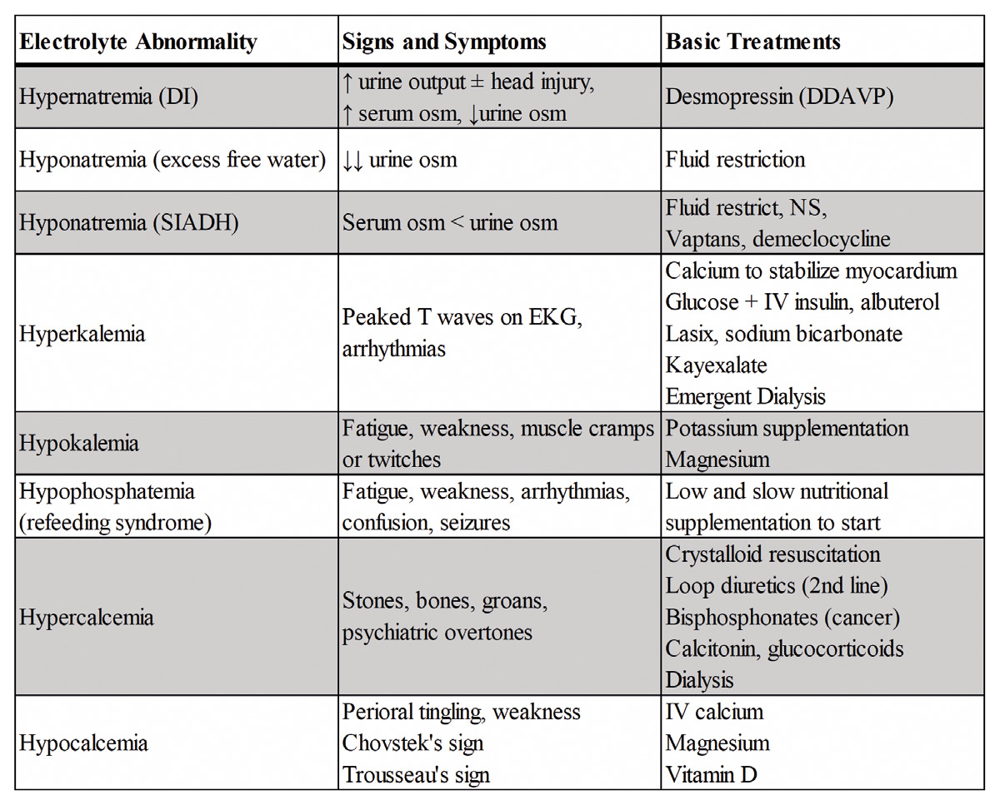

# 16 FLUIDS AND ELECTROLYTES

---

<!-- Page 215 -->

215
16 FLUIDS AND 
ELECTROLYTES

---

<!-- Page 216 -->

216
16 FLUIDS AND ELECTROLYTES
•	 What is the percentage of total body water by weight in an 
adult? What percent of total body water is intracellular?
o Body weight in Kg x 0 .6 = L of water
o 2/3rds is intracellular 
•	 If 1/3rd of our total body water is extracellular, what percentage 
of that is intravascular?
o ¼ is intravascular
o ¾ is extravascular
•	 What is blood volume of 70 kg male?
o 5 L
o 7% by body weight
o In pediatric it is 80 cc/kg
•	 What are our common maintenance fluids?
o D5 ½ NS + 20 Meq of K
o D5 ¼ NS in babies
•	 Resuscitative fluids?
o Balanced crystalloid (LR or NS)
o Colloids
•	 Electrolyte concentrations of NS and LR in 1L
o NS = 154 mEq of Na and Cl
o LR = 130 mEq sodium, 4 mEq potassium, 2.7 mEq calcium, 
109 mEq chloride and 28 mEq of HCO3
•	 Maintenance fluids
o 4, 2, 1 rule = hourly rate
o 4 cc/kg for first 10 kg, 2 cc/kg for second 10, every 1 cc for 
every kg over 20 kg
o Simplified version(for adults) = weight in kg + 40 = hourly 
rate of fluids

---

<!-- Page 217 -->

217
16 FLUIDS AND ELECTROLYTES
•	 How much sodium does a person need a day?
o 1-2 mEq/kg
o 70 kg person = 70-140 mEq/day
•	 How much potassium does a person need a day?
o 0.5 -1 mEq/kg
o 70 kg person = 35-70 mEq/day
•	 When to use D5 ½ NS?
o Patients that are NPO
o Protein sparing for fasting patients
o D5 = 5% per liter = 50 Grams
o 50 Grams x 3 .4 kcal = 170 kcals per liter of D5 saline 
solution
•	 What fluid do you give to someone that has been copiously 
vomiting?
o Resuscitative fluids (no D5), generally NS
o 1 L at a time to see if they respond
o ¼ of it stays intravascular
•	 How do colloids increase intravascular volume?
o Oncotic pressure in vessel that draws fluids intravascular
o Concern in sepsis/trauma/burns is with increased capillary 
permeability is colloid will leak out to interstitial space and 
draw fluid with it
•	 What colloids are available?
o Albumin
o Plasmanate
o Hetastarch, Hespand 
• Side effects of coagulopathy
• Negatively effects platelet function
• Also can cause acute kidney injury

---

<!-- Page 218 -->

218
16 FLUIDS AND ELECTROLYTES
•	 What increases insensible losses?
o Burns
o Fevers
o Ventilators
o Open abdomen
o Large open wounds
•	 What fluid do you replace with?
o High NG tube output
• Normal Saline
o High volume bile leak (lose bicarb in bile)
• LR or D5 solution with bicarb
o Patient with diarrhea (lose K for colon)
• LR or NS with K
•	 Patient 2 days s/p open procedure now hyponatremic what are 
possibilities?
o Excess free water
o SIADH
o Pseudohyponatermia due to hyperglycemia or other high 
protein state
o How to differentiate 
o Determine measured serum osmoles and calculated serum 
osmoles
o Serum osmolality is calculated by looking at chemistry
• Na, Glucose and BUN
• (2 x Na) + Glucose/18 + BUN/2 .8
• Simplified (Na x 2) + 10
• Compare to urine osmolality
• If it is SIADH your serum osmolality will be less than urine 
(very concentrated urine)
• If it is excess free water urine osmolality will be very low 
(trying to excrete excess water)

---

<!-- Page 219 -->

219
16 FLUIDS AND ELECTROLYTES
o If it is excess free water how do you treat?
• Fluid restriction
o If it is SIADH?
• Fluid restriction
• Give NS (don’t correct sodium too quickly, no more than 1 
mEq/hour)
• Vaptans (vasopressin antagonist)
• Demeclocycline 
•	 How to determine sodium deficit?
o Desired sodium – actual sodium x TBW = Sodium deficit in 
mEq
•	 Primary causes of hypernatremia?
o Iatrogenic
o Diabetes insipidus 
o Pt with head injury and urine output increases to 700 cc/hr 
and now hypernatremic how to confirm its DI?
• Compare serum osmolality to urine osmolality  
• Serum osmolality will be high and urine will be low in DI
o How to treat DI?
• Desmopressin (DDAVP)
o How to calculate free water deficit
• (Actual Na – Desired Na)/ Desired Na x TBW = Volume in 
liters 
•	 What is hypophosphatemia associated with?
o Refeeding syndrome due to P04 shift extracellular to 
intracellular
o Can lead to failure to wean from ventilator
•	 How do you manage patient with hyperkalemia?
o Likely renal failure, could be medication induced
o EKG looking for peaked T waves

---

<!-- Page 220 -->

220
16 FLUIDS AND ELECTROLYTES
o Treatment
• Give calcium to stabilize myocardium
• NaHCO3
• Glucose with IV Insulin
• Lasix
• Kayexalate
• Albuterol 
• Emergent Dialysis 
•	 How to treat hypokalemia?
o Causes – Iatrogenic such as over diuresis
o 40 mEq of K should increase total K 0.4
•	 Hypocalcemia symptoms
o Weakness
o Perioral Tingling
o Chovstek’s sign – tap on facial nerve and get perioral 
twitching
o Trousseau’s sign – Carpal pedal spasm with blood pressure 
cuff
•	 Treatment of hypocalcemia?
o IV Calcium
o Vit D and Mg
•	 If hypocalcemia patient has low serum albumin, how do we 
correct serum calcium?
o Normal Albumin = 4
o Every point below 4 add 0 .8 to calcium level
o If Albumin = 2, add 1 .6 to serum calcium level
•	 What are main causes of hypercalcemia?
o MC cause of hypercalcemia in outpatient = 
hyperparathyroidism
o MC cause of hypercalcemia in an inpatient = malignancy

---

<!-- Page 221 -->

221
16 FLUIDS AND ELECTROLYTES
•	 Symptoms of hypercalcemia?
o Stones, bones, groans, and psychiatric overtones
o Kidney stones, bone pain, abdominal pain, and psychosis
•	 Treatment of hypercalcemia?
o Crystalloid resuscitation
o Loop diuretic second line
o Bisphosphonates are helpful for hypercalcemia due to 
cancer
o Calcitonin
o Glucocorticoids
o Dialysis 
•	 Most important parts of ABG?
o pCO2, Bicarb, Base Excess/Base Deficit 
•	 Normal values of ABG (to remember for exam)
o pCO2 = 40
o pH = 7 .4
o Bicarb = 24
•	 A change in pCO2 what change in pH would you expect?
o 0.8 x DCO2 = DpH for acute changes
o pH change by  .1 for every 12 point change in CO2
•	 Dr . Matthew Martin Tips When Looking at ABG
o Looks at CO2 first 
• If high writes resp acidosis . If low, writes resp alkalosis 
o Then looks at bicarb
• If high, writes metabolic alkalosis .  If low, writes metabolic 
acidosis
o Then he looks at pH and their history to put it all together

---

<!-- Page 222 -->

222
16 FLUIDS AND ELECTROLYTES
•	 Metabolic acidosis
o Start with calculating anion gap
o (Na + K) – (Cl + HCO3)
o Gap Acidosis = MUDPILES
o Non-Anion Gap = Ileal conduit, Fistulas, Hyperchloremic 
(Too much NaCL), Renal Tubular Acidosis, Diarrhea, 
Acetazolamide 
•	 Metabolic alkalosis
o NG suction – Hyperchloremic, hypokalemic metabolic 
alkalosis
o Contraction alkalosis from over diuresis 
• Give chloride back is most important
Table 1:  Common Electrolyte Abnormalities and Treatment

---

<!-- Page 223 -->

223
16 FLUIDS AND ELECTROLYTES
Acid Base Practice Problems
•	 Patient undergoes surgery and has 3L NG Suction, postop 
ABG shows 7 .55, pCO2= 52, HCO3 = 40
o What is his primary disorder?
• He is alkalotic with a metabolic alkalosis (HCO3 of 40)
• Respiratory acidosis is compensatory
• Primary metabolic alkalosis with respiratory compensation
•	 Patient who is admitted in a coma, pCO2 = 16, HCO3 = 5, pH 
= 7 .1
o Metabolic acidosis with a respiratory compensation
o Respiratory alkalosis is compensatory as overall disorder is 
acidotic 
•	 Climber climbing a mountain, he is at 5000 meters, what is his 
going to happen to his pCO2 and his pH?
o pCO2 will go down and pH will go up
o Respiratory alkalosis
•	 Patient whose pH is 7 .5, PCO2 = 50, HCO3 is 35
o Primarily metabolic alkalosis with respiratory compensation 
Quick Hits
•	 Cation that determines serum osmolarity
o Na
•	 Primary intracellular cation 
o K
•	 Sepsis resuscitation bolus amount cc/kg
o 30cc/kg
•	 Pediatric patient who needs bolus
o 20 cc/kg
o Blood products = 10 cc/kg

---

<!-- Page 224 -->

224
16 FLUIDS AND ELECTROLYTES
•	 Pt with K of 6 .5 and peaked T waves on EKG, what medication 
do you give first
o Calcium gluconate 
•	 Pt on liver transplant list, who was started on a “water pill” by 
his PCP, now has K of 2 .5
o Lasix
•	 Pt on liver transplant list, who was started on a “water pill” by 
his PCP, now his K is 5 .5
o Spironolactone
•	 Pt came in hyponatremic getting 3% NS, and now they 
develop spastic quadriplegia 
o Central pontine myelinolysis
•	 Pt is hyponatremic, they are on free water restriction, still 
hyponatremic
o Can give vaptans (acts on V2 receptor in the kidney) or 
demeclocycline
o Or hypertonic saline
•	 Baby with pyloric stenosis who has been having emesis for 1 
week
o Hypochloremic, hypokalemic, metabolic acidosis
o Paradoxical aciduria 
•	 Effect of acidosis on oxygen-hemoglobin disassociation curve
o Right shift – oxygen will unload easier
•	 Surgical patient gets hextend and is now bleeding in OR, what 
coagulation disorder do they have
o Platelet dysfunction
•	 Pt with marked metabolic alkalosis, now has decreased 
respiratory drive, what drug could you give
o Acetazolamide 
•	 Pt with high NG output, or vomiting
o Hypochloremic, metabolic alkaloses

---

<!-- Page 225 -->

225
16 FLUIDS AND ELECTROLYTES
•	 Pt with diarrhea
o Hypokalemic metabolic acidosis
•	 Mountain climber
o Respiratory alkalosis
•	 POD 2 after whipple is now somnolent with pinpoint pupils
o Respiratory acidosis, due to overdose on narcotics
•	 Ileal conduit and high output
o Metabolic acidosis, non-gap

---

<!-- Page 226 -->

226
16 FLUIDS AND ELECTROLYTES

## Figures

