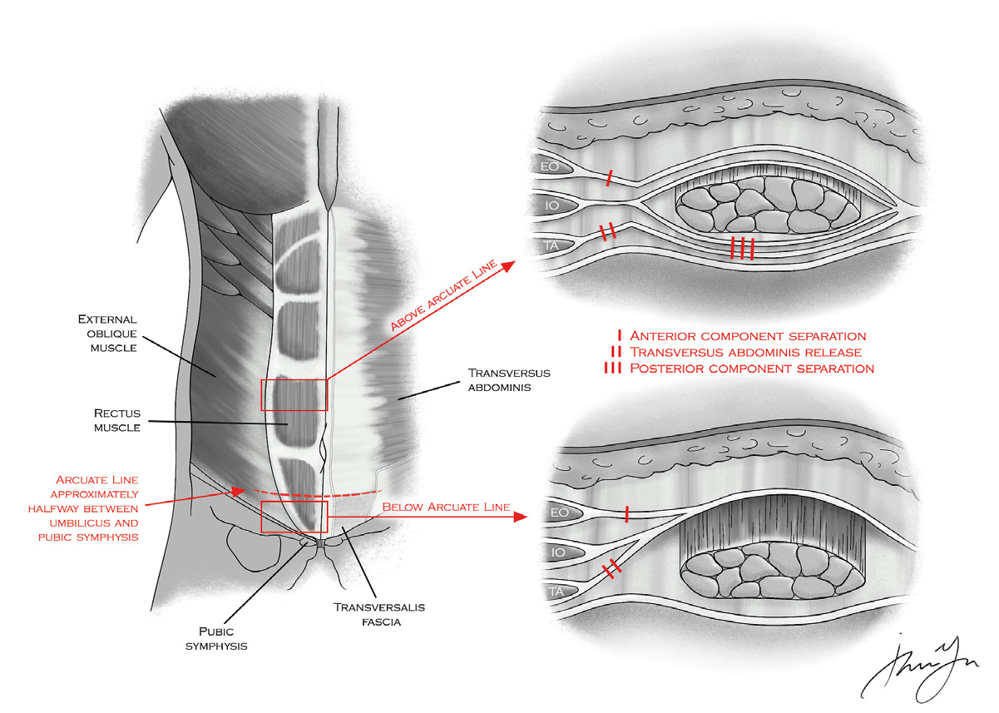

# 17 HERNIAS

---

<!-- Page 227 -->

227
17 HERNIAS

---

<!-- Page 228 -->

228
17 HERNIAS
Basic Principles
Underlying principle of good hernia repair = Tension free
Most common cause for recurrent hernia = wound infection
Rank as cause of SBO = 2nd to adhesion (worldwide = 1st)
Figure 1 - Abdominal Wall Anatomy
Abdominal Wall Anatomy
•	 Layers of abdominal wall just off midline:
o Skin
o Subcutaneous Fat/Camper’s Fascia
o Scarpa’s Fascia
o Anterior Rectus Sheath
o Rectus Muscle 
o Posterior Rectus Sheath
o Preperitoneal Fat
o Peritoneum
•	 Layers of abdominal wall lateral to rectus:
o Skin
o Subcutaneous Fat/Camper’s Fascia

---

<!-- Page 229 -->

229
17 HERNIAS
o Scarpa’s Fascia
o External Oblique
o Internal Oblique
o Transversus Abdominis
o Transversalis Fascia 
o Preperitoneal Fat
o Peritoneum
•	 Where does rectus sheath end?
o Arcuate line (third of distance between umbilicus and pubis 
symphysis)
•	 Bloody supply to the rectus?
o Inferior and Superior Epigastrics
•	 Hesselbach’s Triangle Anatomy
o Medial Border  – Rectus
o Inferior Border – Inguinal Ligament
o Lateral Border – Epigastrics
o Hernia in Hesselbach’s triangle = Direct Hernia
•	 What is the inguinal ligament?
o Extension of the external oblique fascia
•	 What are the embryological structures that are at or go through 
umbilicus?
o Omphalomesenteric duct (Vitelline duct)  Becomes 
Meckel’s Diverticulum
o Median umbilical ligament  urachus
o Medial umbilical ligaments  obliterated umbilical arteries
o Round ligament of the liver (ligamentum teres)  obliterated 
umbilical vein
•	 When does the midgut herniate?  And what does it return?
o Herniates at 6 weeks
o Returns at 10 weeks

---

<!-- Page 230 -->

230
17 HERNIAS
•	 Abdominal wall defect in Omphalocele? Gastroschisis?
o Omphalocele  Through the umbilical stalk
o Gastroschisis  Inferior/Right of the umbilicus
Umbilical Hernias
•	 Usually congenital
•	 Usual contents  preperitoneal fat
•	 Repair options?
o Open vs . Laparoscopic
o Primary repair  <1cm and pediatric patients
•	 2 yo with umbilical hernia
o Wait until 5yo to see if it will close and then repair
o Fix before going to school
Inguinal Hernias
•	 What defines indirect/direct hernia?
o Indirect is lateral to inferior epigastrics
o Direct is medial to inferior epigastrics
•	 Etiology of indirect?
o Congenital - Patent processus vaginalis
•	 Etiology of direct?
o Acquired - Weakness in floor of inguinal canal
•	 Risk factors for direct?
o Obesity, smoking, poor nutrition, ascites, anything with 
increased abdominal pressure
•	 Contents of spermatic cord?
o Cremasteric muscles, testicular artery, vas deferens, 
pampiniform plexus, ilioinguinal nerve, genital branch of 
genitofemoral nerve
•	 What forms the cremaster muscles?
o Extension of the internal oblique muscle fibers

---

<!-- Page 231 -->

231
17 HERNIAS
•	 What are the key nerves in open inguinal hernia repair?
o Ilioinguinal
o Genital branch of genitofemoral
o Iliohypogastric
o MC injured  Ilioinguinal (when opening external oblique)
•	 MC injured nerve in laparoscopic hernia repair
o Lateral femoral cutaneous
• Occurs from improperly placed tack laterally
•	 Bassini
o Conjoint tendon (transversalis + internal oblique) to inguinal 
ligament
•	 Shouldice
o Same as bassini in multiple (4) layers
•	 Lichtenstein repair
o Repair with mesh, sew inguinal ligament to conjoined/
transversalis
•	 Plug and patch
o Plug goes into internal repair and then Lichtenstein on top
•	 Pediatric repair basics?
o High ligation of sac
•	 Laparoscopic hernia repair
o Total Extra-Peritoneal Repair (TEP) and Trans-Abdominal 
Pre-Peritoneal Repair (TAPP)
o Repair covers internal, direct, and femoral spaces
o Main structure of fixation in laparoscopic repair?
• Cooper’s ligament
o What and where is the triangle of doom?
• Contains Iliac vessels, medial with apex at iliopubic tract 
and bounded by vas deferens medially and spermatic 
vessels laterally

---

<!-- Page 232 -->

232
17 HERNIAS
o What and where is the triangle of pain?
• Contains Nerve structures, lateral to spermatic vessels 
below iliopubic tract
Femoral Hernias
•	 Who is at highest risk for femoral hernias?
o Females and elderly
•	 Where is the defect?
o Below the inguinal ligament, medial to the femoral vein
•	 How do you repair it open?
o McVay (Cooper’s) Repair 
• Open inguinal floor, close femoral space by suturing 
Conjoint tendon to Cooper’s Ligament
Incarceration vs. Strangulation
•	 What are the signs of symptoms?
o Obstructive, non-reducible hernia, skin changes, severe 
tenderness and pain
•	 Open approach and needed bowel resection .  How do you 
repair?
o Biologic mesh or tissue repair
Ventral/Incisional Hernias
•	 Risks Factors for incisional hernia?
o Wound infection, obesity, COPD, smoking
o GET THEM TO STOP SMOKING prior to elective repair
o Where can you place the mesh?
• Underlay, inlay, onlay
• Highest recurrence in inlay mesh
• Choose macroporous mesh
• Biologic mesh if contamination
o How to manage large ventral hernia if you cannot obtain 

---

<!-- Page 233 -->

233
17 HERNIAS
primary closure?
• Component separation -- There are several types/
variations. A common board question regards which layer 
is incised (See Image) .
• Anterior Component Separation (incise external 
oblique)
• Transversus Abdominis Repair (incise transversus 
abdominis)
• Posterior Component Separation (incise posterior 
rectus sheath)
o Optimal suture closer method?
• 5-7mm bites with absorbable suture
Quick Hits
•	 Junction of semilunaris and arcuate line?
o Spigelian hernia  intramuscular hernia
•	 Appendix in inguinal hernia sac?
o Amyand hernia, primary repair in appendicitis
•	 Meckel’s diverticulum in inguinal hernia?
o Littre’s hernia
•	 Both indirect and direct hernia?
o Pantaloon hernia
•	 Sliding hernia?
o Retroperitoneal structure makes up a portion of the sac
o Do not open sac with a sliding hernia
•	 Richter’s hernia
o Part of the wall of the bowel is present in the hernia sac
o Strangulation without obstruction
•	 Doing inguinal hernia repair and skeletonized cord and can’t 
find hernia?
o Need to open floor and look for femoral hernia

---

<!-- Page 234 -->

234
17 HERNIAS
•	 Child’s C cirrhotic with massive ascites and umbilical hernia 
with intermittent obstructive symptoms?
o TIPS first to control ascites before considering repair
•	 Laparoscopic inguinal hernia repair and tack mesh to cooper’s 
ligament and get large arterial bleeding?
o Corona mortis (branch between obturator and external iliac 
artery)
•	 Placing suture during open inguinal hernia repair and get 
sudden bleeding?
o Femoral vein injury, pull suture out and hold pressure
•	 Groin pain/significant medial thigh pain with internal rotation of 
the hip?
o Obturator hernia
o Obturator sign/Howship Romberg sign
•	 One-month s/p open inguinal hernia repair with prolene mesh 
and now have wound infection with purulent fluid around 
mesh?
o Mesh explantation
•	 Inguinal hernia repair and can’t reduce sac
o Ligate proximal portion that will reduce into abdominal cavity
o Keep distal portion open to reduce chances of hydrocele

## Figures

